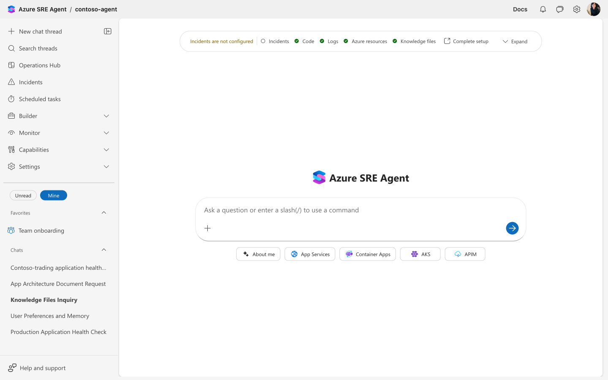

# Shift Left with Azure SRE Agent: An Agent That Guards Every PR

## Azure SRE Agent can do more than investigate production incidents. With HTTP triggers and a deployment guard skill, it analyzes pull requests by deploying changes to staging, comparing health metrics against production baselines, and posting risk assessments directly on the PR — before the code is merged.

## The Gap Between Code Review and Production

Most teams have two reliability checkpoints: code review (before merge) and monitoring (after deployment). The gap between them is where subtle breaking changes slip through.

A renamed environment variable, a removed health check endpoint, a changed database schema — these changes pass code review because they look correct in isolation. They pass CI because nobody wrote a test for the specific interaction between the code change and the deployment configuration. They reach production, and the first signal is an alert at 2 AM.

The challenge is cross-referencing: a human reviewer would need to compare the PR diff against the live infrastructure config, the deployment environment variables, and the production health baselines. In practice, this doesn't happen for routine changes.

Azure SRE Agent's HTTP trigger capability fills this gap by inserting an automated reliability check into the PR workflow.

## How It Works

The deployment guard uses a webhook bridge pattern:

```
GitHub PR → GitHub Actions workflow → Logic App webhook bridge → SRE Agent HTTP trigger
                                                                        ↓
                                                              deployment-guard subagent
                                                                        ↓
                                                    ┌───────────────────┼───────────────────┐
                                                    ↓                   ↓                   ↓
                                               Read PR diff     Deploy to staging     Query Dynatrace
                                                                        ↓              + LAW baselines
                                                                  Canary traffic
                                                                        ↓
                                                                  Compare health
                                                                        ↓
                                                              Post risk assessment
                                                              comment on PR
```

Here's the agent configured with the deployment guard skill, HTTP trigger, and connectors:

<!-- Screenshot: SRE Agent Builder canvas showing contoso-agent with skills, subagents, connectors, and HTTP trigger -->


The HTTP trigger receives PR events from GitHub via a Logic App webhook bridge and routes them to the deployment-guard subagent in autonomous mode:

<!-- Screenshot: HTTP trigger configuration for pr-deployment-guard -->


When a developer opens a PR, GitHub Actions sends the event to the SRE Agent via the Logic App bridge. The agent's deployment guard subagent runs a 9-step analysis:

1. **Read the PR diff** from the connected GitHub repo — identify what changed (app code, IaC, config, DB schema, dependencies)
2. **Static analysis** — check for breaking patterns: renamed env vars, removed endpoints, changed schemas, missing error handling
3. **Capture production baselines** — query Dynatrace and Log Analytics for current error rates, latency percentiles, and throughput. Send test requests to production endpoints and record response structure
4. **Deploy to staging** — use `az containerapp update` to deploy the PR's changes to the staging environment
5. **Canary traffic** — send synthetic HTTP requests to staging endpoints for 2-3 minutes to exercise affected code paths
6. **Validate responses** — compare staging API responses against production baselines. Catch cases where the app returns 200 OK but serves degraded or incorrect data
7. **Monitor health** — query Dynatrace and LAW for staging metrics over 5 minutes. Compare against production
8. **Risk assessment** — classify as LOW, MEDIUM, HIGH, or CRITICAL
9. **Post PR comment** — structured report with risk level, static analysis findings, canary test results, health comparison table, and recommendation

## Risk Levels

| Risk | Criteria | Example |
|---|---|---|
| LOW | No functional or performance changes detected | Updated a log message or code comment |
| MEDIUM | Minor changes, no regressions in staging | Added a new optional query parameter |
| HIGH | Behavioral regression detected, staging still functional | Response payload changed, latency increased 2x |
| CRITICAL | Staging failing or data integrity compromised | Database connection failed, endpoints returning 500 |

## Example: Environment Variable Rename

A PR titled "Standardize database env var naming" renames `DATABASE_URL` to `DB_CONNECTION_URL` in the payment service. The commit is clean, the description is clear, and the change looks like responsible housekeeping.

The deployment guard:
- Reads the diff and flags `DATABASE_URL` → `DB_CONNECTION_URL` as a potential env var mismatch
- Deploys to staging — the Container App's environment variables still define `DATABASE_URL`
- Sends canary traffic to the payment-service endpoint
- Gets 500 errors — the service can't find `DB_CONNECTION_URL` and fails to connect to the database
- Posts a CRITICAL risk assessment on the PR:

| Check | Result |
|---|---|
| Static Analysis | `DATABASE_URL` renamed to `DB_CONNECTION_URL` — env var mismatch with deployment config |
| Staging Deploy | Deployed |
| Canary Tests | payment-service returning 500 — database connection failed |
| Health Comparison | Production: 0 errors / Staging: 100% error rate on /api/payments |

**Recommendation**: Update the Container App env var to `DB_CONNECTION_URL` or revert the code change.

The developer sees this before merging. No production incident.

## How It Compares to CI Tests

| Capability | CI Tests | Deployment Guard |
|---|---|---|
| Catches what you wrote tests for | Yes | N/A |
| Catches unanticipated regressions | No | Yes — compares against live production baselines |
| Compares response payloads against production | No | Yes — detects silent data degradation |
| Cross-references code against infrastructure config | No | Yes — reads the diff and checks env vars, endpoints, schemas |
| Requires pre-written test cases | Yes | No — uses real traffic against a real staging deployment |

The deployment guard complements CI — it doesn't replace it. CI validates correctness against known expectations. The deployment guard validates behavior against the live production environment.

## Setting It Up

### Step 1 — Deploy an agent with the `law-dynatrace-github-httptrigger-prvalidation` recipe

```bash
cd sreagent-templates

./bin/new-agent.sh --recipe law-dynatrace-github-httptrigger-prvalidation --non-interactive \
  --set agentName=my-deployment-guard \
  --set resourceGroup=rg-sre-guard \
  --set location=eastus2 \
  --set lawId=/subscriptions/<sub>/resourceGroups/<rg>/providers/Microsoft.OperationalInsights/workspaces/<name> \
  --set dtTenant=<your-tenant-id> \
  --set dtToken=<your-api-token> \
  --set githubRepo=<org>/<repo> \
  --set targetRGs=rg-prod,rg-staging \
  -o my-deployment-guard/

./bin/deploy.sh my-deployment-guard/
```

The recipe includes:

| Component | What it does |
|---|---|
| **deployment-guard-analysis** skill | 9-step PR analysis workflow |
| **deployment-guard** subagent | Autonomous agent with access to az CLI, Dynatrace, LAW, GitHub |
| **pr-deployment-guard** HTTP trigger | Receives webhook events and routes to the subagent |
| **Log Analytics connector** | Azure-side logs and metrics |
| **Dynatrace MCP connector** | Application performance data |
| **Safety hooks** | deny-prod-deletes, require-approval-for-restarts |

### Step 2 — Copy the GitHub workflow to your app repo

The recipe generates a sample workflow at `data/sample-github-workflow.yml`. Copy it to your app repo:

```bash
cp my-deployment-guard/data/sample-github-workflow.yml \
  /path/to/your-app/.github/workflows/sre-agent-pr-guard.yml
```

### Step 3 — Set the webhook secret

Get the Logic App trigger URL from the agent's webhook bridge and add it as a GitHub secret:

```bash
gh secret set SRE_AGENT_WEBHOOK_URL --repo <org>/<repo> --body "<webhook-url>"
```

### Step 4 — Open a PR and watch the agent analyze it

Every PR on the app repo now triggers the deployment guard. The agent posts its risk assessment as a PR comment within 5-10 minutes (baseline capture + canary testing + analysis).

## Lab and Recipe

| Resource | Description |
|---|---|
| [law-dynatrace-github-httptrigger-prvalidation recipe](https://github.com/microsoft/sre-agent/tree/main/sreagent-templates/recipes/law-dynatrace-github-httptrigger-prvalidation) | Deploy an agent with LAW + Dynatrace + HTTP trigger + deployment guard pre-configured |
| [deployment-guard lab](https://github.com/microsoft/sre-agent/tree/main/labs/deployment-guard) | End-to-end walkthrough using [contoso-trading](https://github.com/dm-chelupati/contoso-trading) as the target app — includes a demo script that creates a risky PR and shows the agent's response |
| [Inside SRE Agent Live](https://www.youtube.com/@InsideSREAgent) | Live demo recordings |

## Learn More

- [HTTP Triggers](https://sre.azure.com/docs/capabilities/http-triggers) — Configuring webhook-based automation
- [Skills](https://sre.azure.com/docs/capabilities/skills) — Creating custom analysis workflows
- [Subagents](https://sre.azure.com/docs/capabilities/subagents) — Dedicated agents with scoped tools and instructions
- [Connectors](https://sre.azure.com/docs/capabilities/connectors) — Connecting Log Analytics, Dynatrace, and other data sources
- [SRE Agent Templates](https://github.com/microsoft/sre-agent) — Recipes, labs, and deployment tooling
