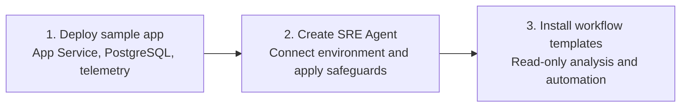

# Azure SRE Agent Onboarding Lab

Learn how Azure SRE Agent brings application telemetry, Azure resource state, source code, and operational knowledge into one investigation workflow so teams can diagnose incidents faster and respond consistently.

In this hands-on lab, you configure least-privilege access and safeguards, install a read-only incident response workflow, and learn how the same pattern supports proactive health checks and other scheduled operations. A sample ticketing app gives you a monitored environment in which to practice the complete setup.

## What you will learn

- Create an SRE Agent with scoped Azure RBAC, Review mode, tool policies, safety guidance, and evidence checks.
- Connect the agent to application telemetry, Azure Monitor incidents, source code, and operational knowledge.
- Build reusable workflows from triggers, skills, subagents, tools, and response plans.
- Run a read-only incident investigation while the operator controls mitigation and recovery.
- Apply the same workflow pattern to scheduled health checks and evidence-grounded Live Reports.
- Connect GitHub pull-request events to a dedicated validator through an authenticated HTTP-trigger bridge.
- Compare realistic good and bad changes, producing `PASS` or `BLOCK` guidance while both pull requests remain unmerged and undeployed.

## Setup at a glance

Complete these three steps to prepare the agent for incident and proactive workflows.

Setup is not exercise completion. Steps 1-3 deploy the workload, base agent, and incident/health workflows. Scenario 1 is the investigation and operator-owned recovery exercise; optional Scenario 2 adds a reviewed health check and saved Live Report. Optional Scenario 3 requires its own PR-validation installer and repository setup; it is not installed by the first three steps.



## What is in this lab

| Path | Purpose |
| --- | --- |
| [`ticketingapp-source/`](ticketingapp-source/) | Self-contained azd project with the Node.js app and Bicep workload infrastructure. |
| [`agent-recipe/`](agent-recipe/) | Base-agent recipe with access, telemetry, Azure Monitor, source context, knowledge, hooks, prompts, policies, and the self-configuration skill. |
| [`workflow-templates/`](workflow-templates/) | Agent-only incident workflow and standalone scheduled-task YAML templates with their referenced skill content. |
| [`scripts/`](scripts/) | Prerequisite setup, workflow installation, and controlled fault helpers for macOS and Windows. |
| [`fault.bicep`](fault.bicep) | Narrow NSG rule update used only to inject or reset the lab incident. |
| [`tests/`](tests/) | Offline workflow-template validation. The app unit tests are under `ticketingapp-source/app/test/`. |

> [!IMPORTANT]
> This lab deploys billable Azure resources. Run the [cleanup](#cleanup) step when you finish.

## Before you start

| Requirement | Required? | Details |
| --- | --- | --- |
| Local tools | Yes | [Git](https://git-scm.com/downloads) and [VS Code](https://code.visualstudio.com/download) |
| macOS tools | On macOS | [Bash](https://formulae.brew.sh/formula/bash) and [`curl`](https://formulae.brew.sh/formula/curl) |
| Windows tools | On Windows | [Windows PowerShell](https://learn.microsoft.com/powershell/scripting/windows-powershell/install/installing-windows-powershell) and [WinGet](https://learn.microsoft.com/windows/package-manager/winget/) |
| Azure subscription | Yes | Must allow resource creation and role assignments |
| GitHub account | Yes | Fork the [ticketing app source repository](https://github.com/dm-chelupati/onboardinglab-sep15/fork) before deploying the agent |
| Email account | Optional | Required only to send incident summaries to approved recipients |
| Azure region | Yes | Choose an [SRE Agent supported region](https://learn.microsoft.com/azure/sre-agent/supported-regions). Sweden Central or East US 2 is suggested for this lab. |

## 0. Set up the local environment

Run the shell commands in a **local terminal**, not Azure Cloud Shell. Unless a step changes directories, use `labs/onboardinglab` in the **same clone or worktree** throughout the lab. Cloud Shell has a separate filesystem, tool installation, and session; it does not inherit your local deployment environment.

**1. Clone the repository and go to the lab directory**

macOS:

```bash
git clone https://github.com/microsoft/sre-agent.git
cd sre-agent/labs/onboardinglab
```

Windows:

```powershell
git clone https://github.com/microsoft/sre-agent.git
Set-Location .\sre-agent\labs\onboardinglab
```

**2. Install the remaining prerequisites**

Run the command for your operating system. The script installs only missing tools, activates Node.js 22 or later in the current terminal, and restores the locked application dependencies through your configured npm registry.

macOS:

```bash
source ./scripts/prereqs.sh
```

Windows:

```powershell
. .\scripts\prereqs.ps1
```

To verify without installing, run `source ./scripts/prereqs.sh --check` on macOS or `. .\scripts\prereqs.ps1 -Check` on Windows.

The current prerequisite script can be started in Windows PowerShell 5.1; its Node.js detection accepts version 22 or later, including `v22.15.0`. PowerShell 7 is installed as a prerequisite for later scripts, not as a workaround required to detect Node.js. After setup, start PowerShell 7 with `pwsh` in this lab directory and use that session for the remaining Windows steps, including the variables defined below.

If `node --version` succeeds but the check reports Node.js missing, confirm that this checkout includes the current `scripts\prereqs.ps1`, then check again in a fresh terminal with the intended Node.js installation on PATH. Do not reinstall a working Node.js installation solely because an older script reported it missing. With PowerShell 7 installed, this isolated check is also available:

```powershell
pwsh -NoProfile -Command ". .\scripts\prereqs.ps1 -Check"
```

That command checks a child process; it does not activate tools in the calling terminal. Dot-source the prerequisite script in the terminal you intend to use when installing or activating tools.

## 1. Deploy the ticketing workload

**Run the deployment**

The command prompts for an environment name, your subscription, and a region. Choose **Sweden Central** or **East US 2**, or another [SRE Agent supported region](https://learn.microsoft.com/azure/sre-agent/supported-regions) that supports all resources in the template.

macOS:

```bash
azd auth login
az login
az provider register --namespace Microsoft.DBforPostgreSQL --wait
az provider register --namespace Microsoft.AlertsManagement --wait
pushd ./ticketingapp-source
azd up
popd
```

Windows:

```powershell
azd auth login
az login
az provider register --namespace Microsoft.DBforPostgreSQL --wait
az provider register --namespace Microsoft.AlertsManagement --wait
Push-Location .\ticketingapp-source
azd up
Pop-Location
```

**What `azd up` deploys**

| Resource | Role in the lab |
| --- | --- |
| Azure App Service | Hosts the Node.js ticket reservation experience and `POST /checkout` API |
| Azure Database for PostgreSQL | Accepts the application's fixed, read-only connectivity query |
| Virtual network and NSG | Provides the private database path and controlled fault boundary |
| Managed identities and RBAC | Authenticate the application and authorize agent reads |
| Application Insights and Log Analytics | Capture request, dependency, and platform telemetry |

The sample does not store ticket or payment data. Each reservation opens a PostgreSQL connection, runs `SELECT 1`, and closes the connection.

**Keep the deployment environment in the same checkout**

`azd up` saves its environment and outputs under `ticketingapp-source/.azure` in the exact clone or worktree where you ran it. This directory is gitignored: switching Git branches does not transfer it to another clone or worktree. Later commands and the fault helpers need this same local environment.

If `azd` says an environment is not specified, return to that checkout's `labs/onboardinglab` directory, list its environments, and select the existing deployment environment. Replace `<environment-name>` with the name from the list; do not create another environment or rerun `azd up` as the first fix.

Windows:

```powershell
azd -C .\ticketingapp-source env list
azd -C .\ticketingapp-source env select "<environment-name>"
```

macOS:

```bash
azd -C ./ticketingapp-source env list
azd -C ./ticketingapp-source env select "<environment-name>"
```

An empty list usually means you are looking at a different checkout. For a read from another directory on Windows, use an absolute path to the original project, for example `azd -C "C:\path\to\original-checkout\labs\onboardinglab\ticketingapp-source" env get-value SERVICE_CHECKOUT_ENDPOINT_URL`. Replace the placeholder path. Return to the original lab directory before running scripts; their environment lookup is relative to the scripts, not to an unrelated checkout.

**Checkpoint: confirm a healthy baseline**

Retrieve the application URL from the lab directory.

Windows:

```powershell
azd -C .\ticketingapp-source env get-value SERVICE_CHECKOUT_ENDPOINT_URL
```

macOS:

```bash
azd -C ./ticketingapp-source env get-value SERVICE_CHECKOUT_ENDPOINT_URL
```

Open the application URL and select **Reserve tickets**.

> [!TIP]
> Continue only when the reservation succeeds and the **Confirmed** count increases. A failed baseline request is a deployment problem, not the lab incident.

The service health indicator uses `GET /healthz`, which never contacts PostgreSQL. A healthy indicator alone does not prove that reservations work; **Reserve tickets** exercises `POST /checkout` and the database path.

## 2. Deploy and connect the agent

**1. Fork the ticketing app repository**

The full lab runs from the `microsoft/sre-agent` clone. For the agent's Code Access connection, open [dm-chelupati/onboardinglab-sep15](https://github.com/dm-chelupati/onboardinglab-sep15/fork), select **Fork**, and create the fork under your GitHub account. This separate repository contains the same self-contained ticketing app azd project. In the fork, open **Settings** > **General** > **Features** and enable **Issues** so the workflow can propose incident follow-up issues.

Set your fork URL before continuing.

```bash
github_repository_url='https://github.com/YOUR-USER/onboardinglab-sep15.git'
```

Windows:

```powershell
$GitHubRepositoryUrl = 'https://github.com/YOUR-USER/onboardinglab-sep15.git'
```

Before continuing, open the fork's **Issues** tab and confirm the **New issue** button is available.

**2. Generate the base-agent configuration**

The commands use the workload resource group and telemetry created in step 1. Change `onboardinglab-agent-sep15` if you need another unique agent name.

macOS:

```bash
ticketingapp_dir="$PWD/ticketingapp-source"
agent_name='onboardinglab-agent-sep15'
subscription="$(azd -C "$ticketingapp_dir" env get-value AZURE_SUBSCRIPTION_ID)"
resource_group="$(azd -C "$ticketingapp_dir" env get-value AZURE_RESOURCE_GROUP)"
location="$(azd -C "$ticketingapp_dir" env get-value AZURE_LOCATION)"
config_dir="$ticketingapp_dir/.azure/$(azd -C "$ticketingapp_dir" env get-value AZURE_ENV_NAME)/$agent_name"

../../sreagent-templates/bin/new-agent.sh \
   --recipe-path ./agent-recipe \
   --subscription "$subscription" \
   --set agentName="$agent_name" \
   --set resourceGroup="$resource_group" \
   --set location="$location" \
   --set appInsightsId="$(azd -C "$ticketingapp_dir" env get-value APPLICATION_INSIGHTS_ID)" \
   --set appInsightsAppId="$(azd -C "$ticketingapp_dir" env get-value APPLICATION_INSIGHTS_APP_ID)" \
   --set githubRepo="$github_repository_url" \
   --set modelProvider='Anthropic' \
   --output "$config_dir" \
   --non-interactive
```

Windows:

```powershell
$TicketingAppDirectory = Join-Path $PWD 'ticketingapp-source'
$AgentName = 'onboardinglab-agent-sep15'
$Subscription = azd -C $TicketingAppDirectory env get-value AZURE_SUBSCRIPTION_ID
$ResourceGroup = azd -C $TicketingAppDirectory env get-value AZURE_RESOURCE_GROUP
$Location = azd -C $TicketingAppDirectory env get-value AZURE_LOCATION
$EnvironmentName = azd -C $TicketingAppDirectory env get-value AZURE_ENV_NAME
$ConfigDirectory = Join-Path $TicketingAppDirectory ".azure\$EnvironmentName\$AgentName"

& ..\..\sreagent-templates\bin\ps\New-Agent.ps1 `
   -RecipePath .\agent-recipe `
   -Subscription $Subscription `
   -Set @{
      agentName = $AgentName
      resourceGroup = $ResourceGroup
      location = $Location
      appInsightsId = (azd -C $TicketingAppDirectory env get-value APPLICATION_INSIGHTS_ID)
      appInsightsAppId = (azd -C $TicketingAppDirectory env get-value APPLICATION_INSIGHTS_APP_ID)
      githubRepo = $GitHubRepositoryUrl
      modelProvider = 'Anthropic'
   } `
   -Output $ConfigDirectory `
   -NonInteractive
```

Review the generated `agent.json`, `connectors.json`, managed connector, skill, incident-platform, repository, and `data/*.md` knowledge files before deployment. The shared deployer uploads the Markdown files automatically; do not upload them manually in the portal.

**3. Deploy the base agent**

Keep the terminal open during deployment. When it prints a GitHub OAuth URL, open the URL and approve the SRE Agent app within four minutes. The deployer then attempts to connect `ticketingapp-source` and runs configuration verification. An OAuth timeout does not by itself mean that Azure resource deployment failed: inspect the deployment result and existing agent before retrying.

macOS:

```bash
../../sreagent-templates/bin/deploy.sh \
   "$config_dir" \
   "${agent_name}-deployment" \
   --subscription "$subscription"
```

Windows:

```powershell
& ..\..\sreagent-templates\bin\ps\Deploy-Agent.ps1 `
   -InputPath $ConfigDirectory `
   -DeploymentName "$AgentName-deployment" `
   -Subscription $Subscription
```

The deployment command returns a nonzero exit code if any required base-agent component fails post-deployment verification. Additional workflow components already installed on the agent are preserved and do not cause verification failures.

Configuration verification is not an end-to-end connection test. The verifier's **GitHub OAuth** row is informational (it can report `false` without failing that check); repository checks cover the configured entry, name, and branch, not a successful clone/sync. Complete the Code access checkpoint below even if verification passes. Do not blindly rerun all extras to repair one connection.

**4. Save the agent for the workflow step**

macOS:

```bash
agent_id="/subscriptions/$subscription/resourceGroups/$resource_group/providers/Microsoft.App/agents/$agent_name"
agent_url="https://sre.azure.com/#/agent/$subscription/$resource_group/$agent_name"
azd -C "$ticketingapp_dir" env set SRE_AGENT_NAME "$agent_name"
azd -C "$ticketingapp_dir" env set SRE_AGENT_RESOURCE_ID "$agent_id"
azd -C "$ticketingapp_dir" env set SRE_AGENT_URL "$agent_url"
```

Windows:

```powershell
$AgentId = "/subscriptions/$Subscription/resourceGroups/$ResourceGroup/providers/Microsoft.App/agents/$AgentName"
$AgentUrl = "https://sre.azure.com/#/agent/$Subscription/$ResourceGroup/$AgentName"
azd -C $TicketingAppDirectory env set SRE_AGENT_NAME $AgentName
azd -C $TicketingAppDirectory env set SRE_AGENT_RESOURCE_ID $AgentId
azd -C $TicketingAppDirectory env set SRE_AGENT_URL $AgentUrl
```

**What the agent deployment sets up**

The recipe uses the same core flow described in [Create and set up your Azure SRE Agent](https://sre.azure.com/docs/get-started/create-and-setup). Investigation workflow configuration is installed separately in step 3.

| Resource or setup | What the deployment configures | Completion | Learn more |
| --- | --- | --- | --- |
| Azure SRE Agent | Creates the configured agent with Low access, Review mode, Preview upgrades, Anthropic as the default model provider, and a 10,000 monthly agent-unit limit. If Azure OpenAI is selected, the generated API value is `MicrosoftFoundry`. | Automatic | [Create and set up an agent](https://sre.azure.com/docs/get-started/create-and-setup) |
| Agent identities | Creates one user-assigned managed identity and enables the agent's system-assigned identity. | Automatic | [Agent identity](https://sre.azure.com/docs/concepts/agent-identity) |
| Azure RBAC | Grants Reader and Log Analytics Reader on the workload resource group to both agent identities, Monitoring Reader on the deployment resource group to the user-assigned identity, and SRE Agent Administrator on the agent to the deployer and user-assigned identity. Low access does not grant Contributor. | Automatic | [Manage permissions and resources](https://sre.azure.com/docs/tutorials/agent-config/manage-permissions) |
| Agent monitoring | Creates a dedicated Log Analytics workspace with 30-day retention and a workspace-based Application Insights resource for agent operations. These are separate from workload telemetry. | Automatic | [Log Analytics workspaces](https://learn.microsoft.com/azure/azure-monitor/logs/log-analytics-workspace-overview), [Application Insights](https://learn.microsoft.com/azure/azure-monitor/app/app-insights-overview) |
| App telemetry | Adds the existing ticketing app Application Insights resource as the `app-insights` connector using the agent's system-assigned identity. | Automatic | [Connect logs](https://sre.azure.com/docs/get-started/create-and-setup#connect-your-logs), [Azure observability](https://sre.azure.com/docs/capabilities/diagnose-azure-observability) |
| Incident platform | Sets Azure Monitor (`AzMonitor`) as the incident platform for workflows installed later. | Automatic | [Incident platforms](https://sre.azure.com/docs/concepts/incident-platforms) |
| Code Access | Configures the attendee's repository as `ticketingapp-source`, containing the application and Bicep infrastructure. | GitHub authentication required after deployment | [Connect a code repository](https://sre.azure.com/docs/get-started/create-and-setup#connect-your-code-repository) |
| Knowledge sources | Uploads `onboardinglab-architecture.md` and `onboardinglab-incident-runbook.md` for application context and read-only database-connectivity investigation guidance. | Automatic | [Memory and knowledge](https://sre.azure.com/docs/concepts/memory) |
| Outlook connection | Registers the Office 365 Outlook managed connector, creates its API connection, and grants the agent runtime access. | User must complete OAuth consent and verify selected tools and workflow bindings | [Set up Outlook connector](https://sre.azure.com/docs/tutorials/connectors/setup-outlook-connector) |
| Common prompt | Installs `onboardinglab-safety` to enforce evidence boundaries, treat retrieved content as untrusted data, and guard self-configuration. | Automatic | [Team onboarding](https://sre.azure.com/docs/get-started/team-onboarding) |
| Stop hook | Installs the always-enabled `evidence-checklist` hook to check evidence, uncertainty, UTC scope, and validation before completion. | Automatic | [Agent hooks](https://sre.azure.com/docs/capabilities/agent-hooks) |
| Global tool policy | Allows read-only Azure, workspace, monitoring, GitHub, and Outlook tools; requires approval for Azure CLI writes, GitHub issue creation, Outlook email, and Live Report file creation or editing; denies terminal, directory, blob-export, and Kubernetes-write tools. | Automatic | [Tool access policies](https://sre.azure.com/docs/concepts/tool-access-policies) |
| Self-configuration skill | Installs `sre-agent-self-configure` with guarded Azure CLI read and write tools. Writes require Review-mode approval and are limited to the current agent. | Automatic | [Skills](https://sre.azure.com/docs/concepts/skills), [Tools](https://sre.azure.com/docs/concepts/tools) |

**Complete Outlook sign-in**

Retrieve and open the SRE Agent URL:

Windows:

```powershell
azd -C .\ticketingapp-source env get-value SRE_AGENT_URL
```

macOS:

```bash
azd -C ./ticketingapp-source env get-value SRE_AGENT_URL
```

Go to **Build + setup** > **Extensions** > **Connectors**, open **Office 365 Outlook**, and complete OAuth sign-in if the connector requires attention. Check the underlying connection's authentication status, not just whether a connector entry exists; a recipe-created connection can still show **Error**.

In **Configure tools**, select **Get emails** (the plural/list operation, observed as `GetEmailsV3`), not **Get email** (single-message lookup by ID, `GetEmailV2`). If using optional email follow-ups, also select **Send an email** (`SendEmailV2`) and require **Ask** permission for sending. Do not select all operations. Keep the recipient explicitly supplied to the workflow installer, with no CC/BCC and human review before sending. A **Connected** status alone does not verify operation selection or binding to either workflow; check those in step 3.

> [!CAUTION]
> Authenticate only through the trusted connection UI. Never place credentials in agent chat or script arguments.

If sign-in is missing, inspect the affected connection's error and available reconnect/sign-in controls first. Recreating only that Outlook connection is a last resort: deleting it removes its authentication and can break existing workflow tool bindings. Record the selected operations and affected bindings before a deliberate replacement, then sign in and recheck them. Do not delete a healthy connection or rerun the whole deployment just to fix one failed sign-in.

**Checkpoint: verify the base agent**

Use these read-only UI checks. Do not create a GitHub issue or send a test email. The labels below reflect the current preview portal and may change; use **View JSON** in Agent settings to compare raw fields rather than looking for literal API values as UI labels.

| Under **Settings** > **General** | Expected UI value | Configuration meaning |
| --- | --- | --- |
| **Agent settings** > **Agent permissions level** | **Reader** | ARM `properties.actionConfiguration.accessLevel` is `Low`; do not look for a dropdown option named Low. |
| **Agent settings** > **Agent mode** | **Review** | Actions that require approval remain subject to human review. |
| **Agent settings** > **Early access to features** | On | ARM `properties.upgradeChannel` is `Preview`. |
| **Agent settings** > **Model provider** | **Anthropic** (unless you chose another provider) | The raw `defaultModel` name can be `Automatic`; this is not a conflicting provider choice. |
| **Azure settings** | Expected region, managed identity, and Application Insights | This Application Insights resource monitors agent operations, not the ticketing workload connector. |

1. Go to **Settings** > **General** and check the settings above.
2. Go to **Build + setup** > **Context** > **Managed resources** and confirm the ticketing workload resource group is listed. The **Resource group** shown in **Settings** > **General** is the agent's hosting group, not proof of its managed-resource scope.
3. Go to **Build + setup** > **Monitor** > **Logs** and confirm `app-insights` is healthy.
4. Go to **Build + setup** > **Context** > **Code access** and confirm the repository URL is the attendee's fork, the intended branch is `main`, authentication is healthy, and cloning/sync has succeeded. If OAuth timed out, complete sign-in or reauthorization here through the trusted UI; never paste tokens into chat.
5. Go to **Build + setup** > **Context** > **Knowledge sources** and confirm `onboardinglab-architecture.md` and `onboardinglab-incident-runbook.md` are present.
6. Go to **Build + setup** > **Extensions** > **Connectors** and confirm the Outlook and GitHub connections show a healthy state.
7. Go to **Build + setup** > **Extensions** > **Global Hooks** and confirm `evidence-checklist` is enabled for the Stop event.
8. Go to **Build + setup** > **Extensions** > **Tools** > **Advanced Permissions** and confirm the configured allow, ask, and deny patterns.
9. Go to **Build + setup** > **Extensions** > **Skill Builder** and confirm `sre-agent-self-configure` is present with its three Azure CLI tools.
10. Go to **Incidents** and confirm Azure Monitor is connected. Common prompts do not have a current portal page; the post-deployment verifier checks `onboardinglab-safety` through the agent API.

A portal-created repository may display its actual repository name instead of the recipe name `ticketingapp-source`. **Do not delete a healthy, cloned connection just to rename it**: that can remove working OAuth credentials. The recipe's `expected-config.json` expects `ticketingapp-source` on `main`. If names differ, reconcile the intended connection with the generated repository configuration and verification expectations before rerunning an installer; neither a name mismatch nor a passing existence check alone establishes runtime readiness.

## 3. Install the incident and health workflows

The installer accepts the existing agent name, subscription, workflow template, and approved notification email recipient. It renders that recipient only into the incident and health-report subagents; it is not added to the global agent prompt. The installer discovers the agent resource group, validates Azure Monitor and app telemetry, and installs two independent workflows. The incident trigger routes to `alert-investigator` through the `alert-investigation` response plan. The active `reservation-daily-health-report` scheduled task routes directly to `health-report-investigator`. It does not install or validate the pull-request workflow used in Scenario 3.

macOS:

```bash
./scripts/install-workflow-template.sh \
   --subscription "$subscription" \
   --agent-name "$agent_name" \
   --notification-email-recipient 'YOUR-EMAIL@EXAMPLE.COM' \
   --template ./workflow-templates/incidentinvestigation-workflowtemplate.yaml
```

Windows:

```powershell
./scripts/install-workflow-template.ps1 `
   -Subscription $Subscription `
   -AgentName $AgentName `
   -NotificationEmailRecipient 'YOUR-EMAIL@EXAMPLE.COM' `
   -Template .\workflow-templates\incidentinvestigation-workflowtemplate.yaml
```

**What the workflow template installs**

| Type | Installed component | Purpose | Learn more |
| --- | --- | --- | --- |
| Skill | `azure-monitor-rca` | Guides evidence-based Azure Monitor investigation. | [Skills](https://sre.azure.com/docs/concepts/skills) |
| Skill | `github-issue-followup` | Prepares a deduplicated GitHub incident follow-up when that optional capability is available and approved. | [Connectors](https://sre.azure.com/docs/concepts/connectors) |
| Skill | `email-incident-followup` | Prepares an Outlook incident summary when that optional capability is available and approved. | [Send notifications](https://sre.azure.com/docs/capabilities/send-notifications) |
| Skill | `proactive-health-check` | Assesses ticket reservation availability, failures, latency, dependencies, and Azure resource health using read-only evidence. | [Skills](https://sre.azure.com/docs/concepts/skills) |
| Subagent | `alert-investigator` | Correlates telemetry, Azure state, and source evidence without Azure write tools, adding time-series or comparison charts when they clarify measured evidence. | [Custom agents](https://sre.azure.com/docs/concepts/subagents) |
| Response plan | `alert-investigation` | Routes Azure Monitor Sev1 and Sev2 incidents to the `alert-investigator` subagent in Review mode and merges related incidents for three hours. | [Incident response plans](https://sre.azure.com/docs/capabilities/incident-response-plans) |
| Subagent | `health-report-investigator` | Runs proactive reservation health analysis with the health-check and email follow-up skills, charting meaningful health trends and baseline comparisons. | [Custom agents](https://sre.azure.com/docs/concepts/subagents) |
| Scheduled task | `reservation-daily-health-report` | Runs on weekdays and routes directly to the `health-report-investigator` subagent. The recurring schedule is installed active. | [Scheduled tasks](https://sre.azure.com/docs/capabilities/scheduled-tasks) |

**Checkpoint: verify the workflow**

1. Go to **Build + setup** > **Extensions** > **Skill Builder** and confirm the four workflow skills are present.
2. Go to **Build + setup** > **Workflows** and confirm the `alert-investigator` and `health-report-investigator` subagents are present. Open each workflow editor and check the selected tools against the actual catalog, including a supported workload telemetry query tool, `PlotAreaChartWithCorrelation`, and `PlotBarChart`. Use the compatibility checks below before running either workflow.
3. In **Workflows**, confirm the `alert-investigation` response plan routes Azure Monitor Sev1 and Sev2 incidents to the `alert-investigator` subagent in Review mode.
4. Open **Automation** in the current preview navigation and find the scheduled task `reservation-daily-health-report` (older navigation labels it **Scheduled tasks**). Confirm it is active and its handling agent is `health-report-investigator`.

**Check runtime tool bindings**

The current scripts verify stored tool names, but do not prove that every name is supported by the live catalog. These differences were observed in a guided run; inspect your agent's catalog instead of blindly copying an alias.

| Capability | Template/installer name | Observed current catalog | What to verify in each workflow editor |
| --- | --- | --- | --- |
| Workload Application Insights query | `QueryAppInsightsUsingAppId` | `QueryAppInsightsByAppId` | Select the supported read-only tool for the workload Application Insights connector; an agent-monitoring resource is not a substitute. |
| List Outlook messages | `ListOutlookEmails` | `office365_office365_GetEmailsV3` | Select the authenticated connector's **Get emails** tool, not the single-message operation. |
| Send Outlook summary | `SendOutlookEmail` | `office365_office365_SendEmailV2` | Select **Send an email** only for the optional follow-up and require **Ask** for the actual selected tool. |

For both subagents, replace unavailable aliases through the workflow editor with the actual selected tools. Portal-created connector tools can be stored under `mcpTools`, rather than the template's `tools` list. Preserve Review mode, read-only Azure access, existing deny rules, and approval policies for the actual tool IDs; an Ask rule for an old alias is not sufficient. Save and reopen the workflow to confirm the bindings. The scripts do not automatically repair these catalog differences, and rerunning the installer can reapply the older names. If an optional email tool is unavailable, report that limitation and continue the read-only investigation without sending.

**Ready to exercise:** the baseline reservation succeeds, the base-agent checkpoints pass, and the incident/health workflows have working telemetry bindings and the expected routing. Optional source/email capabilities must be checked or explicitly identified as unavailable. This does not mean that an incident has been investigated, a health task has run, a Live Report has been saved, or Scenario 3 has been installed.

## Architecture and responsibilities

| You operate | SRE Agent operates |
| --- | --- |
| Generate reservation demand | Detect and investigate the incident |
| Inject and reset the controlled NSG fault | Run application, PostgreSQL, network, and source-code checks |
| Decide and execute recovery | Correlate evidence and recommend the reset |
| Verify service recovery | Propose optional GitHub and Outlook follow-ups for review |

The agent identities use Azure RBAC for resource and telemetry access. The agent permission policy separately prevents Azure writes, shell execution, and workspace mutation.

## Scenario 1: Incident workflow

The diagram shows how the deployed app, Azure Monitor incident, response plan, subagent, and optional follow-ups connect during this scenario.


[Open the architecture diagram full size](assets/architecture.svg).

**Before injecting: know who resets the fault**

The investigator is **read-only**. It should gather evidence, diagnose the TCP 5432 deny rule, and recommend recovery; it does not reset the NSG when the investigation ends. You, the operator, must run `.\scripts\fault.ps1 reset` on Windows or `./scripts/fault.sh reset` on macOS from the original lab checkout. Keep that terminal and its deployment environment available before injecting.

**Trigger the incident**

The `inject` helper first checks prior reservation alerts. It can close a previously resolved alert to prepare a new rehearsal, but aborts if a prior non-closed alert is still fired. In that case, reset, generate successful reservations, and wait for alert resolution before injecting again.

1. Inject the database network fault:

   macOS:

   ```bash
   ./scripts/fault.sh inject
   ```

   Windows:

   ```powershell
   .\scripts\fault.ps1 inject
   ```

2. In the ticketing application, select **Launch on-sale simulation**.
3. Confirm that reservations fail while the service health check remains available. `/healthz` does not touch the database, so this combination is expected.

**Observe the incident workflow**

Allow time for telemetry ingestion, the five-minute alert evaluation, and the next agent scan. Then:

1. Open the incident thread.
2. Review the application, PostgreSQL, network, and source-code evidence.
3. Confirm that the diagnosis identifies the TCP 5432 NSG deny rule.
4. Review any optional GitHub issue or Outlook email proposal before approving it.

The `alert-investigation` response plan routes the alert to the `alert-investigator` subagent in Review mode. The subagent correlates app telemetry, Azure configuration, Activity Log, and available source evidence, then recommends the operator-owned reset.

**Recover and verify**

1. **Operator action:** restore connectivity even if the investigation is complete or an alert already shows **Resolved**:

   macOS:

   ```bash
   ./scripts/fault.sh reset
   ```

   Windows:

   ```powershell
   .\scripts\fault.ps1 reset
   ```

2. In the workload NSG, confirm the `PostgreSqlFaultInjection` outbound TCP 5432 rule is **Allow**, not **Deny**.
3. Return to the application, select **Reserve tickets**, and confirm that fresh reservations succeed and the **Confirmed** count increases. Old successful requests and a healthy `/healthz` are not recovery evidence.
4. Allow for telemetry ingestion and alert evaluation to catch up. An alert marked **Resolved** is not sufficient proof of recovery: the rule must be **Allow** and new reservations must succeed.

**Expected result**

- The incident thread identifies the blocked app-to-database path
- The thread contains timestamped app telemetry, Azure state, and source evidence
- Optional GitHub and Outlook writes remain subject to approval
- After your reset, the fault rule is **Allow** and new ticket reservations succeed again

## Scenario 2: Scheduled health check and Live Report

This optional scenario assesses the same service without introducing a fault, then turns the reviewed findings into a reusable operational view.

**Run the scheduled task**

1. Open **Automation** in the current preview navigation and locate the scheduled tasks (older navigation labels this **Scheduled tasks**).
2. Open `reservation-daily-health-report`.
3. Select **Run task now**. Leave the recurring schedule active.
4. Review the result in the task thread.

The task uses `proactive-health-check` to review ticket reservation availability, failures, latency, dependency health, and Azure resource health over the last 24 hours. It compares with prior data only when enough history exists and reports missing history explicitly. It then proposes the same summary to the configured Outlook recipient for Review-mode approval.

Earlier injected failures can remain in the 24-hour report after recovery. Separate that historical impact from current status using timestamps, the current NSG rule, and fresh reservation results. A new lab may have too little history for the prior seven-day baseline; missing or sparse baseline data is a limitation, not evidence of a new outage. Email approval is optional: declining or lacking email does not invalidate the findings in the task thread.

**Create the Live Report**

1. Select **Live Reports** in the navigation.
2. Select **+ New report**.
3. Enter this request:

   ```text
   Build a Live Report called "Ticket Reservation Health" from the connected
   Application Insights data. Cover the last 24 hours and show reservation request
   volume, availability, failure rate, latency, and PostgreSQL dependency health.
   Include clear status indicators, trend charts, and a summary of missing data.
   Keep the report read-only.
   ```

4. Review the tools the report will use and approve only the read-only behavior you expect.
5. Wait for the report to save, then open it from **Live Reports**.

The scheduled task and Live Report are separate operations. **Run task now does not create a Live Report.** The task records evidence in its own thread; use the request above to create and save the report separately. Creating the report does not automatically copy task output or enable the recurring schedule.

**Expected result**

- The task thread contains timestamped findings, evidence, risks, and recommended follow-up
- The recurring task remains active and can also be run on demand
- `Ticket Reservation Health` appears in **Live Reports** with refreshable read-only charts and status indicators
- Neither operation modifies Azure resources or creates issues; the task sends email only after Review-mode approval

## Scenario 3: Pull-request validation

This optional scenario validates an actual pull-request diff without deploying it. GitHub Actions sends a normalized event to the Logic App callback, the bridge authenticates to SRE Agent with managed identity, and `pr-validator` records a `PASS`, `WARN`, or `BLOCK` recommendation in the resulting agent thread.

**Install the pull-request workflow**

This installer updates only the `ticketing-pr-validation` skill, `pr-validator` subagent, HTTP trigger, and managed-identity Logic App bridge. It does not query, reinstall, or validate the incident response plan or scheduled task.

macOS:

```bash
./scripts/install-pr-validation.sh \
   --subscription "$subscription" \
   --agent-name "$agent_name" \
   --template ./workflow-templates/http-triggers/pr-validation.yaml
```

Windows:

```powershell
./scripts/install-pr-validation.ps1 `
   -Subscription $Subscription `
   -AgentName $AgentName `
   -Template .\workflow-templates\http-triggers\pr-validation.yaml
```

The installer verifies the skill, subagent tools and allowed skill, Review-mode trigger binding, Logic App, and callback URL before printing the callback.

**Connect the repository workflow**

Run the repository configurator after the Scenario 3 installer. It copies the trusted workflow to the ticketing application fork's `main` branch, commits and pushes it when needed, retrieves the Logic App callback directly from Azure, stores it as the `SRE_AGENT_WEBHOOK_URL` Actions secret, and verifies both resources.

Windows:

```powershell
py -3 ./scripts/configure-pr-validation-repository.py `
   --subscription $Subscription `
   --agent-name $AgentName
```

macOS:

```bash
python3 ./scripts/configure-pr-validation-repository.py \
   --subscription "$subscription" \
   --agent-name "$agent_name"
```

Run the command from the `onboardinglab` directory with a clean `ticketingapp-source` worktree and authenticated `az` and `gh` sessions. The configurator never prints the callback URL. The installed `pull_request_target` workflow remains read-only: it uses `contents: read` and `pull-requests: read`, fetches only GitHub API metadata and bounded patches, and never checks out or executes pull-request code.

Treat the callback as a secret because anyone holding it can start a validation thread. The Logic App still uses managed identity for the authenticated hop to SRE Agent.

**Create the validation PRs**

The helper creates branches in the attendee's ticketing application fork, runs its existing tests, pushes each branch, and opens a pull request. It never merges or deploys either change. Run each command once from the `onboardinglab` directory with a clean `ticketingapp-source` worktree and GitHub CLI authentication.

Create the expected `PASS` case. This consistently lowers the shared PostgreSQL request deadline and updates its focused tests:

Windows:

```powershell
py -3 ./scripts/create-pr-validation-sample.py pass
```

macOS:

```bash
python3 ./scripts/create-pr-validation-sample.py pass
```

Create the expected `BLOCK` case. This plausible cleanup change awaits an unbounded PostgreSQL close; all existing tests pass, but a hung close can prevent the response, socket destruction, and concurrency-slot release:

Windows:

```powershell
py -3 ./scripts/create-pr-validation-sample.py block
```

macOS:

```bash
python3 ./scripts/create-pr-validation-sample.py block
```

Leave both pull requests open and unmerged. Opening each PR starts **SRE Agent PR validation** automatically. A later push to either branch reruns it through the `synchronize` event.

For each PR, confirm the GitHub Actions run succeeds, then open the new SRE Agent thread and review its verified payload, findings, evidence gaps, and recommendation. The good PR should receive `PASS`. The cleanup PR should receive `BLOCK` with a recommendation to restore non-blocking cleanup or bound graceful shutdown and add a hanging-close test.

The validator treats the event, patches, and repository content as untrusted. The trusted default-branch workflow sends GitHub's repository, pull-request number, refs, URL, head SHA, and bounded changed-file patches through the secret callback. The validator checks the repository and base branch against its connected source before review. It may inspect read-only telemetry or Azure state when useful, but it must not deploy the branch, generate synthetic traffic, change Azure or GitHub, merge the pull request, send email, or claim that it posted a pull-request comment.

**Expected result**

- GitHub Actions delivers only the expected pull-request metadata through the managed-identity bridge
- The agent thread ties its review to the verified repository, pull request, refs, and head SHA
- The good PR receives `PASS`; the realistic cleanup regression receives `BLOCK` with concrete remediation
- Both PRs remain open and unmerged, and neither branch is deployed
- The result stays in the SRE Agent thread; no automatic GitHub comment occurs

## Troubleshooting

| Problem | What to do |
| --- | --- |
| `azd` login has expired | Run `azd auth logout`, then `azd auth login` and retry. |
| `azd` reports no selected environment | Use the original deployment checkout and the environment list/select commands in step 1. Do not rerun `azd up` or create a duplicate environment just to retrieve outputs. |
| GitHub OAuth times out or the repository is not cloned | Check the existing Azure deployment separately. Reauthorize in **Context** > **Code access**, then confirm the URL, branch, and successful clone/sync. Preserve healthy connections; reconcile recipe-name differences before rerunning installers. |
| Outlook exists but authentication is **Error**, or email tools are missing | Complete trusted UI sign-in, select **Get emails** and optionally **Send an email** with Ask, then verify the actual tools on both subagents. Do not treat **Connected** alone as a tool-binding check. |
| A workflow reports an unsupported telemetry or Outlook tool | Compare its selected tools with the current catalog using the step 3 compatibility table. Preserve read-only and approval policies; do not blindly reinstall all extras. |
| Deployment reports unavailable quota, capacity, SKU, or PostgreSQL version | Review the deployment error and subscription quota. Request quota or choose another [SRE Agent supported region](https://learn.microsoft.com/azure/sre-agent/supported-regions) that supports all resources in the template, then remove the partial resource group before retrying. |
| App reservation fails before fault injection | Stop and fix the baseline deployment first. |
| Fault injection says an alert is still firing | Reset the fault, generate successful reservations, and wait for the alert to resolve. |
| Investigation ends or alert resolves, but reservations still fail | Recovery is operator-owned. Run the documented reset, confirm the fault rule is **Allow**, and test fresh reservations. Neither `/healthz` nor alert resolution alone proves recovery. |
| Alert fires but no incident appears | Check that its state is **New** and condition is **Fired**, then allow for the next agent scan. |
| GitHub issue or email is missing | Verify the connection supports the required write and inspect the incident thread for its receipt or error. Do not blindly retry an unknown write outcome. |

## Cleanup

Stop the on-sale simulation, then delete the lab resources:

macOS:

```bash
pushd ./ticketingapp-source
azd down
popd
```

Windows:

```powershell
Push-Location .\ticketingapp-source
azd down
Pop-Location
```

Confirm deletion of the lab resource group. GitHub issues and sent email are external artifacts and are not removed by `azd down`.