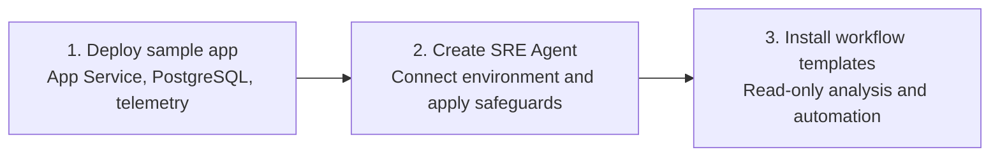
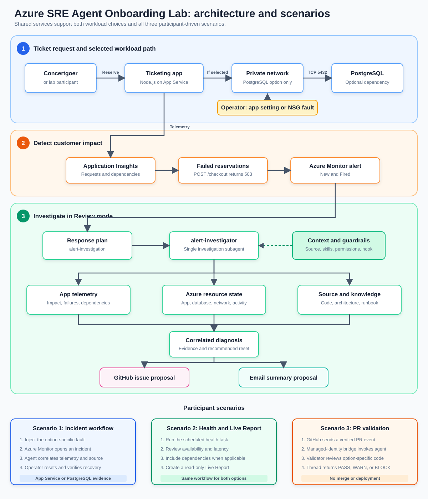

# Azure SRE Agent Onboarding Lab

Learn how Azure SRE Agent brings application telemetry, Azure resource state, source code, and operational knowledge into one investigation workflow so teams can diagnose incidents faster and respond consistently.

In this hands-on lab, you configure least-privilege access and safeguards, install a read-only incident response workflow, and learn how the same pattern supports proactive health checks and other scheduled operations. A sample ticketing app gives you a monitored environment in which to practice the complete setup.

## What you will learn

- Create an SRE Agent with scoped Azure RBAC, Review mode, tool policies, safety guidance, and evidence checks.
- Connect the agent to application telemetry, Azure Monitor incidents, source code, and operational knowledge.
- Build reusable workflows from triggers, skills, subagents, tools, and response plans.
- Run a read-only incident investigation while the operator controls mitigation and recovery.
- Apply the same workflow pattern to proactive operations such as scheduled health checks.

## Setup at a glance

Complete these three steps to prepare the agent for incident and proactive workflows.



## What is in this lab

| Path | Purpose |
| --- | --- |
| [`ticketingapp-source/`](ticketingapp-source/) | Self-contained azd project with the Node.js app and Bicep workload infrastructure. |
| [`agent-recipe/`](agent-recipe/) | Base-agent recipe with access, telemetry, Azure Monitor, source context, knowledge, hooks, prompts, policies, and the self-configuration skill. |
| [`workflow-templates/`](workflow-templates/) | Agent-only incident workflow and standalone scheduled-task YAML templates with their referenced skill content. |
| [`scripts/`](scripts/) | Prerequisite setup, workflow installation, and controlled fault helpers for macOS and Windows. |
| [`fault.bicep`](fault.bicep) | Narrow NSG rule update used only to inject or reset the lab incident. |
| [`tests/`](tests/) | Offline workflow-template validation. The app unit tests are under `ticketingapp-source/app/test/`. |

> [!IMPORTANT]
> This lab deploys billable Azure resources. Run the [cleanup](#cleanup) step when you finish.

## Before you start

| Requirement | Required? | Details |
| --- | --- | --- |
| Local tools | Yes | [Git](https://git-scm.com/downloads) and [VS Code](https://code.visualstudio.com/download) |
| macOS tools | On macOS | [Bash](https://formulae.brew.sh/formula/bash) and [`curl`](https://formulae.brew.sh/formula/curl) |
| Windows tools | On Windows | [Windows PowerShell](https://learn.microsoft.com/powershell/scripting/windows-powershell/install/installing-windows-powershell) and [WinGet](https://learn.microsoft.com/windows/package-manager/winget/) |
| Azure subscription | Yes | Must allow resource creation and role assignments |
| GitHub account | Yes | Fork the [ticketing app source repository](https://github.com/dm-chelupati/onboardinglab-sep15/fork) before deploying the agent |
| Email account | Optional | Required only to send incident summaries to approved recipients |
| Azure region | Yes | Choose an [SRE Agent supported region](https://learn.microsoft.com/azure/sre-agent/supported-regions). Sweden Central or East US 2 is suggested for this lab. |

## 0. Set up the local environment

**1. Clone the repository and go to the lab directory**

macOS:

```bash
git clone https://github.com/microsoft/sre-agent.git
cd sre-agent/labs/onboardinglab
```

Windows:

```powershell
git clone https://github.com/microsoft/sre-agent.git
Set-Location .\sre-agent\labs\onboardinglab
```

**2. Install the remaining prerequisites**

Run the command for your operating system. The script installs only missing tools, activates Node.js 22 or later in the current terminal, and restores the locked application dependencies through your configured npm registry.

macOS:

```bash
source ./scripts/prereqs.sh
```

Windows:

```powershell
. .\scripts\prereqs.ps1
```

To verify without installing, run `source ./scripts/prereqs.sh --check` on macOS or `. .\scripts\prereqs.ps1 -Check` on Windows.

## 1. Deploy the ticketing workload

**Run the deployment**

The command prompts for an environment name, your subscription, and a region. Choose **Sweden Central** or **East US 2**, or another [SRE Agent supported region](https://learn.microsoft.com/azure/sre-agent/supported-regions) that supports all resources in the template.

macOS:

```bash
azd auth login
az login
az provider register --namespace Microsoft.DBforPostgreSQL --wait
az provider register --namespace Microsoft.AlertsManagement --wait
pushd ./ticketingapp-source
azd up
popd
```

Windows:

```powershell
azd auth login
az login
az provider register --namespace Microsoft.DBforPostgreSQL --wait
az provider register --namespace Microsoft.AlertsManagement --wait
Push-Location .\ticketingapp-source
azd up
Pop-Location
```

**What `azd up` deploys**

| Resource | Role in the lab |
| --- | --- |
| Azure App Service | Hosts the Node.js ticket reservation experience and `POST /checkout` API |
| Azure Database for PostgreSQL | Accepts the application's fixed, read-only connectivity query |
| Virtual network and NSG | Provides the private database path and controlled fault boundary |
| Managed identities and RBAC | Authenticate the application and authorize agent reads |
| Application Insights and Log Analytics | Capture request, dependency, and platform telemetry |

The sample does not store ticket or payment data. Each reservation opens a PostgreSQL connection, runs `SELECT 1`, and closes the connection.

**Checkpoint: confirm a healthy baseline**

Retrieve the application URL:

```powershell
azd -C ./ticketingapp-source env get-value SERVICE_CHECKOUT_ENDPOINT_URL
```

Open the application URL and select **Reserve tickets**.

> [!TIP]
> Continue only when the reservation succeeds and the **Confirmed** count increases. A failed baseline request is a deployment problem, not the lab incident.

## 2. Deploy and connect the agent

**1. Fork the ticketing app repository**

The full lab runs from the `microsoft/sre-agent` clone. For the agent's Code Access connection, open [dm-chelupati/onboardinglab-sep15](https://github.com/dm-chelupati/onboardinglab-sep15/fork), select **Fork**, and create the fork under your GitHub account. This separate repository contains the same self-contained ticketing app azd project. In the fork, open **Settings** > **General** > **Features** and enable **Issues** so the workflow can propose incident follow-up issues.

Set your fork URL before continuing.

```bash
github_repository_url='https://github.com/YOUR-USER/onboardinglab-sep15.git'
```

Windows:

```powershell
$GitHubRepositoryUrl = 'https://github.com/YOUR-USER/onboardinglab-sep15.git'
```

Before continuing, open the fork's **Issues** tab and confirm the **New issue** button is available.

**2. Generate the base-agent configuration**

The commands use the workload resource group and telemetry created in step 1. Change `onboardinglab-agent-sep15` if you need another unique agent name.

macOS:

```bash
ticketingapp_dir="$PWD/ticketingapp-source"
agent_name='onboardinglab-agent-sep15'
subscription="$(azd -C "$ticketingapp_dir" env get-value AZURE_SUBSCRIPTION_ID)"
resource_group="$(azd -C "$ticketingapp_dir" env get-value AZURE_RESOURCE_GROUP)"
location="$(azd -C "$ticketingapp_dir" env get-value AZURE_LOCATION)"
config_dir="$ticketingapp_dir/.azure/$(azd -C "$ticketingapp_dir" env get-value AZURE_ENV_NAME)/$agent_name"

../../sreagent-templates/bin/new-agent.sh \
   --recipe-path ./agent-recipe \
   --subscription "$subscription" \
   --set agentName="$agent_name" \
   --set resourceGroup="$resource_group" \
   --set location="$location" \
   --set appInsightsId="$(azd -C "$ticketingapp_dir" env get-value APPLICATION_INSIGHTS_ID)" \
   --set appInsightsAppId="$(azd -C "$ticketingapp_dir" env get-value APPLICATION_INSIGHTS_APP_ID)" \
   --set githubRepo="$github_repository_url" \
   --set modelProvider='Anthropic' \
   --output "$config_dir" \
   --non-interactive
```

Windows:

```powershell
$TicketingAppDirectory = Join-Path $PWD 'ticketingapp-source'
$AgentName = 'onboardinglab-agent-sep15'
$Subscription = azd -C $TicketingAppDirectory env get-value AZURE_SUBSCRIPTION_ID
$ResourceGroup = azd -C $TicketingAppDirectory env get-value AZURE_RESOURCE_GROUP
$Location = azd -C $TicketingAppDirectory env get-value AZURE_LOCATION
$EnvironmentName = azd -C $TicketingAppDirectory env get-value AZURE_ENV_NAME
$ConfigDirectory = Join-Path $TicketingAppDirectory ".azure\$EnvironmentName\$AgentName"

& ..\..\sreagent-templates\bin\ps\New-Agent.ps1 `
   -RecipePath .\agent-recipe `
   -Subscription $Subscription `
   -Set @{
      agentName = $AgentName
      resourceGroup = $ResourceGroup
      location = $Location
      appInsightsId = (azd -C $TicketingAppDirectory env get-value APPLICATION_INSIGHTS_ID)
      appInsightsAppId = (azd -C $TicketingAppDirectory env get-value APPLICATION_INSIGHTS_APP_ID)
      githubRepo = $GitHubRepositoryUrl
      modelProvider = 'Anthropic'
   } `
   -Output $ConfigDirectory `
   -NonInteractive
```

Review the generated `agent.json`, `connectors.json`, managed connector, skill, incident-platform, repository, and `data/*.md` knowledge files before deployment. The shared deployer uploads the Markdown files automatically; do not upload them manually in the portal.

**3. Deploy the base agent**

Keep the terminal open during deployment. When it prints a GitHub OAuth URL, open the URL and approve the SRE Agent app within four minutes. The deployer then connects `ticketingapp-source` and completes strict verification.

macOS:

```bash
../../sreagent-templates/bin/deploy.sh \
   "$config_dir" \
   "${agent_name}-deployment" \
   --subscription "$subscription"
```

Windows:

```powershell
& ..\..\sreagent-templates\bin\ps\Deploy-Agent.ps1 `
   -InputPath $ConfigDirectory `
   -DeploymentName "$AgentName-deployment" `
   -Subscription $Subscription
```

The deployment command returns a nonzero exit code if any required base-agent component fails post-deployment verification. Additional workflow components already installed on the agent are preserved and do not cause verification failures.

**4. Save the agent for the workflow step**

macOS:

```bash
agent_id="/subscriptions/$subscription/resourceGroups/$resource_group/providers/Microsoft.App/agents/$agent_name"
agent_url="https://sre.azure.com/#/agent/$subscription/$resource_group/$agent_name"
azd -C "$ticketingapp_dir" env set SRE_AGENT_NAME "$agent_name"
azd -C "$ticketingapp_dir" env set SRE_AGENT_RESOURCE_ID "$agent_id"
azd -C "$ticketingapp_dir" env set SRE_AGENT_URL "$agent_url"
```

Windows:

```powershell
$AgentId = "/subscriptions/$Subscription/resourceGroups/$ResourceGroup/providers/Microsoft.App/agents/$AgentName"
$AgentUrl = "https://sre.azure.com/#/agent/$Subscription/$ResourceGroup/$AgentName"
azd -C $TicketingAppDirectory env set SRE_AGENT_NAME $AgentName
azd -C $TicketingAppDirectory env set SRE_AGENT_RESOURCE_ID $AgentId
azd -C $TicketingAppDirectory env set SRE_AGENT_URL $AgentUrl
```

**What the agent deployment sets up**

The recipe uses the same core flow described in [Create and set up your Azure SRE Agent](https://sre.azure.com/docs/get-started/create-and-setup). Investigation workflow configuration is installed separately in step 3.

| Resource or setup | What the deployment configures | Completion | Learn more |
| --- | --- | --- | --- |
| Azure SRE Agent | Creates the configured agent with Low access, Review mode, Preview upgrades, Anthropic as the default model provider, and a 10,000 monthly agent-unit limit. If Azure OpenAI is selected, the generated API value is `MicrosoftFoundry`. | Automatic | [Create and set up an agent](https://sre.azure.com/docs/get-started/create-and-setup) |
| Agent identities | Creates one user-assigned managed identity and enables the agent's system-assigned identity. | Automatic | [Agent identity](https://sre.azure.com/docs/concepts/agent-identity) |
| Azure RBAC | Grants Reader and Log Analytics Reader on the workload resource group to both agent identities, Monitoring Reader on the deployment resource group to the user-assigned identity, and SRE Agent Administrator on the agent to the deployer and user-assigned identity. Low access does not grant Contributor. | Automatic | [Manage permissions and resources](https://sre.azure.com/docs/tutorials/agent-config/manage-permissions) |
| Agent monitoring | Creates a dedicated Log Analytics workspace with 30-day retention and a workspace-based Application Insights resource for agent operations. These are separate from workload telemetry. | Automatic | [Log Analytics workspaces](https://learn.microsoft.com/azure/azure-monitor/logs/log-analytics-workspace-overview), [Application Insights](https://learn.microsoft.com/azure/azure-monitor/app/app-insights-overview) |
| App telemetry | Adds the existing ticketing app Application Insights resource as the `app-insights` connector using the agent's system-assigned identity. | Automatic | [Connect logs](https://sre.azure.com/docs/get-started/create-and-setup#connect-your-logs), [Azure observability](https://sre.azure.com/docs/capabilities/diagnose-azure-observability) |
| Incident platform | Sets Azure Monitor (`AzMonitor`) as the incident platform for workflows installed later. | Automatic | [Incident platforms](https://sre.azure.com/docs/concepts/incident-platforms) |
| Code Access | Configures the attendee's repository as `ticketingapp-source`, containing the application and Bicep infrastructure. | GitHub authentication required after deployment | [Connect a code repository](https://sre.azure.com/docs/get-started/create-and-setup#connect-your-code-repository) |
| Knowledge sources | Uploads `onboardinglab-architecture.md` and `onboardinglab-incident-runbook.md` for application context and read-only database-connectivity investigation guidance. | Automatic | [Memory and knowledge](https://sre.azure.com/docs/concepts/memory) |
| Outlook connection | Registers the Office 365 Outlook managed connector, creates its API connection, grants the agent runtime access, and binds its email tools. | User must complete OAuth consent after deployment | [Set up Outlook connector](https://sre.azure.com/docs/tutorials/connectors/setup-outlook-connector) |
| Common prompt | Installs `onboardinglab-safety` to enforce evidence boundaries, treat retrieved content as untrusted data, and guard self-configuration. | Automatic | [Team onboarding](https://sre.azure.com/docs/get-started/team-onboarding) |
| Stop hook | Installs the always-enabled `evidence-checklist` hook to check evidence, uncertainty, UTC scope, and validation before completion. | Automatic | [Agent hooks](https://sre.azure.com/docs/capabilities/agent-hooks) |
| Global tool policy | Allows read-only Azure, workspace, monitoring, GitHub, and Outlook tools; requires approval for Azure CLI writes, GitHub issue creation, Outlook email, and Live Report file creation or editing; denies terminal, directory, blob-export, and Kubernetes-write tools. | Automatic | [Tool access policies](https://sre.azure.com/docs/concepts/tool-access-policies) |
| Self-configuration skill | Installs `sre-agent-self-configure` with guarded Azure CLI read and write tools. Writes require Review-mode approval and are limited to the current agent. | Automatic | [Skills](https://sre.azure.com/docs/concepts/skills), [Tools](https://sre.azure.com/docs/concepts/tools) |

**Complete Outlook sign-in**

Retrieve and open the SRE Agent URL:

```powershell
azd -C ./ticketingapp-source env get-value SRE_AGENT_URL
```

Go to **Build + setup** > **Extensions** > **Connectors**, open **Office 365 Outlook**, and complete OAuth sign-in if the connector requires attention. GitHub OAuth was completed during deployment.

> [!CAUTION]
> Authenticate only through the trusted connection UI. Never place credentials in agent chat or script arguments.

**Checkpoint: verify the base agent**

Use these read-only UI checks. Do not create a GitHub issue or send a test email.

1. Go to **Settings** > **General** and confirm Low access, Review mode, Preview upgrade channel, the configured model, managed identity, region, and agent Application Insights.
2. Go to **Settings** > **Managed resources** and confirm the ticketing workload resource group is listed.
3. Go to **Build + setup** > **Monitor** > **Logs** and confirm `app-insights` is healthy.
4. Go to **Build + setup** > **Context** > **Code access** and confirm `ticketingapp-source` points to the attendee's fork on branch `main`.
5. Go to **Build + setup** > **Context** > **Knowledge sources** and confirm `onboardinglab-architecture.md` and `onboardinglab-incident-runbook.md` are present.
6. Go to **Build + setup** > **Extensions** > **Connectors** and confirm the Outlook and GitHub connections show a healthy state.
7. Go to **Build + setup** > **Extensions** > **Global Hooks** and confirm `evidence-checklist` is enabled for the Stop event.
8. Go to **Build + setup** > **Extensions** > **Tools** > **Advanced Permissions** and confirm the configured allow, ask, and deny patterns.
9. Go to **Build + setup** > **Extensions** > **Skill Builder** and confirm `sre-agent-self-configure` is present with its three Azure CLI tools.
10. Go to **Incidents** and confirm Azure Monitor is connected. Common prompts do not have a current portal page; the post-deployment verifier checks `onboardinglab-safety` through the agent API.

## 3. Install the incident and health workflows

The installer accepts the existing agent name, subscription, workflow template, and approved notification email recipient. It renders that recipient only into the incident and health-report subagents; it is not added to the global agent prompt. The installer discovers the agent resource group, validates Azure Monitor and app telemetry, and installs two independent workflows. The incident trigger routes to `alert-investigator` through the `alert-investigation` response plan. The active `reservation-daily-health-report` scheduled task routes directly to `health-report-investigator`. It does not install or validate the pull-request workflow used in Scenario 3.

macOS:

```bash
./scripts/install-workflow-template.sh \
   --subscription "$subscription" \
   --agent-name "$agent_name" \
   --notification-email-recipient 'YOUR-EMAIL@EXAMPLE.COM' \
   --template ./workflow-templates/incidentinvestigation-workflowtemplate.yaml
```

Windows:

```powershell
./scripts/install-workflow-template.ps1 `
   -Subscription $Subscription `
   -AgentName $AgentName `
   -NotificationEmailRecipient 'YOUR-EMAIL@EXAMPLE.COM' `
   -Template .\workflow-templates\incidentinvestigation-workflowtemplate.yaml
```

**What the workflow template installs**

| Type | Installed component | Purpose | Learn more |
| --- | --- | --- | --- |
| Skill | `azure-monitor-rca` | Guides evidence-based Azure Monitor investigation. | [Skills](https://sre.azure.com/docs/concepts/skills) |
| Skill | `github-issue-followup` | Prepares a deduplicated GitHub incident follow-up when that optional capability is available and approved. | [Connectors](https://sre.azure.com/docs/concepts/connectors) |
| Skill | `email-incident-followup` | Prepares an Outlook incident summary when that optional capability is available and approved. | [Send notifications](https://sre.azure.com/docs/capabilities/send-notifications) |
| Skill | `proactive-health-check` | Assesses ticket reservation availability, failures, latency, dependencies, and Azure resource health using read-only evidence. | [Skills](https://sre.azure.com/docs/concepts/skills) |
| Subagent | `alert-investigator` | Correlates telemetry, Azure state, and source evidence without Azure write tools, adding time-series or comparison charts when they clarify measured evidence. | [Custom agents](https://sre.azure.com/docs/concepts/subagents) |
| Response plan | `alert-investigation` | Routes Azure Monitor Sev1 and Sev2 incidents to the `alert-investigator` subagent in Review mode and merges related incidents for three hours. | [Incident response plans](https://sre.azure.com/docs/capabilities/incident-response-plans) |
| Subagent | `health-report-investigator` | Runs proactive reservation health analysis with the health-check and email follow-up skills, charting meaningful health trends and baseline comparisons. | [Custom agents](https://sre.azure.com/docs/concepts/subagents) |
| Scheduled task | `reservation-daily-health-report` | Runs on weekdays and routes directly to the `health-report-investigator` subagent. The recurring schedule is installed active. | [Scheduled tasks](https://sre.azure.com/docs/capabilities/scheduled-tasks) |

**Checkpoint: verify the workflow**

1. Go to **Build + setup** > **Extensions** > **Skill Builder** and confirm the four workflow skills are present.
2. Go to **Build + setup** > **Workflows** and confirm the `alert-investigator` and `health-report-investigator` subagents are present. Both must include the discovered telemetry query tool, `PlotAreaChartWithCorrelation`, and `PlotBarChart`.
3. In **Workflows**, confirm the `alert-investigation` response plan routes Azure Monitor Sev1 and Sev2 incidents to the `alert-investigator` subagent in Review mode.
4. Go to **Build + setup** > **Scheduled tasks** and confirm `reservation-daily-health-report` is active and its handling agent is `health-report-investigator`.

## Architecture and responsibilities

| You operate | SRE Agent operates |
| --- | --- |
| Generate reservation demand | Detect and investigate the incident |
| Inject and reset the controlled NSG fault | Run application, PostgreSQL, network, and source-code checks |
| Decide and execute recovery | Correlate evidence and recommend the reset |
| Verify service recovery | Propose optional GitHub and Outlook follow-ups for review |

The agent identities use Azure RBAC for resource and telemetry access. The agent permission policy separately prevents Azure writes, shell execution, and workspace mutation.

## Scenario 1: Incident workflow

The diagram shows how the deployed app, Azure Monitor incident, response plan, subagent, and optional follow-ups connect during this scenario.



[Open the architecture diagram full size](assets/architecture.svg).

**Trigger the incident**

1. Inject the database network fault:

   macOS:

   ```bash
   ./scripts/fault.sh inject
   ```

   Windows:

   ```powershell
   ./scripts/fault.ps1 inject
   ```

2. In the ticketing application, select **Launch on-sale simulation**.
3. Confirm that reservations fail while the service health check remains available.

**Observe the incident workflow**

Allow time for telemetry ingestion, the five-minute alert evaluation, and the next agent scan. Then:

1. Open the incident thread.
2. Review the application, PostgreSQL, network, and source-code evidence.
3. Confirm that the diagnosis identifies the TCP 5432 NSG deny rule.
4. Review any optional GitHub issue or Outlook email proposal before approving it.

The `alert-investigation` response plan routes the alert to the `alert-investigator` subagent in Review mode. The subagent correlates app telemetry, Azure configuration, Activity Log, and available source evidence, then recommends the operator-owned reset.

**Recover and verify**

1. Restore connectivity:

   macOS:

   ```bash
   ./scripts/fault.sh reset
   ```

   Windows:

   ```powershell
   ./scripts/fault.ps1 reset
   ```

2. Return to the application and confirm that new reservations succeed.

**Expected result**

- The incident thread identifies the blocked app-to-database path
- The thread contains timestamped app telemetry, Azure state, and source evidence
- Optional GitHub and Outlook writes remain subject to approval
- After your reset, ticket reservations succeed again

## Scenario 2: Scheduled health check and Live Report

This optional scenario assesses the same service without introducing a fault, then turns the reviewed findings into a reusable operational view.

**Run the scheduled task**

1. Go to **Build + setup** > **Scheduled tasks**.
2. Open `reservation-daily-health-report`.
3. Select **Run task now**. Leave the recurring schedule active.
4. Review the result in the task thread.

The task uses `proactive-health-check` to review ticket reservation availability, failures, latency, dependency health, and Azure resource health over the last 24 hours. It compares with prior data only when enough history exists and reports missing history explicitly. It then proposes the same summary to the configured Outlook recipient for Review-mode approval.

**Create the Live Report**

1. Select **Live Reports** in the navigation.
2. Select **+ New report**.
3. Enter this request:

   ```text
   Build a Live Report called "Ticket Reservation Health" from the connected
   Application Insights data. Cover the last 24 hours and show reservation request
   volume, availability, failure rate, latency, and PostgreSQL dependency health.
   Include clear status indicators, trend charts, and a summary of missing data.
   Keep the report read-only.
   ```

4. Review the tools the report will use and approve only the read-only behavior you expect.
5. Wait for the report to save, then open it from **Live Reports**.

The scheduled task and Live Report are separate operations. The task records evidence in its own thread; creating the report does not automatically copy task output or enable the recurring schedule.

**Expected result**

- The task thread contains timestamped findings, evidence, risks, and recommended follow-up
- The recurring task remains active and can also be run on demand
- `Ticket Reservation Health` appears in **Live Reports** with refreshable read-only charts and status indicators
- Neither operation modifies Azure resources or creates issues; the task sends email only after Review-mode approval

## Scenario 3: Pull-request validation

This optional scenario validates an actual pull-request diff without deploying it. GitHub Actions sends a normalized event to the Logic App callback, the bridge authenticates to SRE Agent with managed identity, and `pr-validator` records a `PASS`, `WARN`, or `BLOCK` recommendation in the resulting agent thread.

**Install the pull-request workflow**

This installer updates only the `ticketing-pr-validation` skill, `pr-validator` subagent, HTTP trigger, and managed-identity Logic App bridge. It does not query, reinstall, or validate the incident response plan or scheduled task.

macOS:

```bash
./scripts/install-pr-validation.sh \
   --subscription "$subscription" \
   --agent-name "$agent_name" \
   --template ./workflow-templates/http-triggers/pr-validation.yaml
```

Windows:

```powershell
./scripts/install-pr-validation.ps1 `
   -Subscription $Subscription `
   -AgentName $AgentName `
   -Template .\workflow-templates\http-triggers\pr-validation.yaml
```

The installer verifies the skill, subagent tools and allowed skill, Review-mode trigger binding, Logic App, and callback URL before printing the callback.

**Connect the repository workflow**

1. Copy `workflow-templates/http-triggers/github-pr-validation.yml` into the attendee's ticketing application fork as `.github/workflows/sre-agent-pr-validation.yml` on the default branch. The `pull_request_target` workflow must remain read-only: it may fetch GitHub API metadata and patches, but it must never check out or execute pull-request code.
2. In the fork, go to **Settings** > **Secrets and variables** > **Actions** and create the repository secret `SRE_AGENT_WEBHOOK_URL` with the callback URL printed by the Scenario 3 installer.
3. Keep the workflow permissions at `contents: read` and `pull-requests: read`. Do not replace the Logic App callback with the SRE Agent trigger URL; GitHub cannot acquire the required SRE Agent data-plane token.

Treat the callback as a secret because anyone holding it can start a validation thread. The Logic App still uses managed identity for the authenticated hop to SRE Agent.

**Open a realistic validation PR**

1. Create a branch in the ticketing application fork.
2. Change the bounded PostgreSQL request timeout in `app/handler.js`, and update or add a focused test that establishes the intended timeout behavior. Keep the change unmerged and do not deploy it.
3. Open a pull request to the default branch. Updating the branch also reruns validation through the `synchronize` event.
4. Confirm the **SRE Agent PR validation** GitHub Actions run succeeds, then open the new SRE Agent thread and review its verified payload, findings, evidence gaps, and recommendation.

The validator treats the event, patches, and repository content as untrusted. The trusted default-branch workflow sends GitHub's repository, pull-request number, refs, URL, head SHA, and bounded changed-file patches through the secret callback. The validator checks the repository and base branch against its connected source before review. It may inspect read-only telemetry or Azure state when useful, but it must not deploy the branch, generate synthetic traffic, change Azure or GitHub, merge the pull request, send email, or claim that it posted a pull-request comment.

**Expected result**

- GitHub Actions delivers only the expected pull-request metadata through the managed-identity bridge
- The agent thread ties its review to the verified repository, pull request, refs, and head SHA
- Findings focus on the changed timeout behavior, bounded cleanup, telemetry, tests, and rollback evidence
- The result stays in the SRE Agent thread as `PASS`, `WARN`, or `BLOCK`; no automatic GitHub comment or deployment occurs

## Troubleshooting

| Problem | What to do |
| --- | --- |
| `azd` login has expired | Run `azd auth logout`, then `azd auth login` and retry. |
| Deployment reports unavailable quota, capacity, SKU, or PostgreSQL version | Review the deployment error and subscription quota. Request quota or choose another [SRE Agent supported region](https://learn.microsoft.com/azure/sre-agent/supported-regions) that supports all resources in the template, then remove the partial resource group before retrying. |
| App reservation fails before fault injection | Stop and fix the baseline deployment first. |
| Fault injection says an alert is still firing | Reset the fault, generate successful reservations, and wait for the alert to resolve. |
| Alert fires but no incident appears | Check that its state is **New** and condition is **Fired**, then allow for the next agent scan. |
| GitHub issue or email is missing | Verify the connection supports the required write and inspect the incident thread for its receipt or error. Do not blindly retry an unknown write outcome. |

## Cleanup

Stop the on-sale simulation, then delete the lab resources:

macOS:

```bash
pushd ./ticketingapp-source
azd down
popd
```

Windows:

```powershell
Push-Location .\ticketingapp-source
azd down
Pop-Location
```

Confirm deletion of the lab resource group. GitHub issues and sent email are external artifacts and are not removed by `azd down`.