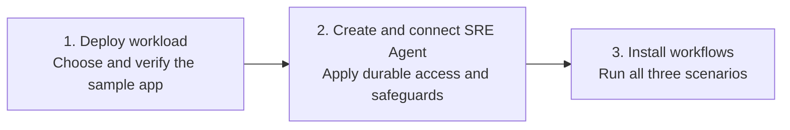

# Azure SRE Agent Onboarding Lab

Learn how Azure SRE Agent brings application telemetry, Azure resource state, source code, and operational knowledge into one investigation workflow so teams can diagnose incidents faster and respond consistently.

In this hands-on lab, you configure least-privilege access and safeguards, install a read-only incident response workflow, and learn how the same pattern supports proactive health checks and other scheduled operations. A sample ticketing app gives you a monitored environment in which to practice the complete setup.

## What you will learn

- Create an SRE Agent with scoped Azure RBAC, Review mode, tool policies, safety guidance, and evidence checks.
- Connect the agent to application telemetry, Azure Monitor incidents, source code, and operational knowledge.
- Build reusable workflows from triggers, skills, subagents, tools, and response plans.
- Run a read-only incident investigation while the operator controls mitigation and recovery.
- Apply the same workflow pattern to scheduled health checks and evidence-grounded Live Reports.
- Connect GitHub pull-request events to a dedicated validator through an authenticated HTTP-trigger bridge.
- Compare realistic good and bad changes, producing `PASS` or `BLOCK` guidance while both pull requests remain unmerged and undeployed.

## Setup at a glance

The lab always has three steps. The setup path you choose changes how you complete
Steps 1 and 2; it does not remove either step.



## What is in this lab

| Path | Purpose |
| --- | --- |
| [`ticketingapp-source/`](ticketingapp-source/) | Self-contained azd project with the Node.js app and Bicep workload infrastructure. |
| [`agent-recipe/`](agent-recipe/) | Base-agent recipe with access, telemetry, Azure Monitor, source context, knowledge, hooks, prompts, policies, and the self-configuration skill. |
| [`workflow-templates/`](workflow-templates/) | Agent-only incident workflow and standalone scheduled-task YAML templates with their referenced skill content. |
| [`scripts/`](scripts/) | Prerequisite setup, workflow installation, and controlled fault helpers for macOS and Windows. |
| [`fault.bicep`](fault.bicep) | Narrow NSG rule update used only to inject or reset the lab incident. |
| [`tests/`](tests/) | Offline workflow-template validation. The app unit tests are under `ticketingapp-source/app/test/`. |

> [!IMPORTANT]
> This lab deploys billable Azure resources. Run the [cleanup](#cleanup) step when you finish.

## Before you start

| Requirement | Required? | Details |
| --- | --- | --- |
| Local tools | For local setup, Step 3, and scenarios | [Git](https://git-scm.com/downloads), a terminal and editor such as [VS Code](https://code.visualstudio.com/download), Visual Studio, or an IntelliJ-based IDE, and the prerequisites installed in Step 3 |
| macOS tools | On macOS | [Bash](https://formulae.brew.sh/formula/bash) and [`curl`](https://formulae.brew.sh/formula/curl) |
| Windows tools | On Windows | [PowerShell 7](https://learn.microsoft.com/powershell/scripting/install/installing-powershell-on-windows) and [WinGet](https://learn.microsoft.com/windows/package-manager/winget/) |
| Azure subscription | Yes | Must allow resource creation and role assignments |
| GitHub account | Yes | Fork [`microsoft/sre-agent`](https://github.com/microsoft/sre-agent/fork) before setup and enable Issues on the fork. One interactive OAuth consent lets the agent use that fork for source access, issue creation, and pull-request validation. |
| Email account | Optional | Required only to send incident summaries to approved recipients |
| Azure region | Yes | This lab uses Sweden Central. The App Service + PostgreSQL option also depends on PostgreSQL Flexible Server 16 / `Standard_B1ms` capability for the participant's subscription in Sweden Central. |

From the `labs/onboardinglab` directory, run the check command for your platform
to confirm the local prerequisites before starting. Check mode reports missing or
outdated tools without installing or changing them.

macOS:

```bash
source ./scripts/prereqs.sh --check
```

Windows:

```powershell
. .\scripts\prereqs.ps1 -Check
```

If the check reports missing prerequisites, run the same command without `--check`
or `-Check` to install or configure them as described in Step 1.

## Choose how to complete Steps 1 and 2

All paths deploy the same workload and produce the same final SRE Agent. Choose one
path for Steps 1 and 2, verify its checkpoints, and then continue to Step 3.

| Path | When to use it | What you do |
| --- | --- | --- |
| **Copilot-assisted local setup (recommended)** | You have this repository open in a coding environment with Copilot and want guided execution. | Ask Copilot to follow this README for Steps 1 and 2. Review every proposed command and Azure change. Copilot uses the same repository-owned local commands described under **Local setup for Steps 1 and 2**; it is not a separate deployment model. |
| **Manual local setup** | You prefer to run and inspect each command yourself. | Follow **Local setup for Steps 1 and 2** directly. You deploy the workload with `azd`, then generate and deploy the base-agent configuration. |
| **SRE Agent-assisted setup** | You want the final SRE Agent to deploy and configure the lab after a minimal bootstrap. | Run `bootstrap-agent.ps1` from local PowerShell or Azure Cloud Shell. The bootstrap creates the agent required to start, and that same agent then runs the repository deployment script to complete Steps 1 and 2. |

Suggested prompt for the recommended path:

```text
Follow labs/onboardinglab/README.md to complete Steps 1 and 2 using the local
setup path. Show me each command and its effect before running it, preserve my
selected workload option, stop on any failed checkpoint, and do not continue to
Step 3 until I confirm the workload and base agent are healthy.
```

## Choose a workload option

Both options cover the same three participant-driven learning scenarios. Choose the
workload that fits the Azure capability available to you.

| Option | Workload and incident evidence |
| --- | --- |
| **App Service** | App Service, Application Insights, and Log Analytics. Scenario 1 uses a controlled application 503 while `/healthz` remains healthy. |
| **App Service + PostgreSQL** | The same services plus PostgreSQL Flexible Server, private networking, and managed-identity database access. Scenario 1 uses the existing database-connectivity fault. |

| Scenario | App Service | App Service + PostgreSQL |
| --- | --- | --- |
| **1. Incident workflow** | Investigates a controlled application 503 and `APP_FAULT_ENABLED`. | Investigates failed PostgreSQL dependencies and the TCP 5432 NSG rule. |
| **2. Scheduled health check and Live Report** | Reports request availability, failures, latency, and App Service health. | Reports the same signals plus PostgreSQL dependency health. |
| **3. Pull-request validation** | Creates App Service-specific `PASS` and `BLOCK` sample changes. | Creates PostgreSQL-specific `PASS` and `BLOCK` sample changes. |

> [!NOTE]
> The App Service + PostgreSQL option depends on PostgreSQL Flexible Server regional
> capability and SKU availability for your subscription. The lab currently uses
> PostgreSQL 16 with `Standard_B1ms` in Sweden Central. Setup checks that capability
> before deployment and does not silently change the selected option.

## 1. Deploy the workload

<details open>
<summary><strong>Recommended: local setup for Steps 1 and 2 (Copilot-assisted or manual)</strong></summary>

Use these commands when working locally, either with Copilot guidance or by running
them yourself. They are a supported participant path, not only a maintainer fallback.
The workload and agent remain separate steps so you can review and verify each
boundary before continuing.

### Prepare the local workspace

Clone the public repository and install the lab prerequisites before running the
local commands. Create a fork later only if you choose an optional GitHub scenario.

macOS:

```bash
git clone https://github.com/microsoft/sre-agent.git
cd sre-agent/labs/onboardinglab
source ./scripts/prereqs.sh
```

Windows:

```powershell
git clone https://github.com/microsoft/sre-agent.git
Set-Location .\sre-agent\labs\onboardinglab
. .\scripts\prereqs.ps1
```

For an optional GitHub or pull-request scenario, create and clone your own fork
instead (requires the GitHub CLI):

```bash
gh repo fork microsoft/sre-agent --clone
```

The prerequisite script installs only missing tools, activates Node.js 22 or later in
the current terminal, and restores locked application dependencies. To verify without
installing, run `source ./scripts/prereqs.sh --check` on macOS or
`. .\scripts\prereqs.ps1 -Check` on Windows.

### Local workload deployment

**Run the deployment**

The command prompts for an environment name, your subscription, and a region. Choose **Sweden Central** or **East US 2**, or another [SRE Agent supported region](https://learn.microsoft.com/azure/sre-agent/supported-regions) that supports all resources in the template.

macOS:

```bash
workload_option='app-service' # or 'app-service-postgresql'
azd auth login
az login
az provider register --namespace Microsoft.AlertsManagement --wait
if [[ "$workload_option" == 'app-service-postgresql' ]]; then
  az provider register --namespace Microsoft.DBforPostgreSQL --wait
fi
azd -C ./ticketingapp-source env set LAB_WORKLOAD_OPTION "$workload_option"
azd -C ./ticketingapp-source up
```

Windows:

```powershell
$WorkloadOption = 'app-service' # or 'app-service-postgresql'
azd auth login
az login
az provider register --namespace Microsoft.AlertsManagement --wait
if ($WorkloadOption -eq 'app-service-postgresql') {
   az provider register --namespace Microsoft.DBforPostgreSQL --wait
}
azd -C .\ticketingapp-source env set LAB_WORKLOAD_OPTION $WorkloadOption
azd -C .\ticketingapp-source up
```

**What `azd up` deploys**

| Resource | App Service | App Service + PostgreSQL | Role in the lab |
| --- | --- | --- | --- |
| Azure App Service | Yes | Yes | Hosts the Node.js ticket reservation experience and `POST /checkout` API |
| Application Insights and Log Analytics | Yes | Yes | Capture request, dependency, and platform telemetry |
| Managed identities and RBAC | Yes | Yes | Authenticate the application and authorize agent reads |
| Azure Monitor alert rule | Yes | Yes | Detects the controlled failure used in Scenario 1 |
| Azure Database for PostgreSQL | No | Yes | Accepts the application's fixed connectivity query |
| Virtual network and NSG | No | Yes | Provides the private database path and controlled fault boundary |

The sample does not store ticket or payment data. With the PostgreSQL option, each
reservation also opens a PostgreSQL connection, runs `SELECT 1`, and closes the
connection. The App Service option avoids the PostgreSQL resources and uses a
controlled application failure for the incident scenario.

**Checkpoint: confirm a healthy baseline**

Retrieve the application URL:

```powershell
azd -C ./ticketingapp-source env get-value SERVICE_CHECKOUT_ENDPOINT_URL
```

Open the application URL and select **Reserve tickets**.

> [!TIP]
> Continue only when the reservation succeeds and the **Confirmed** count increases. A failed baseline request is a deployment problem, not the lab incident.

### Local agent deployment

**1. Fork the sre-agent repository**

Open [`microsoft/sre-agent`](https://github.com/microsoft/sre-agent/fork), select
**Fork**, and create the fork under your GitHub account. In the fork, open
**Settings** > **General** > **Features** and enable **Issues**. The same fork is used
for source access, approved incident follow-up issues, and Scenario 3 pull requests.

Set your fork URL before continuing.

```bash
github_repository_url='https://github.com/YOUR-USER/sre-agent'
```

Windows:

```powershell
$GitHubRepositoryUrl = 'https://github.com/YOUR-USER/sre-agent'
```

Before continuing, open the fork's **Issues** tab and confirm the **New issue** button is available.

**2. Generate the base-agent configuration**

The commands use the workload resource group and telemetry created in step 1. Change `onboardinglab-agent-sep15` if you need another unique agent name.

macOS:

```bash
ticketingapp_dir="$PWD/ticketingapp-source"
agent_name='onboardinglab-agent-sep15'
subscription="$(azd -C "$ticketingapp_dir" env get-value AZURE_SUBSCRIPTION_ID)"
resource_group="$(azd -C "$ticketingapp_dir" env get-value AZURE_RESOURCE_GROUP)"
location="$(azd -C "$ticketingapp_dir" env get-value AZURE_LOCATION)"
config_dir="$ticketingapp_dir/.azure/$(azd -C "$ticketingapp_dir" env get-value AZURE_ENV_NAME)/$agent_name"

../../sreagent-templates/bin/new-agent.sh \
   --recipe-path ./agent-recipe \
   --subscription "$subscription" \
   --set agentName="$agent_name" \
   --set resourceGroup="$resource_group" \
   --set location="$location" \
   --set appInsightsId="$(azd -C "$ticketingapp_dir" env get-value APPLICATION_INSIGHTS_ID)" \
   --set appInsightsAppId="$(azd -C "$ticketingapp_dir" env get-value APPLICATION_INSIGHTS_APP_ID)" \
   --set githubRepo="$github_repository_url" \
   --set modelProvider='Anthropic' \
   --output "$config_dir" \
   --non-interactive
```

Windows:

```powershell
$TicketingAppDirectory = Join-Path $PWD 'ticketingapp-source'
$AgentName = 'onboardinglab-agent-sep15'
$Subscription = azd -C $TicketingAppDirectory env get-value AZURE_SUBSCRIPTION_ID
$ResourceGroup = azd -C $TicketingAppDirectory env get-value AZURE_RESOURCE_GROUP
$Location = azd -C $TicketingAppDirectory env get-value AZURE_LOCATION
$EnvironmentName = azd -C $TicketingAppDirectory env get-value AZURE_ENV_NAME
$ConfigDirectory = Join-Path $TicketingAppDirectory ".azure\$EnvironmentName\$AgentName"

& ..\..\sreagent-templates\bin\ps\New-Agent.ps1 `
   -RecipePath .\agent-recipe `
   -Subscription $Subscription `
   -Set @{
      agentName = $AgentName
      resourceGroup = $ResourceGroup
      location = $Location
      appInsightsId = (azd -C $TicketingAppDirectory env get-value APPLICATION_INSIGHTS_ID)
      appInsightsAppId = (azd -C $TicketingAppDirectory env get-value APPLICATION_INSIGHTS_APP_ID)
      githubRepo = $GitHubRepositoryUrl
      modelProvider = 'Anthropic'
   } `
   -Output $ConfigDirectory `
   -NonInteractive
```

Review the generated `agent.json`, `connectors.json`, managed connector, skill, incident-platform, repository, and `data/*.md` knowledge files before deployment. The shared deployer uploads the Markdown files automatically; do not upload them manually in the portal.

**3. Deploy the base agent**

Keep the terminal open during deployment. When it prints a GitHub OAuth URL, open the URL and approve the SRE Agent app within four minutes. The deployer then connects the fork as `sre-agent` and completes strict verification.

macOS:

```bash
../../sreagent-templates/bin/deploy.sh \
   "$config_dir" \
   "${agent_name}-deployment" \
   --subscription "$subscription"
```

Windows:

```powershell
& ..\..\sreagent-templates\bin\ps\Deploy-Agent.ps1 `
   -InputPath $ConfigDirectory `
   -DeploymentName "$AgentName-deployment" `
   -Subscription $Subscription
```

The deployment command returns a nonzero exit code if any required base-agent component fails post-deployment verification. Additional workflow components already installed on the agent are preserved and do not cause verification failures.

**4. Save the agent for the workflow step**

macOS:

```bash
agent_id="/subscriptions/$subscription/resourceGroups/$resource_group/providers/Microsoft.App/agents/$agent_name"
agent_url="https://sre.azure.com/#/agent/$subscription/$resource_group/$agent_name"
azd -C "$ticketingapp_dir" env set SRE_AGENT_NAME "$agent_name"
azd -C "$ticketingapp_dir" env set SRE_AGENT_RESOURCE_ID "$agent_id"
azd -C "$ticketingapp_dir" env set SRE_AGENT_URL "$agent_url"
```

Windows:

```powershell
$AgentId = "/subscriptions/$Subscription/resourceGroups/$ResourceGroup/providers/Microsoft.App/agents/$AgentName"
$AgentUrl = "https://sre.azure.com/#/agent/$Subscription/$ResourceGroup/$AgentName"
azd -C $TicketingAppDirectory env set SRE_AGENT_NAME $AgentName
azd -C $TicketingAppDirectory env set SRE_AGENT_RESOURCE_ID $AgentId
azd -C $TicketingAppDirectory env set SRE_AGENT_URL $AgentUrl
```

**What the agent deployment sets up**

The recipe uses the same core flow described in [Create and set up your Azure SRE Agent](https://sre.azure.com/docs/get-started/create-and-setup). Investigation workflow configuration is installed separately in Step 3.

| Resource or setup | What the deployment configures | Completion | Learn more |
| --- | --- | --- | --- |
| Azure SRE Agent | Creates the configured agent with Reader permissions, Review mode, Preview upgrades, Anthropic as the default model provider, and a 10,000 monthly agent-unit limit. If Azure OpenAI is selected, the generated API value is `MicrosoftFoundry`. | Automatic | [Create and set up an agent](https://sre.azure.com/docs/get-started/create-and-setup) |
| Agent identities | Creates one user-assigned managed identity and enables the agent's system-assigned identity. | Automatic | [Agent identity](https://sre.azure.com/docs/concepts/agent-identity) |
| Azure RBAC | Grants Reader and Log Analytics Reader on the workload resource group to both agent identities, Monitoring Reader on the deployment resource group to the user-assigned identity, and SRE Agent Administrator on the agent to the deployer and user-assigned identity. Reader permissions do not grant Contributor. | Automatic | [Manage permissions and resources](https://sre.azure.com/docs/tutorials/agent-config/manage-permissions) |
| Agent monitoring | Creates a dedicated Log Analytics workspace with 30-day retention and a workspace-based Application Insights resource for agent operations. These are separate from workload telemetry. | Automatic | [Log Analytics workspaces](https://learn.microsoft.com/azure/azure-monitor/logs/log-analytics-workspace-overview), [Application Insights](https://learn.microsoft.com/azure/azure-monitor/app/app-insights-overview) |
| App telemetry | Adds the existing ticketing app Application Insights resource as the `app-insights` connector using the agent's system-assigned identity. | Automatic | [Connect logs](https://sre.azure.com/docs/get-started/create-and-setup#connect-your-logs), [Azure observability](https://sre.azure.com/docs/capabilities/diagnose-azure-observability) |
| Incident platform | Sets Azure Monitor (`AzMonitor`) as the incident platform for workflows installed later. | Automatic | [Incident platforms](https://sre.azure.com/docs/concepts/incident-platforms) |
| Code Access | Configures the attendee's `sre-agent` fork, containing the lab, ticketing application, and Bicep infrastructure. The same OAuth connection supports approved issue creation and Scenario 3. | One GitHub OAuth consent required | [Connect a code repository](https://sre.azure.com/docs/get-started/create-and-setup#connect-your-code-repository) |
| Knowledge sources | Uploads `onboardinglab-architecture.md` and `onboardinglab-incident-runbook.md` for application context and read-only database-connectivity investigation guidance. | Automatic | [Memory and knowledge](https://sre.azure.com/docs/concepts/memory) |
| Outlook connection | Registers the Office 365 Outlook managed connector, creates its API connection, grants the agent runtime access, and binds its email tools. | User must complete OAuth consent after deployment | [Set up Outlook connector](https://sre.azure.com/docs/tutorials/connectors/setup-outlook-connector) |
| Common prompt | Installs `onboardinglab-safety` to enforce evidence boundaries, treat retrieved content as untrusted data, and guard self-configuration. | Automatic | [Team onboarding](https://sre.azure.com/docs/get-started/team-onboarding) |
| Stop hook | Installs the always-enabled `evidence-checklist` hook to check evidence, uncertainty, UTC scope, and validation before completion. | Automatic | [Agent hooks](https://sre.azure.com/docs/capabilities/agent-hooks) |
| Global tool policy | Allows read-only Azure, workspace, monitoring, GitHub, and Outlook tools; requires approval for Azure CLI writes, GitHub issue creation, Outlook email, and Live Report file creation or editing; denies terminal, directory, blob-export, and Kubernetes-write tools. | Automatic | [Tool access policies](https://sre.azure.com/docs/concepts/tool-access-policies) |
| Self-configuration skill | Installs `sre-agent-self-configure` with guarded Azure CLI read and write tools. Writes require Review-mode approval and are limited to the current agent. | Automatic | [Skills](https://sre.azure.com/docs/concepts/skills), [Tools](https://sre.azure.com/docs/concepts/tools) |

**Complete Outlook sign-in**

Retrieve and open the SRE Agent URL:

```powershell
azd -C ./ticketingapp-source env get-value SRE_AGENT_URL
```

Go to **Build + setup** > **Extensions** > **Connectors**, open **Office 365 Outlook**, and complete OAuth sign-in if the connector requires attention. GitHub OAuth was completed during deployment.

> [!CAUTION]
> Authenticate only through the trusted connection UI. Never place credentials in agent chat or script arguments.

**Checkpoint: verify the base agent**

Use these read-only UI checks. Do not create a GitHub issue or send a test email.

1. Go to **Settings** > **General** and confirm Reader permissions, Review mode, Preview upgrade channel, the configured model, managed identity, region, and agent Application Insights.
2. Go to **Settings** > **Managed resources** and confirm the ticketing workload resource group is listed.
3. Go to **Build + setup** > **Monitor** > **Logs** and confirm `app-insights` is healthy.
4. Go to **Build + setup** > **Context** > **Code access** and confirm `sre-agent` points to the attendee's fork on branch `main`.
5. Go to **Build + setup** > **Context** > **Knowledge sources** and confirm `onboardinglab-architecture.md` and `onboardinglab-incident-runbook.md` are present.
6. Go to **Build + setup** > **Extensions** > **Connectors** and confirm the Outlook and GitHub connections show a healthy state.
7. Go to **Build + setup** > **Extensions** > **Global Hooks** and confirm `evidence-checklist` is enabled for the Stop event.
8. Go to **Build + setup** > **Extensions** > **Tools** > **Advanced Permissions** and confirm the configured allow, ask, and deny patterns.
9. Go to **Build + setup** > **Extensions** > **Skill Builder** and confirm `sre-agent-self-configure` is present with its three Azure CLI tools.
10. Go to **Incidents** and confirm Azure Monitor is connected. Common prompts do not have a current portal page; the post-deployment verifier checks `onboardinglab-safety` through the agent API.

</details>

### SRE Agent-assisted path (also completes Step 2)

Run the bootstrap from PowerShell locally or in Azure Cloud Shell. Cloud Shell is
an optional convenience, not a requirement. This path creates the final agent first
so that the agent can deploy the selected workload and converge its own durable
configuration. It therefore completes both Step 1 and Step 2.

The bootstrap creates the final agent with **Privileged** permissions in **Review**
mode and grants its action identity temporary **Owner** access on the lab resource
group. Privileged permissions let the agent deploy resources, while Review mode
requires you to approve each write. After successful verification, the bootstrap
automatically removes temporary Owner and changes the agent to **Reader** permissions
in **Review** mode. The API represents these UI profiles as `High` and `Low` access.

1. Download [`scripts/bootstrap-agent.ps1`](scripts/bootstrap-agent.ps1). If you
   already cloned the repository locally, use the script from that clone.
2. Open a PowerShell terminal. You can use local PowerShell with Azure CLI, or open
   [Azure Cloud Shell](https://shell.azure.com), switch to **PowerShell**, and upload
   `bootstrap-agent.ps1` through **Manage files**.
3. Run the script:

   ```powershell
   ./bootstrap-agent.ps1
   ```

   If your account has access to multiple subscriptions, choose the subscription for
   the lab from the numbered list. With one enabled subscription, setup selects it
   automatically. A fresh run uses the first available resource group name in the
   sequence `SreAgentOnboardingLabRG`, `SreAgentOnboardingLabRG-2`,
   `SreAgentOnboardingLabRG-3`, and so on. The agent name remains
   `onboardinglab-agent`; agent names can be reused in different resource groups.
4. Enter the HTTPS URL of your `sre-agent` fork, then choose **App Service** or
   **App Service + PostgreSQL** when prompted.
5. Ensure the branch you pass with `-GitHubRepositoryBranch` is the fork's default
   branch. Code Access currently clones the default branch. Open the GitHub OAuth URL
   printed by the bootstrap. One interactive OAuth consent authorizes the fork. The
   script verifies the exact cloned commit before it starts deployment. The same
   connection is used for source inspection, approved issue creation, and pull-request
   validation; you do not select repositories manually.
6. If the bootstrap cannot create the deployment thread, open the printed agent link,
    start a new chat, and paste the request below after replacing every `<...>` value
    with the value printed by the script:

    ```text
    Deploy the Azure SRE Agent Onboarding Lab.

    First find the local workspace directory for the Code Access clone of the sre-agent
    repository. Confirm that it contains labs/onboardinglab/agent-deploy-runbook.md.
    Repository setup can still be in progress when this chat starts, so if the path is
    not available yet, wait and retry periodically instead of failing or cloning another
    copy. Change to that repository root, then follow
    labs/onboardinglab/agent-deploy-runbook.md. Launch its deployment script once with
    the exact inputs below, keep the operator informed with the script's status messages,
    and wait for the script to finish.

    Inputs:
    - SUBSCRIPTION: <SUBSCRIPTION-ID>
    - LAB_RG: <LAB-RESOURCE-GROUP>
    - LOCATION: swedencentral
    - NAME_PREFIX: flu-lab01
    - AGENT_NAME: <AGENT-NAME>
    - AGENT_IDENTITY_NAME: <AGENT-IDENTITY-NAME>
    - AGENT_IDENTITY_CLIENT_ID: <AGENT-IDENTITY-CLIENT-ID>
    - WORKLOAD_OPTION: <app-service OR app-service-postgresql>

    You are the final lab agent. The resource group already exists and your action
    identity has temporary Owner on it.
    * Find the local sre-agent repository root, then follow
       labs/onboardinglab/agent-deploy-runbook.md and launch its deployment script with
       the exact inputs above.
    * Let that script deploy the workload and converge your durable configuration. Do
       not create another SRE Agent or managed identity, and do not duplicate the script's
       commands separately.
    * Leave the selected workload fault off.
    * Do not modify anything outside <LAB-RESOURCE-GROUP>.
    * Report when external finalization is safe.
    ```
7. Keep the PowerShell session open while you review the agent's proposed writes. After the agent
   records successful end-to-end verification, the bootstrap finalizes access
   automatically. If the wait times out or the terminal disconnects, rerun the command
   under [Finalize deployment access](#finalize-deployment-access).
8. In the agent portal, go to **Build + setup** > **Extensions** > **Connectors**, open
   **Office 365 Outlook**, and complete OAuth consent. The bootstrap registers and
   configures the connection, but Outlook authentication remains interactive. Skip
   this consent only when you do not intend to send the optional email follow-ups.

The final agent deploys the selected workload, publishes the application, configures
its telemetry connection and durable safeguards, and records the selected option on
the resource group. The script and deployment are re-entrant. Rerun the bootstrap
after an interrupted terminal session; reuse an existing deployment chat rather
than starting a second one. To keep an existing environment as a fallback and start
a separate test, run `./bootstrap-agent.ps1 -Reset`; the script selects the next
available versioned resource group and leaves the existing environment unchanged.

**Checkpoint: confirm a healthy baseline**

Open the checkout URL reported by the deployment and select **Reserve tickets**.
Continue only when the request succeeds and the **Confirmed** count increases. A
failed baseline request is a deployment problem, not the lab incident.

### Finalize deployment access

The bootstrap normally performs finalization automatically. Use this recovery command
only if the terminal disconnected or timed out after the agent completed verification:

```powershell
./bootstrap-agent.ps1 -LabResourceGroup SreAgentOnboardingLabRG -Finalize
```

Pass `-AgentName` if you changed its default. Finalization verifies the workload,
permanent read-only roles, telemetry connector, agent configuration, and completion
marker before removing temporary Owner and switching from Privileged to Reader
permissions. It refuses to finalize a failed or incomplete deployment.


## 2. Create and connect the SRE Agent

This step creates or selects the base agent and connects it to the workload from
Step 1. It does not install the scenario workflows.

### Simple portal setup

Use this path when participants created the workload with `azd up` and want to
configure the agent manually:

1. Open [Azure SRE Agent](https://sre.azure.com), create an agent with a unique
   name, and select the same subscription and region used by the workload.
2. Under **Settings** > **Managed resources**, add the resource group created by
   `azd up`.
3. Under **Build + setup** > **Extensions** > **Connectors**, connect the
   Application Insights resource created by `azd up` and wait for it to report a
   healthy state.
4. Connect **Azure Monitor** as the incident platform.
5. Confirm that the agent identities have **Reader** access to the workload
   resource group.

GitHub and Outlook connections are optional for the core incident exercise. Missing
optional connectors must not block workflow installation or investigation.

Participants who prefer an automated base-agent configuration can use one of the
existing setup paths:

- **SRE Agent-assisted path:** the bootstrap and agent deployment in Step 1 already
  completed this step. Confirm the base-agent checkpoint and finalized access before
  continuing.
- **Copilot-assisted or manual local path:** complete **Local agent deployment**
  under the local setup section above, then confirm its base-agent
  checkpoint.

Do not continue until the agent is healthy, the workload resource group and
Application Insights are connected, and Azure Monitor is configured. For the SRE
Agent-assisted path, also confirm that temporary deployment access was removed.

## 3. Clone the repository and install the workflows

> [!TIP]
> Already have an SRE Agent, an Azure resource group, and Application Insights?
> You can skip Steps 1 and 2 and begin at Step 3. Connect the resource group as a
> managed resource, connect its Application Insights resource, and connect Azure
> Monitor as the incident platform before installing an incident scenario. The
> resources do not need to use the lab's names or resource group. They should
> represent the workload you want the agent to investigate.

The workflow installers and scenario helpers run from a local clone:

- **Copilot-assisted or manual local path:** continue in the existing
  `sre-agent/labs/onboardinglab` directory. Do not clone a second copy.
- **SRE Agent-assisted path:** clone the repository now and install the local prerequisites
  with the commands below.

Run the prerequisite script before installing any Step 3 scenario, including when
you skipped Steps 1 and 2. It checks the local command-line tools required by the
scenario installers; it does not deploy or modify Azure resources.

If you do not already have a local clone, clone the public repository first:

```bash
git clone https://github.com/microsoft/sre-agent.git
```

macOS:

```bash
cd sre-agent/labs/onboardinglab
source ./scripts/prereqs.sh
```

Windows:

```powershell
Set-Location .\sre-agent\labs\onboardinglab
. .\scripts\prereqs.ps1
```

### Install the incident workflow

Each workflow template represents one scenario. The installer reads the selected
template's trigger type and installs only that scenario's skills, subagent, and
trigger. It discovers the agent resource group, validates the prerequisites
declared by the template, and does not read or mutate agent-level tool policies.

Set the subscription and agent name produced by your selected setup path before
running the installer:

macOS:

```bash
subscription='YOUR-SUBSCRIPTION-ID'
agent_name='YOUR-AGENT-NAME'
```

Windows:

```powershell
$Subscription = 'YOUR-SUBSCRIPTION-ID'
$AgentName = 'YOUR-AGENT-NAME'
```

macOS:

```bash
./scripts/install-workflow-template.sh \
   --subscription "$subscription" \
   --agent-name "$agent_name" \
   --template ./workflow-templates/incidentinvestigation-workflowtemplate.yaml
```

Windows:

```powershell
./scripts/install-workflow-template.ps1 `
   -Subscription $Subscription `
   -AgentName $AgentName `
   -Template .\workflow-templates\incidentinvestigation-workflowtemplate.yaml
```

**What the workflow template installs**

| Type | Installed component | Purpose | Learn more |
| --- | --- | --- | --- |
| Skill | `azure-monitor-rca` | Guides evidence-based Azure Monitor investigation. | [Skills](https://sre.azure.com/docs/concepts/skills) |
| Skill | `github-issue-followup` | Prepares a deduplicated GitHub incident follow-up when that optional capability is available and approved. | [Connectors](https://sre.azure.com/docs/concepts/connectors) |
| Skill | `email-incident-followup` | Prepares an Outlook incident summary when that optional capability is available and approved. | [Send notifications](https://sre.azure.com/docs/capabilities/send-notifications) |
| Subagent | `alert-investigator` | Correlates telemetry, Azure state, and source evidence without Azure write tools, adding time-series or comparison charts when they clarify measured evidence. | [Custom agents](https://sre.azure.com/docs/concepts/subagents) |
| Response plan | `alert-investigation` | Routes Azure Monitor Sev1 and Sev2 incidents to the `alert-investigator` subagent in Review mode and merges related incidents for three hours. | [Incident response plans](https://sre.azure.com/docs/capabilities/incident-response-plans) |

**Checkpoint: verify the workflow**

1. Go to **Build + setup** > **Extensions** > **Skill Builder** and confirm the three incident workflow skills are present.
2. Go to **Build + setup** > **Workflows** and confirm the `alert-investigator` subagent is present. It must include the discovered telemetry query tool, `PlotAreaChartWithCorrelation`, and `PlotBarChart`.
3. In **Workflows**, confirm the `alert-investigation` response plan routes Azure Monitor Sev1 and Sev2 incidents to the `alert-investigator` subagent in Review mode.

## Architecture and responsibilities

The diagram combines the shared deployment with all three participant scenarios. Both
workload options use the same App Service and observability path; PostgreSQL and its
private network path apply only to the App Service + PostgreSQL option.

<p align="center">
   
</p>

[Open the architecture diagram full size](assets/architecture.svg).

| You operate | SRE Agent operates |
| --- | --- |
| Generate reservation demand | Detect and investigate the incident |
| Inject and reset the controlled fault for the selected option | Run application, Azure, source-code, and available dependency checks |
| Decide and execute recovery | Correlate evidence and recommend the reset |
| Verify service recovery | Propose optional GitHub and Outlook follow-ups for review |

The agent identities use Azure RBAC for resource and telemetry access. The agent permission policy separately prevents Azure writes, shell execution, and workspace mutation.

## Scenario 1: Incident workflow

**Trigger the incident**

1. Inject the controlled fault for your selected workload option:

   macOS:

   ```bash
   ./scripts/fault.sh inject --subscription "$subscription" --resource-group 'YOUR-LAB-RESOURCE-GROUP'
   ```

   Windows:

   ```powershell
   ./scripts/fault.ps1 inject -Subscription $Subscription -ResourceGroup 'YOUR-LAB-RESOURCE-GROUP'
   ```

2. In the ticketing application, select **Launch on-sale simulation**.
3. Confirm that reservations fail while the service health check remains available.

**Observe the incident workflow**

Allow time for telemetry ingestion, the five-minute alert evaluation, and the next agent scan. Then:

1. Open the incident thread.
2. Review the evidence for your option:
   - **App Service:** failed `POST /checkout` requests with `application-fault`, a healthy `/healthz`, App Service configuration, and source behavior.
   - **App Service + PostgreSQL:** application failures, PostgreSQL dependency telemetry, network configuration, and source behavior.
3. Confirm that the diagnosis identifies the controlled fault for your option: `APP_FAULT_ENABLED=true` for App Service, or the TCP 5432 NSG deny rule for App Service + PostgreSQL.
4. Review any optional GitHub issue or Outlook email proposal before approving it.

The `alert-investigation` response plan routes the alert to the `alert-investigator` subagent in Review mode. The subagent correlates app telemetry, Azure configuration, Activity Log, and available source evidence, then recommends the operator-owned reset.

**Recover and verify**

1. Restore connectivity:

   macOS:

   ```bash
   ./scripts/fault.sh reset --subscription "$subscription" --resource-group 'YOUR-LAB-RESOURCE-GROUP'
   ```

   Windows:

   ```powershell
   ./scripts/fault.ps1 reset -Subscription $Subscription -ResourceGroup 'YOUR-LAB-RESOURCE-GROUP'
   ```

2. Return to the application and confirm that new reservations succeed.

**Expected result**

- The incident thread identifies the controlled App Service fault or blocked app-to-database path for the selected option
- The thread contains timestamped app telemetry, Azure state, and source evidence
- Optional GitHub and Outlook writes remain subject to approval
- After your reset, ticket reservations succeed again

## Scenario 2: Scheduled health check and Live Report

This optional scenario assesses the same service without introducing a fault, then turns the reviewed findings into a reusable operational view.

**Install the scheduled-health workflow**

macOS:

```bash
./scripts/install-workflow-template.sh \
   --subscription "$subscription" \
   --agent-name "$agent_name" \
   --template ./workflow-templates/scheduled-tasks/reservation-daily-health-report.yaml
```

Windows:

```powershell
./scripts/install-workflow-template.ps1 `
   -Subscription $Subscription `
   -AgentName $AgentName `
   -Template .\workflow-templates\scheduled-tasks\reservation-daily-health-report.yaml
```

This template installs only the `proactive-health-check` and
`email-incident-followup` skills, the `health-report-investigator` subagent, and
the `reservation-daily-health-report` scheduled task.

**Run the scheduled task**

1. Go to **Build + setup** > **Scheduled tasks**.
2. Open `reservation-daily-health-report`.
3. Select **Run task now**. Leave the recurring schedule active.
4. Review the result in the task thread.

The task uses `proactive-health-check` to review ticket reservation availability, failures, latency, and Azure resource health over the last 24 hours. The App Service + PostgreSQL option also includes dependency health. It compares with prior data only when enough history exists and reports missing history explicitly. It then proposes the same summary to the configured Outlook recipient for Review-mode approval.

**Create the Live Report**

1. Select **Live Reports** in the navigation.
2. Select **+ New report**.
3. Enter this request:

   ```text
   Build a Live Report called "Ticket Reservation Health" from the connected
   Application Insights data. Cover the last 24 hours and show reservation request
   volume, availability, failure rate, and latency. If this environment uses the
   App Service + PostgreSQL option, include PostgreSQL dependency health; otherwise
   state that database dependency analysis is not applicable. Include clear status
   indicators, trend charts, and a summary of missing data. Keep the report read-only.
   ```

4. Review the tools the report will use and approve only the read-only behavior you expect.
5. Wait for the report to save, then open it from **Live Reports**.

The scheduled task and Live Report are separate operations. The task records evidence in its own thread; creating the report does not automatically copy task output or enable the recurring schedule.

**Expected result**

- The task thread contains timestamped findings, evidence, risks, and recommended follow-up
- The recurring task remains active and can also be run on demand
- `Ticket Reservation Health` appears in **Live Reports** with refreshable read-only charts and status indicators
- Neither operation modifies Azure resources or creates issues; the task sends email only after Review-mode approval

## Scenario 3: Pull-request validation

This optional scenario validates an actual pull-request diff without deploying it. GitHub Actions sends a normalized event to the Logic App callback, the bridge authenticates to SRE Agent with managed identity, and `pr-validator` records a `PASS`, `WARN`, or `BLOCK` recommendation in the resulting agent thread.

**Install the pull-request workflow**

The shared workflow installer dispatches this HTTP-trigger template to its
specialized handler. It updates only the `ticketing-pr-validation` skill,
`pr-validator` subagent, HTTP trigger, and managed-identity Logic App bridge. It
does not query, reinstall, or validate the incident response plan or scheduled
task.

macOS:

```bash
./scripts/install-workflow-template.sh \
   --subscription "$subscription" \
   --agent-name "$agent_name" \
   --template ./workflow-templates/http-triggers/pr-validation.yaml
```

Windows:

```powershell
./scripts/install-workflow-template.ps1 `
   -Subscription $Subscription `
   -AgentName $AgentName `
   -Template .\workflow-templates\http-triggers\pr-validation.yaml
```

The installer verifies the skill, subagent tools and allowed skill, Review-mode trigger binding, Logic App, and callback URL before printing the callback.

**Connect the repository workflow**

Run the repository configurator after the Scenario 3 installer. It copies the trusted workflow to the participant's `sre-agent` fork on its default branch, commits and pushes it when needed, retrieves the Logic App callback directly from Azure, stores it as the `SRE_AGENT_WEBHOOK_URL` Actions secret, and verifies both resources.

Windows:

```powershell
py -3 ./scripts/configure-pr-validation-repository.py `
   --subscription $Subscription `
   --agent-name $AgentName
```

macOS:

```bash
python3 ./scripts/configure-pr-validation-repository.py \
   --subscription "$subscription" \
   --agent-name "$agent_name"
```

Run the command from the `onboardinglab` directory with a clean `sre-agent` worktree and authenticated `az` and `gh` sessions. The configurator never prints the callback URL. The installed `pull_request_target` workflow remains read-only: it uses `contents: read` and `pull-requests: read`, fetches only GitHub API metadata and bounded patches, and never checks out or executes pull-request code.

Treat the callback as a secret because anyone holding it can start a validation thread. The Logic App still uses managed identity for the authenticated hop to SRE Agent.

**Create the validation PRs**

The helper creates branches in the attendee's `sre-agent` fork, changes only the nested ticketing application, runs its existing tests, pushes each branch, and opens a pull request. It never merges or deploys either change. Run each command once from the `onboardinglab` directory with a clean worktree and GitHub CLI authentication.

Create the expected `PASS` case. Pass the same workload option selected during setup. The App Service sample adds and tests a bounded checkout processing budget; the App Service + PostgreSQL sample lowers the shared database deadline and updates its focused tests:

Windows:

```powershell
$WorkloadOption = 'app-service' # or 'app-service-postgresql'; use your Step 1 choice
py -3 ./scripts/create-pr-validation-sample.py pass --workload-option $WorkloadOption
```

macOS:

```bash
workload_option='app-service' # or 'app-service-postgresql'; use your Step 1 choice
python3 ./scripts/create-pr-validation-sample.py pass --workload-option "$workload_option"
```

Create the expected `BLOCK` case. The App Service sample introduces an unbounded request delay; the App Service + PostgreSQL sample awaits an unbounded client close. Both are plausible changes that must remain unmerged and undeployed.

Windows:

```powershell
py -3 ./scripts/create-pr-validation-sample.py block --workload-option $WorkloadOption
```

macOS:

```bash
python3 ./scripts/create-pr-validation-sample.py block --workload-option "$workload_option"
```

Leave both pull requests open and unmerged. Opening each PR starts **SRE Agent PR validation** automatically. A later push to either branch reruns it through the `synchronize` event.

For each PR, confirm the GitHub Actions run succeeds, then open the new SRE Agent thread and review its verified payload, findings, evidence gaps, and recommendation. The good PR should receive `PASS`. The regression PR should receive `BLOCK` with concrete remediation appropriate to the selected option.

The validator treats the event, patches, and repository content as untrusted. The trusted default-branch workflow sends GitHub's repository, pull-request number, refs, URL, head SHA, and bounded changed-file patches through the secret callback. The validator checks the repository and base branch against its connected source before review. It may inspect read-only telemetry or Azure state when useful, but it must not deploy the branch, generate synthetic traffic, change Azure or GitHub, merge the pull request, send email, or claim that it posted a pull-request comment.

**Expected result**

- GitHub Actions delivers only the expected pull-request metadata through the managed-identity bridge
- The agent thread ties its review to the verified repository, pull request, refs, and head SHA
- The good PR receives `PASS`; the realistic cleanup regression receives `BLOCK` with concrete remediation
- Both PRs remain open and unmerged, and neither branch is deployed
- The result stays in the SRE Agent thread; no automatic GitHub comment occurs

## Troubleshooting

| Problem | What to do |
| --- | --- |
| `azd` login has expired | Run `azd auth logout`, then `azd auth login` and retry. |
| Workload choice is preselected or you want a completely fresh run | `-Reset` clears saved choices only. For a blank environment, delete the lab resource group, wait for deletion, remove `$HOME/.onboardinglab-agent-bootstrap.json`, then rerun the current bootstrap with `-Reset`. |
| PostgreSQL 16 or `Standard_B1ms` is unavailable in Sweden Central | Start a new environment with the App Service option, or use a subscription with the required PostgreSQL capability. Setup never silently changes the selected option. |
| App reservation fails before fault injection | Stop and fix the baseline deployment first. |
| Fault injection says an alert is still firing | Reset the fault, generate successful reservations, and wait for the alert to resolve. |
| Alert fires but no incident appears | Check that its state is **New** and condition is **Fired**, then allow for the next agent scan. |
| GitHub issue or email is missing | Verify the connection supports the required write and inspect the incident thread for its receipt or error. Do not blindly retry an unknown write outcome. |

## Cleanup

Stop the on-sale simulation. After the resource owner approves deletion, confirm
the exact subscription and resource group, then delete the agent-driven environment:

```powershell
az group delete --subscription YOUR-SUBSCRIPTION-ID --name YOUR-LAB-RESOURCE-GROUP
```

The final agent and workload share the resource group, so this removes both options.
Confirm deletion completed. GitHub issues and sent email are external artifacts and
are not removed with the resource group.