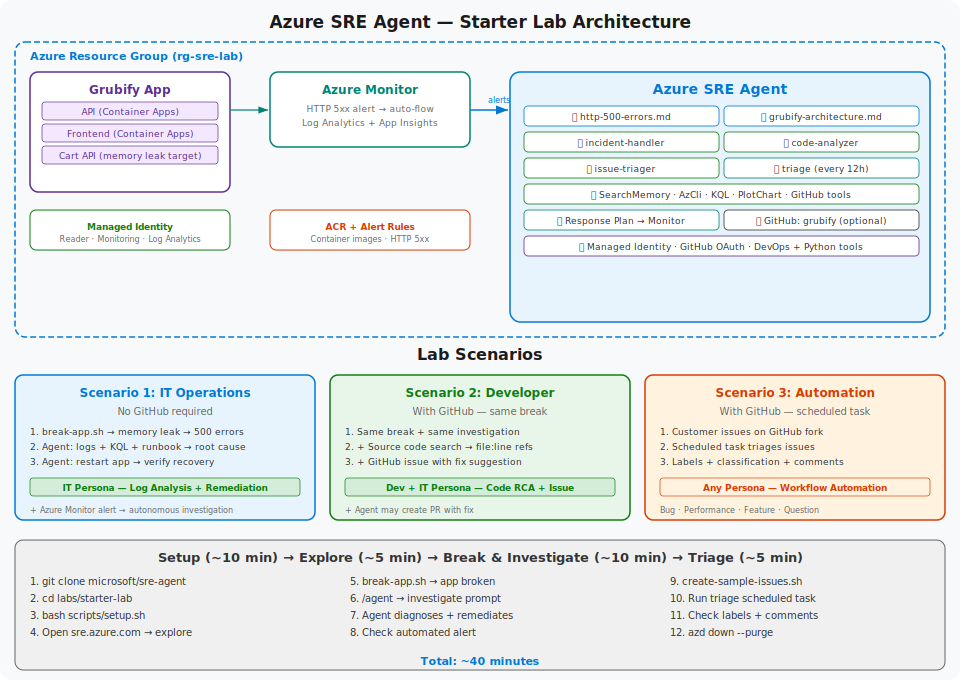

# Azure SRE Agent — Starter Lab

Deploy an Azure SRE Agent, break a sample app, and watch it diagnose and fix the issue. **~40 minutes.**

## Architecture

<p align="center">
  
</p>

## What Gets Deployed

| Resource | Purpose |
|----------|---------|
| **SRE Agent** | AI agent with managed identity, knowledge base, custom agents |
| **Grubify App** | Sample food ordering app (API + Frontend on Container Apps) |
| **Log Analytics + App Insights** | Monitoring and log storage |
| **Azure Monitor Alert** | HTTP 5xx alert → auto-triggers agent investigation |
| **Container Registry** | Grubify container images |
| **Managed Identity** | Reader + Monitoring Reader + Log Analytics Reader RBAC |

### SRE Agent Configuration

| Component | Purpose |
|-----------|---------|
| **Knowledge Base** | HTTP error runbook, app architecture docs |
| **incident-handler** | Investigates using logs, KQL, runbooks |
| **code-analyzer** | Same + source code search, creates GitHub issues |
| **issue-triager** | Triages customer issues with labels and comments |
| **Response Plan** | Routes alerts to custom agents autonomously |
| **GitHub OAuth** | Code search + issue management (optional) |
| **Scheduled Task** | Triage issues every 12 hours (optional) |
| **Global Tools** | DevOps + Python plotting enabled |

## Lab Scenarios

| # | Scenario | Persona | GitHub Required? |
|---|----------|---------|:---:|
| 1 | **Break app → Agent investigates logs + remediates** | IT Operations | No |
| 2 | **Same break → Agent finds root cause in source code + creates GitHub issue** | Developer + IT | Yes |
| 3 | **Triage customer issues → classify, label, comment** | Workflow Automation | Yes |

## Prerequisites

| Tool | macOS | Windows |
|------|-------|---------|
| [Azure CLI](https://learn.microsoft.com/cli/azure/install-azure-cli) 2.60+ | `brew install azure-cli` | `winget install Microsoft.AzureCLI` |
| [Azure Developer CLI](https://learn.microsoft.com/azure/developer/azure-developer-cli/install-azd) 1.9+ | `brew install azd` | `winget install Microsoft.Azd` |
| [Git](https://git-scm.com/) 2.x | `brew install git` | `winget install Git.Git` |
| [Python](https://python.org) 3.10+ | `brew install python3` | `winget install Python.Python.3.12` |

> **Windows:** After installing Python, disable Store aliases: **Settings → Apps → App execution aliases** → turn OFF `python.exe` and `python3.exe`

### Azure Requirements

- Active Azure subscription with **Owner** role
- Register: `az provider register -n Microsoft.App --wait`

### Optional

- [GitHub account](https://github.com) — fork [dm-chelupati/grubify](https://github.com/dm-chelupati/grubify/fork) for Scenarios 2 & 3

## Quick Start

### One-Command Setup (Recommended)

The `setup.sh` script handles everything: login, deploy, and configure.

**macOS / Linux:**
```bash
git clone https://github.com/microsoft/sre-agent.git
cd sre-agent/labs/starter-lab
bash scripts/setup.sh
```

**Windows:**
```cmd
git clone https://github.com/microsoft/sre-agent.git
cd sre-agent\labs\starter-lab
"C:\Program Files\Git\bin\bash.exe" scripts/setup.sh
```

The script will:
1. Check prerequisites
2. Sign in to Azure (`--use-device-code`)
3. Sign in to Azure Developer CLI
4. Register resource providers
5. Ask for GitHub username (optional)
6. Deploy infrastructure (~5-8 min)
7. Configure the SRE Agent

### Manual Setup

If you prefer to run each step yourself:

```bash
az login --use-device-code
azd auth login --use-device-code
az provider register -n Microsoft.App --wait

azd env new sre-lab
azd env set AZURE_LOCATION eastus2
# Optional: azd env set GITHUB_USER <your-username>
azd up

bash scripts/post-provision.sh
```

## Verify Setup

Open [sre.azure.com](https://sre.azure.com) → Full Setup → verify:
- **Code**: 1 repository (if GitHub connected)
- **Incidents**: Connected to Azure Monitor
- **Azure resources**: 1 resource group
- **Knowledge sources**: runbook files indexed

## Scenario 1: IT Operations (No GitHub)

Break the app and ask the agent to investigate using logs and knowledge base.

```bash
# macOS/Linux
bash scripts/break-app.sh

# Windows
"C:\Program Files\Git\bin\bash.exe" scripts/break-app.sh
```

1. Open the Grubify frontend — try adding to cart (it's broken!)
2. Start a **new chat** → type `/` → select any custom agent
3. Send:
   ```
   The Grubify API is not responding — specifically the "Add to Cart" is failing. 
   Can you investigate, find the root cause, and create a GitHub issue with your detailed findings?
   ```
4. Agent investigates: searches memory, queries KQL, references runbook, identifies memory leak
5. Ask: `Can you mitigate this issue?`
6. Verify recovery in browser

> **Automated Alert:** After 10-15 min, check **Activities → Incidents** — Azure Monitor may have fired an alert and the agent investigated autonomously.

## Scenario 2: Developer (Requires GitHub)

Same break as Scenario 1, but the agent also:
- Searches Grubify source code for the root cause
- Finds exact file:line causing the memory leak
- Creates a GitHub issue with code references and fix suggestion
- May create a PR with the fix

> If the agent can't create an issue, nudge it: `Use the GitHub API to create the issue if the direct tool isn't working`

## Scenario 3: Workflow Automation (Requires GitHub)

```bash
# Create sample customer issues (uses gh CLI, no PAT needed)
bash scripts/create-sample-issues.sh <your-user>/grubify

# Or Windows:
"C:\Program Files\Git\bin\bash.exe" scripts/create-sample-issues.sh <your-user>/grubify
```

1. Go to **Builder → Scheduled tasks** → **triage-grubify-issues** → **Run task now**
2. Check `github.com/<your-user>/grubify/issues` — each `[Customer Issue]` gets:
   - Classification: Bug, Performance, Feature Request, Question
   - Labels: `bug`, `api-bug`, `severity-high`, etc.
   - Triage comment from the agent

## Bonus Scenarios

### Ask the Agent Anything

Try these prompts in a new chat (no `/agent` needed — the meta agent handles these):

```
What is the public endpoint URL for the Grubify frontend container app?
```

```
Show me the CPU and memory usage trends for the Grubify container app over the last hour
```

```
Check if there are any Azure Advisor recommendations for my resource group
```

```
What recent changes were made to resources in my resource group? Check the Activity Log.
```

### Custom Prompts with Runbook

```
Using the http-500-errors runbook, walk me through all the diagnostic KQL queries 
and show me the results for the Grubify app
```

### Team Memory

```
Remember that our on-call rotation is: Monday-Wednesday is Team Alpha, 
Thursday-Sunday is Team Beta. The escalation path is: on-call → team lead → VP Engineering.
```

Then later ask: `Who is on call today?`

## Cleanup

```bash
azd down --purge
```

## Troubleshooting

| Issue | Fix |
|-------|-----|
| Python not found (Windows) | Disable Store aliases, reopen CMD |
| 405 on response plan | Wait 30s, run: `bash scripts/post-provision.sh --retry` |
| GitHub issue creation fails | Nudge: "Use the GitHub API to create the issue" |
| `az login` uses wrong account | Run `az logout` then `az login --use-device-code` |

## Resources

| Resource | Link |
|:---------|:-----|
| **SRE Agent Portal** | [sre.azure.com](https://sre.azure.com) |
| **Documentation** | [sre.azure.com/docs](https://sre.azure.com/docs) |
| **Blog** | [aka.ms/sreagent/blog](https://aka.ms/sreagent/blog) |
| **Labs** | [aka.ms/sreagent/lab](https://aka.ms/sreagent/lab) |
| **Pricing** | [aka.ms/sreagent/pricing](https://aka.ms/sreagent/pricing) |
| **Support** | [aka.ms/sreagent/github](https://aka.ms/sreagent/github) |
