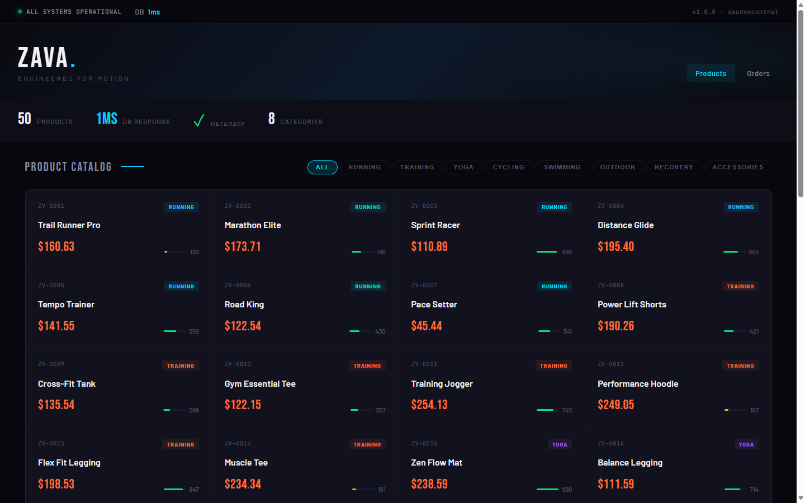
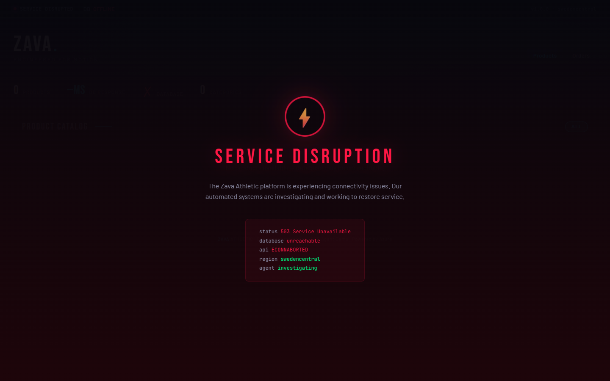

# SRE Agent Demo — Zava Athletic

An AI-first demo showing Azure SRE Agent autonomously detecting and fixing infrastructure issues. Clone it, ask your AI assistant to set it up, break stuff, watch the agent fix it.

## AI-First Setup

This repo is designed to be deployed by an AI agent (Copilot CLI, VS Code Copilot, Claude, etc.). Clone it and ask:

> "Set up this demo for me"

The agent reads `AGENTS.md` and the skills in `.github/skills/` to handle everything — `azd up`, SRE Agent configuration, browser verification. No manual command typing.

Or do it yourself:
```bash
azd up                       # Deploy everything (~25 min)
azd down --force --purge     # Tear down when done
```

## What You Get

| Component | Details |
|-----------|---------|
| **App** | Zava Athletic e-commerce storefront (Node.js/Express on AKS) |
| **Database** | PostgreSQL 16 Flexible Server (Entra-only auth, zero passwords) |
| **Monitoring** | App Insights + Log Analytics (4-day retention on noisy tables, no daily ingestion cap, 100% sampling; probes filtered at the alert KQL so alerts fire fast) + 10 Azure Monitor alert rules. The app emits a **custom OpenTelemetry metric** (`zava.products.category.query.duration_ms` + a `slow_query` counter) so latency regressions surface as a first-class **metric** signal — not just logs/traces — and a PostgreSQL `cpu_percent` metric alert covers DB saturation. |
| **SRE Agent** | Anthropic-backed agent (Preview channel). Connectors, skills, response plans, and Azure Monitor incident binding declared in `infra/modules/sre-agent.bicep`. Knowledge-file upload via `scripts/setup-sre-agent.ps1` (ARM doesn't surface that yet). Default agent + rich skills, no subagent handoff. |
| **Telemetry access** | App Insights, Log Analytics, and Azure Monitor exposed via **connectors** |
| **Demo Scenarios** | 4 break/fix scenarios with scripts |

## Architecture

```
┌─────────────────────────────────────────────────────────────────┐
│  Azure Resource Group (single RG — azd down cleans everything)  │
│                                                                 │
│  ┌──────────┐     ┌───────────────────────────┐                 │
│  │ SRE Agent│◄────│  Azure Monitor Alerts (8) │                 │
│  │ (VNet-   │     └─────────┬─────────────────┘                 │
│  │  injected│               │     egress → Azure Firewall       │
│  │  +FW lock│               │     (default-deny allow-list)     │
│  └────┬─────┘               │                                   │
│       │                     │                                   │
│       ▼                     │                                   │
│  ┌─────────────────────┐    │    ┌────────────────────┐         │
│  │  AKS Cluster        │    │    │  PostgreSQL 16     │         │
│  │  ┌────────────────┐ │    │    │  (Entra auth)      │         │
│  │  │ zava-storefront│─┼────┼───►│  zava_store DB     │         │
│  │  │ zava-api       │ │    │    │  (VNet-delegated)  │         │
│  │  └────────────────┘ │    │    └────────────────────┘         │
│  └─────────────────────┘    │                                   │
│                             │                                   │
│  ┌──────────────────────────┘                                   │
│  │ App Insights + Log Analytics                                 │
│  └──────────────────────────────────────────────────────────────┘
```

## What it looks like

The storefront is a normal e-commerce app — when the backend breaks, the UI degrades visibly so the audience can see the failure without reading logs.

| Healthy | Broken (Scenario 1 — PostgreSQL stopped) |
|---|---|
|  |  |
| `ALL SYSTEMS OPERATIONAL` · 50 products · ~1 ms DB response | `SERVICE DISRUPTION` · 503 · `database unreachable` · `agent investigating` |

While the UI shows `agent investigating`, the SRE Agent is actually working the incident in the Azure portal — investigating telemetry, picking a runbook, and (with autonomous mode + High access enabled by Bicep) executing the fix. Screenshot of an agent thread resolving Scenario 1 goes here:


## Demo Scenarios

### Scenario 1: Database Outage
```powershell
.\.github\skills\running-demo\scripts\break-sql.ps1    # Stops PostgreSQL → 503 errors
# Agent detects via Azure Monitor, investigates, restarts PostgreSQL
.\.github\skills\running-demo\scripts\fix-sql.ps1      # Fallback if agent doesn't fix
```

### Scenario 2: Network Partition
```powershell
.\.github\skills\running-demo\scripts\break-network.ps1  # K8s NetworkPolicy blocks DB traffic
# Agent sees ETIMEDOUT (not ECONNREFUSED), finds and removes NetworkPolicy
.\.github\skills\running-demo\scripts\fix-network.ps1    # Fallback
```

### Scenario 3: Missing Index
```powershell
.\.github\skills\running-demo\scripts\break-db-perf.ps1  # Drops category/name index → slow queries
# Two correlated signals fire for one root cause: the custom-metric alert
# (Zava-category-latency-metric, on zava.products.category.query.duration_ms) AND
# the log alert (Zava-products-query-slow); PG cpu saturation may co-fire. The agent
# correlates logs + metrics + traces and applies CREATE INDEX via the in-cluster helper.
.\.github\skills\running-demo\scripts\fix-db-perf.ps1    # Fallback
```

### Scenario 4: Bad Deploy / Rollback
```powershell
.\.github\skills\running-demo\scripts\break-bad-deploy.ps1  # kubectl set env FAULT_INJECT=500 → new rollout, GET /api/products returns 500
# Existing Zava-http-5xx-errors alert fires; agent correlates the 5xx spike with the recent
# rollout (kubectl rollout history / KubeEvents) and rolls back to the previous good revision.
.\.github\skills\running-demo\scripts\fix-bad-deploy.ps1    # Fallback: kubectl rollout undo
```
Liveness (`/livez`) and readiness (`/api/health`) stay green, so the platform looks healthy while
only the app route regresses — deployment-signal correlation is what ties the symptom to its cause.

## SRE Agent Management

Agent configuration is fully declarative in **`infra/modules/sre-agent.bicep`** —
connectors, custom skills, response plans / incident filters, autonomous mode, and Azure
Monitor incident binding all flow through `Microsoft.App/agents/*` ARM resources. To change
them, edit the Bicep and run `azd provision`.

The only data-plane state ARM doesn't yet surface is **knowledge file upload** — handled
by `scripts/setup-sre-agent.ps1`, which also verifies the Bicep-deployed assets are live.
Drop new `*.md` files into `sre-config/knowledge-base/` and re-run the script to sync.

## How the Agent Operates Against a Private Backend

### Network posture: VNet-injected, egress locked down behind an Azure Firewall

The agent is **injected into the workload VNet** (a delegated `agent-subnet`) and its sandbox egress is **locked down behind an Azure Firewall** — default-deny, with an allow-list of exactly what it needs (ARM, Entra, Microsoft Graph, Azure Monitor, and Microsoft Learn). Because it sits **inside** the VNet, it works the private AKS API server and private PostgreSQL with its **own managed identity** — native kubectl for the cluster, and SQL through an in-cluster helper — while ARM and Azure Monitor go over the control plane. The firewall permits exactly those endpoints and nothing else gets out. The point is a fully locked-down, in-VNet agent: it sits inside the customer network boundary yet its blast radius is constrained to the Azure endpoints on the allow-list and its least-privilege identity grants.

> **What "VNet-injected" means here:** the agent's sandbox has **L7 HTTP(S) egress to allow-listed destinations, not raw L3/L4 network access**. It makes HTTPS calls to the allow-listed endpoints (ARM, Entra, Azure Monitor, Microsoft Learn, and any registry added via `allowedRegistries`); it does not open raw TCP/UDP sockets to private VNet IPs. Anything that needs a direct private connection — a database or other non-HTTP service — runs from a workload with a real VNet NIC (an in-cluster pod via `kubectl exec`). `kubectl` and `az` operate over the Kubernetes and ARM **control planes** (HTTP), so they work from the sandbox directly. Egress allow/deny decisions are visible in the SRE Agent UI under **Workspace Configuration → Inspect → Network audit** (Preview).

> **Scope:** the firewall + forced-tunnel route govern the **agent sandbox's internet egress** (the `agent-subnet` only). They do not restrict private intra-VNet traffic, the AKS subnet's own egress, or what the agent can make AKS do via its Cluster Admin RBAC — those are governed by Kubernetes RBAC and the agent's action boundary, not this firewall.

One consequence is worth calling out, because it shapes Scenario 3's remediation: **DDL like `CREATE INDEX` is data-plane only.** No managed PG service (Azure PG Flex, RDS, Cloud SQL) exposes catalog mutation through its cloud control plane. The agent reads `pg_stat_*` to diagnose the missing index and applies the DDL the same way — by running the in-cluster helper from a workload that's already in the VNet (the api pod) through its native kubectl tool:

```
RunKubectlWriteCommand → kubectl exec deploy/zava-api -n zava-demo -- node bin/run-sql.js "<SQL>"
```

`bin/run-sql.js` is ~30 lines: a `pg`-client wrapper that reuses the pod's existing workload identity (already a PG Entra admin). No new endpoint, no new identity, no temporary network opening — just reuses an existing trust path.

| Component | Endpoint | How the agent works on it |
|---|---|---|
| Storefront / nginx ingress | Public LoadBalancer IP | HTTP from anywhere |
| AKS API server | **Private** (system-managed private DNS zone) | Native kubectl (`RunKubectlReadCommand` / `RunKubectlWriteCommand`) authenticated by the agent's Entra identity (*Cluster Admin* RBAC) |
| Pods, services, node IPs | Private (VNet only) | Native `kubectl <verb>` (`get`, `logs`, `describe`, `delete`, `apply`, `exec`, `rollout`) |
| PostgreSQL Flex (port 5432) | **Private only** — `publicNetworkAccess: Disabled`, VNet-delegated | State/config: `az postgres flexible-server`. SQL (reads + DDL): `kubectl exec deploy/zava-api -- node bin/run-sql.js "<SQL>"` via **native kubectl** (the in-cluster helper reuses the pod's PG Entra identity) |

### What the agent can do (from inside the locked-down VNet)

| Plane | Read | Write / remediate |
|---|---|---|
| **AKS control plane** | `az aks show / nodepool list / get-upgrades` | `az aks start / stop / update / nodepool scale / rotate-certs` |
| **Kubernetes (native kubectl)** | `RunKubectlReadCommand` — `kubectl get …`, `logs`, `describe` | `RunKubectlWriteCommand` — `kubectl delete networkpolicy …` (Scenario 2), `kubectl rollout restart …`, `kubectl exec deploy/zava-api -- node bin/run-sql.js "CREATE INDEX …"` (Scenario 3) |
| **PostgreSQL** | Control: `az postgres flexible-server show / parameter list / backup list / server-logs list / replica list`. Data (reads + DDL): `kubectl exec … bin/run-sql.js` via native kubectl | `az postgres flexible-server start` (**Scenario 1**), `restart`, `update`, `parameter set`, `replica create`, `restore`, `ad-admin create` |
| **Networking** | `az network nsg / vnet / private-dns show` | `az network nsg rule create / delete` (Scenario 2 cleanup) |
| **Telemetry** | App Insights, Log Analytics, and Azure Monitor connectors (KQL + metrics) — API-based, no network reachability needed | Alert / action group create / update |

### Running PostgreSQL SQL

SQL — reads (`pg_stat_*`) and read-mostly DDL like `CREATE INDEX CONCURRENTLY` and `ANALYZE` — runs through the in-cluster `bin/run-sql.js` helper in the application pod, which reuses the pod's PostgreSQL Entra identity:

```
kubectl exec deploy/zava-api -n zava-demo -- node bin/run-sql.js "<SQL>"
```

### Practical limits

`az aks command invoke` runs one command at a time — it's not a streaming kubectl session:
- No log streaming (`-f`), no interactive shells, no port-forwarding

For most break/fix work (Scenarios 1, 2, and 3 here), these limits never bite.

## Platform Behaviors

For repo/IaC author gotchas (Sev4 quirk, NSG-vs-NetworkPolicy, container-image build path, Scenario 3 tuning, etc.), see [`AGENTS.md`](AGENTS.md) → Non-Obvious Things.

### Incident dispatch and merging

Azure Monitor itself does NOT link or merge incidents across different alert rules. Each alert rule fires independently, and the same rule re-firing just updates the existing alert's count (with `autoMitigate: true`, it flips to `Resolved` when the condition clears).

The **merging** behavior happens one layer up — on the SRE Agent's response plans (a.k.a. incident filters). When merging is on, the agent groups any matching alert that arrives within `mergeWindowHours` into the most recent open thread for that response plan, instead of dispatching a new investigation. This is great for cost control and for avoiding parallel investigations of the same root cause during alert storms — but it means back-to-back demo runs against the same agent within the merge window will fold into the previous (closed) thread, leaving the new alert `state=Acknowledged` in Azure Monitor while the agent never opens a new thread.

This sample ships with merging **on** at the platform default (`mergeEnabled: true, mergeWindowHours: 3` in `infra/modules/sre-agent.bicep`, both `dbResponseFilter` and `appResponseFilter`) so you don't burn agent invocations re-investigating the same incident. Fresh dispatches per `azd env new` are still guaranteed because the SRE Agent name includes a per-env suffix (e.g. `sre-agent-zava-awpo`), so a brand-new env gets a brand-new agent with an empty thread store.

If you're iterating on the same env and need fresh dispatch per run (typical when developing the demo itself), flip:

```bicep
mergeEnabled: false
mergeWindowHours: 0
```

…and re-deploy. The trade-off is that a single noisy underlying issue can spin up multiple agent investigations in the same window.

## Prerequisites

- Azure subscription with Contributor access
- [Azure CLI](https://docs.microsoft.com/cli/azure/install-azure-cli) (2.60+)
- [Azure Developer CLI (azd)](https://learn.microsoft.com/azure/developer/azure-developer-cli/install-azd) (1.9+)
- [PowerShell 7.4+](https://learn.microsoft.com/powershell/scripting/install/installing-powershell) — **required on Windows, WSL, Linux, or macOS**; `azd up` runs a pre-provision check and fast-fails if `pwsh` is missing

> **Note:** `kubectl` is **not** required on your local workstation. The AKS cluster is private; operator in-cluster operations in this repo go through `az aks command invoke` (wrapped by `Invoke-AksCommand` in `scripts/_aks-helpers.ps1`). The SRE Agent, by contrast, is VNet-injected and uses its own **native kubectl tools** (Entra / managed-identity auth) — see "How the Agent Operates Against a Private Backend" above.

> **Region default:** `azd up` will prompt for a location. The Bicep default is `swedencentral` (validated end-to-end there). To deploy elsewhere, pick another region at the prompt or run `azd env set AZURE_LOCATION <region>` before `azd up`. Any region with availability for AKS, PostgreSQL Flexible Server, and the SRE Agent resource provider works.

> **Cross-platform note:** All scripts in this repo target PowerShell 7.4+, which runs on Windows, macOS, and Linux. On macOS/Linux, invoke the demo scripts with `pwsh`, e.g. `pwsh ./.github/skills/running-demo/scripts/break-sql.ps1`. The `azd` hooks (`pre-provision`, `post-provision`) auto-select the correct shell per OS via `azure.yaml`.

## Cleanup

```bash
azd down --force --purge     # Deletes entire resource group
```

## Project Structure

```
zava-aks-postgres/
├── .github/
│   └── skills/                   # AI agent skills + co-located break/fix scripts
│       └── running-demo/scripts/ #   Scenario break/fix .ps1 (skill assets)
├── infra/                        # Bicep (AKS, PostgreSQL, SRE Agent, monitoring)
├── src/api/                      # Express.js API
├── src/storefront/               # Zava Athletic storefront UI
├── k8s/                          # Kubernetes manifests (${VAR} substitution)
├── scripts/                 # azd lifecycle hooks + shared helper
│   ├── _aks-helpers.ps1          #   Invoke-AksCommand wrapper (REST fallback)
│   ├── check-environment.ps1     #   azd preprovision hook
│   ├── post-provision.ps1        #   azd postprovision hook
│   └── setup-sre-agent.ps1       #   Knowledge file upload + verification
└── sre-config/                   # Knowledge base files (skills, response plans, and connectors are declared in infra/modules/sre-agent.bicep)
```

## License

MIT

