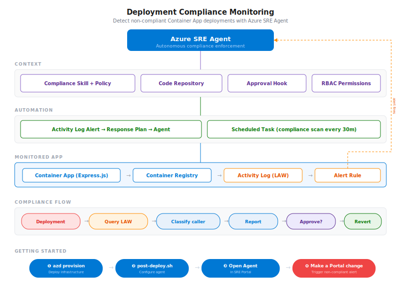

# Deployment Compliance Monitoring with Azure SRE Agent

Automatically detect and respond to non-compliant Azure Container App deployments using SRE Agent, Activity Logs, and a custom compliance skill.

## Stack

- **App**: Express.js Todo API (`src/api/`) — the workload being monitored, deployed as `ca-api-compliancedemo`
- **Compute**: Azure Container Apps + Azure Container Registry
- **Data**: None (Todo API is stateless; Activity Logs in Log Analytics are the system of record)
- **Observability**: Log Analytics Workspace (`law-compliance-compliancedemo`) + Activity Log diagnostic settings → LAW + Activity Log Alert Rule on `Microsoft.App/containerApps/write`
- **SRE Agent**: `sreagent-compliancedemo` with User-Assigned Managed Identity (Log Analytics Reader + Monitoring Contributor). Single skill `deployment-compliance-check` (org policy + KQL templates + classification by `claims.appid` + revert procedures); on-demand approval hook `deployment-compliance-approval`; response plan `containerapp-compliance`; scheduled task `compliance-scan` every 30 min; GitHub OAuth connector for code repo access.
- **Simulator**: None — break path is a manual Portal "Create new revision" action; fix/test is the `scripts/deploy.sh` CI-style deploy
- **CI/CD**: `azd provision` for infra + `bash scripts/post-deploy.sh` for SRE Agent config (idempotent); GitHub Actions workflow `.github/workflows/deploy-container-app.yml` for the compliant-deployment demo path

## What it's about

The deployment-compliance lab is for PMs, SREs, and platform/governance teams who want to see how the **Azure SRE Agent enforces deployment-channel policy on Azure Container Apps** without writing custom audit code. Teams ship Container Apps through many paths — CI/CD, Azure Portal, CLI, PowerShell — and ad-hoc Portal changes silently bypass code review and infrastructure-as-code. This lab installs an SRE Agent skill that continuously classifies every Container App deployment by caller identity (the well-known Microsoft `claims.appid` for Portal/CLI/PowerShell vs. service principals), cross-references resource tags, and flags non-compliant changes — with an approval hook that **never auto-reverts** without human confirmation.

The lab teaches break/fix patterns around deployment governance: detecting Portal-driven revisions, classifying CI/CD-driven revisions as compliant, generating compliance reports on demand, automated alert response when the Activity Log Alert fires, and the every-30-min scheduled scan. Demo flow: `azd provision` → `bash scripts/post-deploy.sh` (configures skill + hook + response plan + scheduled task + GitHub connector + verification) → trigger a non-compliant deployment by editing the Container App in the Portal → ask the agent "check deployment compliance for the last 30 minutes" → the agent flags it and waits for approval to revert.

## The Problem

Teams deploy Container Apps through multiple channels — CI/CD pipelines, Azure Portal, Azure CLI, PowerShell. Without enforcement, ad-hoc Portal changes bypass code review, lack audit trails, and break infrastructure-as-code workflows. Manually auditing Activity Logs is tedious and reactive.

## The Solution

An SRE Agent skill that continuously monitors Activity Logs, classifies every Container App deployment by caller identity (`claims.appid`), and flags non-compliant changes. The agent can recommend — and with user approval — revert unauthorized deployments.

## Architecture

<p align="center">
  
</p>

### How Compliance Detection Works

```
Container App deployment happens
          │
          ▼
Activity Log records the operation
  - Caller: who did it
  - claims.appid: which app/tool was used
          │
          ▼
SRE Agent queries AzureActivity table in LAW
          │
          ▼
Classify by claims.appid:
  ┌─────────────────────────────────────────────────────┐
  │ c44b4083... = Azure Portal      → NON-COMPLIANT     │
  │ 04b07795... = Azure CLI          → NON-COMPLIANT     │
  │ 1950a258... = Azure PowerShell   → NON-COMPLIANT     │
  │ Caller has @  = User principal   → NON-COMPLIANT     │
  │ Other GUID    = Service Principal → COMPLIANT         │
  └─────────────────────────────────────────────────────┘
          │
          ▼
Verify with resource tags (secondary signal):
  deployed-by=pipeline? commit-sha? pipeline-run-id?
          │
          ├── All compliant → Report clean scan
          │
          └── Non-compliant found:
                  │
                  ▼
              Generate report
              Recommend revert
              Activate approval hook
              Wait for user confirmation
                  │
                  ▼
              User approves → Revert to previous revision
```

## What Gets Deployed

### Infrastructure (via `azd provision`)

| Resource | Purpose |
|----------|---------|
| **Container App** (`ca-api-compliancedemo`) | Sample Express.js Todo API — the workload being monitored |
| **ACR** (`acrcompliancedemo*`) | Container image registry |
| **Log Analytics Workspace** (`law-compliance-compliancedemo`) | Stores Activity Logs for KQL querying |
| **Activity Log Alert Rule** | Fires on `Microsoft.App/containerApps/write` operations |
| **SRE Agent** (`sreagent-compliancedemo`) | AI agent with managed identity |
| **User-Assigned Managed Identity** | Agent identity with Log Analytics Reader + Monitoring Contributor |

### SRE Agent Configuration (via `post-deploy.sh`)

| Component | Purpose |
|-----------|---------|
| **Diagnostic Settings** | Routes Activity Logs to the LAW |
| **RBAC Roles** | Log Analytics Reader (LAW queries), Monitoring Contributor (alert management) |
| **Azure Monitor** | Incident platform — alerts flow to the agent automatically |
| **Skill** (`deployment-compliance-check`) | Organization policy, KQL templates, classification rules, revert procedures |
| **Hook** (`deployment-compliance-approval`) | Requires user approval before reverting any deployment |
| **Response Plan** (`containerapp-compliance`) | Handles all severity alerts using the compliance skill |
| **Scheduled Task** (`compliance-scan`) | Runs compliance scan every 30 minutes |
| **GitHub Connector** | OAuth connector for code repository access |
| **Code Repo** (`compliancedemo`) | Agent has access to the deployment code and workflow |

## Setup

### Prerequisites

#### Required Tools

| Tool | macOS | Windows |
|------|-------|---------|
| [Azure CLI](https://learn.microsoft.com/cli/azure/install-azure-cli) 2.60+ | `brew install azure-cli` | `winget install Microsoft.AzureCLI` |
| [Azure Developer CLI](https://learn.microsoft.com/azure/developer/azure-developer-cli/install-azd) 1.9+ | `brew install azd` | `winget install Microsoft.Azd` |
| [Git](https://git-scm.com/) 2.x | `brew install git` | `winget install Git.Git` (includes Git Bash) |
| [Python](https://python.org) 3.10+ | `brew install python3` | `winget install Python.Python.3.12` |
| [jq](https://jqlang.github.io/jq/) 1.6+ | `brew install jq` | `winget install jqlang.jq` |

> **Windows note:** After installing Python, disable the Windows Store app aliases:
> **Settings → Apps → Advanced app settings → App execution aliases** → turn OFF `python.exe` and `python3.exe`

#### Check prerequisites

```bash
# macOS/Linux
bash scripts/prereqs.sh

# Windows (Git Bash or CMD)
"C:\Program Files\Git\bin\bash.exe" scripts/prereqs.sh
```

#### Azure Requirements

- Active Azure subscription
- **Contributor** role on the subscription
- GitHub account (for code repository and CI/CD pipeline)
- Register the resource provider:
  ```bash
  az provider register -n Microsoft.App --wait
  ```

### Step 1: Provision Infrastructure

#### macOS / Linux

```bash
# Clone the repo
git clone https://github.com/dm-chelupati/compliancedemo.git
cd compliancedemo

# Sign in to Azure
az login
azd auth login

# Initialize and provision
azd init
azd provision
```

#### Windows

```cmd
REM Clone the repo
git clone https://github.com/dm-chelupati/compliancedemo.git
cd compliancedemo

REM Sign in to Azure
az login
azd auth login

REM Initialize and provision
azd init
azd provision

REM If post-deploy fails with 'bash not found':
"C:\Program Files\Git\bin\bash.exe" scripts/post-deploy.sh
```

### Step 2: Configure SRE Agent

```bash
bash scripts/post-deploy.sh
```

This script (idempotent — safe to re-run):

1. Resolves deployed resource names from `azd` environment
2. Assigns SRE Agent Administrator role to current user
3. Creates Activity Log diagnostic settings → LAW
4. Grants agent identity Log Analytics Reader + Monitoring Contributor
5. Enables Azure Monitor as incident platform
6. Creates the compliance skill with org policy, KQL templates, tool references
7. Creates the approval hook (on-demand, blocks reverts without approval)
8. Creates response plan + scheduled task
9. Sets up GitHub OAuth connector and adds the code repository
10. **Verifies everything** — checks all connectors, resources, and tools

The script ends with a verification report:
```
  Connectors:
    ✓ LAW query access: Built-in (Log Analytics Reader + diagnostic settings)
    ✓ GitHub connector: Connected
  Code Repositories:
    ✓ compliancedemo: https://github.com/dm-chelupati/compliancedemo (sync: Ready)
  Incident Platform:
    ✓ Azure Monitor: Connected
  Agent Resources:
    ✓ Skill: deployment-compliance-check
    ✓ Hook: deployment-compliance-approval
    ✓ Response plan: containerapp-compliance
    ✓ Scheduled task: compliance-scan
  ✓ All 8/8 checks passed — agent is fully set up!
```

### Step 3: Authorize GitHub (one-time)

Open the OAuth URL printed by the script in your browser and click "Authorize."

### Verify Setup

After all steps complete, open your agent at [sre.azure.com](https://sre.azure.com) and click **Full setup**. You should see green checkmarks on:

| Card | Expected Status |
|------|----------------|
| **Code** | ✅ 1 repository |
| **Incidents** | ✅ Connected to Azure Monitor |
| **Azure resources** | ✅ 1 resource group added |
| **Knowledge files** | ✅ 1 file |

> **Checkpoint:** If any card is missing a checkmark, re-run the setup script: `bash scripts/post-deploy.sh`

Once verified, click **"Done and go to agent"** to open the agent chat and start the team onboarding conversation.

### Team Onboarding

The agent opens a **"Team onboarding"** thread automatically. It will:

1. **Explore your connected context** — reads the code repository, Azure resources, and knowledge files you connected during setup
2. **Interview you about your team** — ask about your team structure, on-call rotation, services you own, and escalation paths

Since the agent already has context from setup, try asking it questions:

> *"What do you know about the compliance demo architecture?"*
>
> *"Summarize the deployment compliance skill"*
>
> *"What Azure resources are in my resource group?"*

The agent saves your team information to persistent memory and references it in every future investigation.

> **Tip:** Ask *"What should I do next?"* for personalized recommendations based on what's connected.

## Demo Steps

### Demo 1: Verify Agent Can Query Activity Logs

Open the agent portal and ask:

```
Use the deployment-compliance-check skill to check deployment compliance
for the last 4 hours
```

The agent should:
- Read the skill to understand the org policy
- Query `AzureActivity` in the LAW using `QueryLogAnalyticsByResourceId`
- Classify any Container App deployments it finds
- Generate a compliance report

### Demo 2: Trigger a Non-Compliant Deployment (Portal)

1. Go to **Azure Portal** → Container Apps → `ca-api-compliancedemo`
2. Click **Revisions and replicas** → **Create new revision**
3. Change something (e.g., add an environment variable `TEST=1`) → **Create**
4. Wait 5-15 minutes for the Activity Log to reach LAW

Then ask the agent:

```
Check deployment compliance for the last 30 minutes
```

The agent should flag the Portal deployment as **non-compliant** (caller `claims.appid = c44b4083-3bb0-49c1-b47d-974e53cbdf3c`).

### Demo 3: Automated Alert Response

When the alert rule fires on the Portal deployment:
- Azure Monitor sends the alert to the SRE Agent
- The response plan triggers the compliance skill
- The agent investigates and classifies the deployment
- If non-compliant, it recommends a revert and activates the approval hook
- **You decide** whether to approve the revert

### Demo 4: Compliant Deployment (CI/CD)

```bash
cd /tmp/compliancedemo
echo "// compliance test" >> src/api/server.js
git add -A && git commit -m "Test compliant deployment" && git push
```

GitHub Actions builds and pushes the image to ACR. Deploy with:

```bash
bash scripts/deploy.sh
```

Then ask the agent to check compliance — this deployment should be classified as **compliant** (service principal caller + pipeline tags).

### Demo 5: Scheduled Compliance Scan

The `compliance-scan` task runs every 30 minutes automatically. Check recent results in the agent's thread history.

## File Structure

```
demos/deployment-compliance/
├── azure.yaml                          # azd template config
├── infra/
│   ├── main.bicep                      # Orchestrator (subscription scope)
│   └── modules/
│       ├── workload.bicep              # Container App + ACR
│       ├── monitoring.bicep            # LAW + Alert Rule + Action Group
│       ├── sre-agent.bicep             # SRE Agent + UAMI + role assignment
│       └── roles.bicep                 # Subscription-level Reader roles
├── scripts/
│   ├── prereqs.sh                      # Prerequisites check (macOS + Windows)
│   ├── post-deploy.sh                  # SRE Agent configuration (run after azd provision)
│   └── deploy.sh                       # Deploy latest image to Container App
├── skills/
│   └── deployment-compliance-check/
│       ├── SKILL.md                    # Org policy, data sources, KQL, classification, revert
│       └── compliance_detection.md     # Decision tree and well-known app IDs
├── hooks/
│   └── deployment-compliance-approval.yaml  # Approval hook definition
├── src/api/
│   ├── server.js                       # Express.js Todo API
│   ├── Dockerfile                      # Container image
│   └── package.json                    # Dependencies
└── .github/workflows/
    └── deploy-container-app.yml        # CI/CD pipeline (build + push to ACR)
```

## Key Design Decisions

- **Built-in LAW access** — No ADX/Kusto connector needed. The agent queries Log Analytics natively via `QueryLogAnalyticsByResourceId` with Log Analytics Reader RBAC.
- **Activity Log diagnostic settings** — Stream Activity Logs to LAW so they're queryable via KQL.
- **`claims.appid` classification** — Well-known app IDs for Portal/CLI/PowerShell are Microsoft constants. More reliable than caller email parsing.
- **Dual-signal detection** — Caller identity (primary) + resource tags (secondary). Tags can be stale; caller identity is authoritative.
- **Approval hook** — Never auto-reverts. Always asks the user first via the `deployment-compliance-approval` hook.
- **Skill as single source of truth** — All compliance logic (policy, data sources, tools, KQL, classification rules, revert procedures) lives in the skill. Response plans and scheduled tasks just reference it.
- **Data plane API for connectors** — Uses the agent's data plane API (`/api/v2/extendedAgent/connectors/`) for connector management, not ARM (which doesn't reliably persist `dataSource`).

## Cleanup

```bash
azd down --purge
```

## Regions

SRE Agent is available in: `eastus2`, `swedencentral`, `australiaeast`

## Links

- [Azure SRE Agent Documentation](https://sre.azure.com/docs)
- [Getting Started Guide](https://sre.azure.com/docs/get-started/create-and-setup)
- [Incident Response Plans](https://sre.azure.com/docs/capabilities/incident-response-plans)
- [Skills](https://sre.azure.com/docs/concepts/skills)
- [Hooks](https://sre.azure.com/docs/concepts/hooks)
- [Scheduled Tasks](https://sre.azure.com/docs/capabilities/scheduled-tasks)
