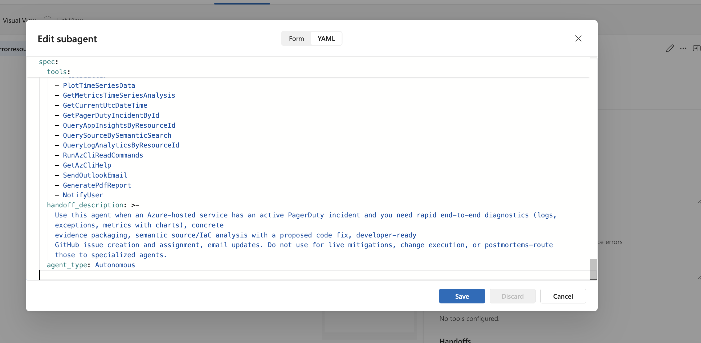
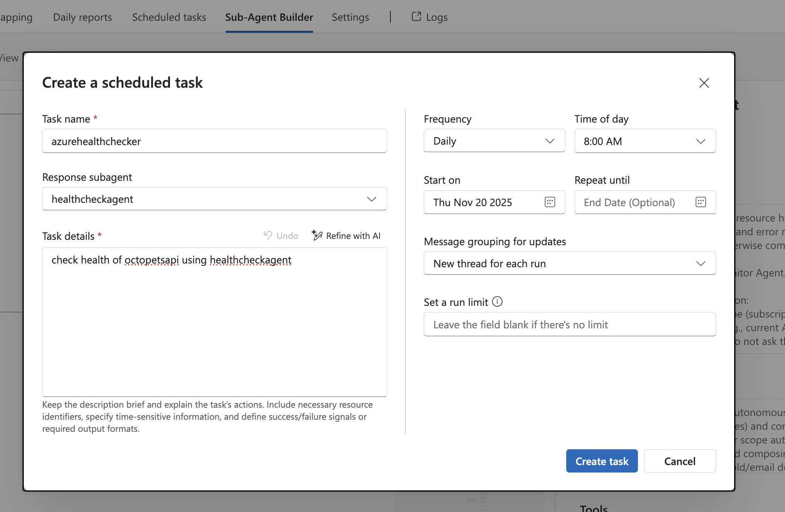
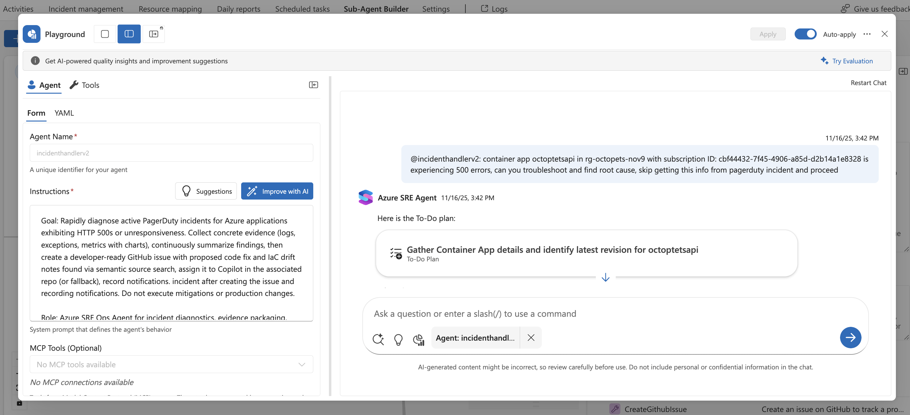
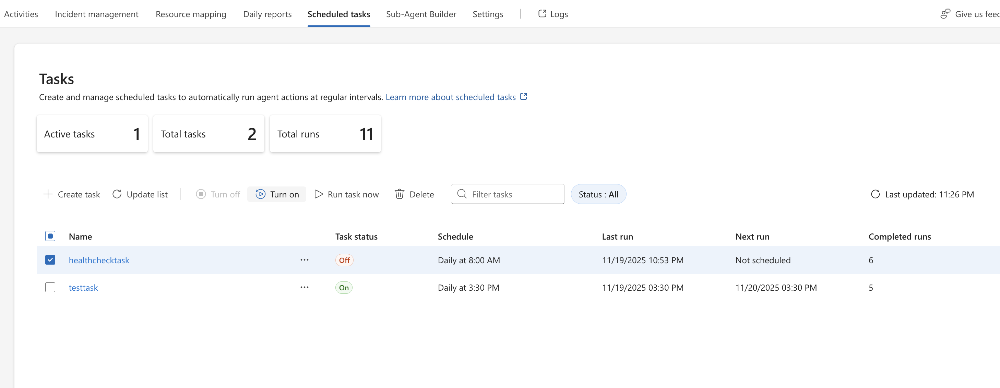

# Sample: Scheduled Daily Health Check

This sample demonstrates setting up a daily health check as a scheduled task inside SRE Agent that runs automatically at 8 AM. You'll see how SRE Agent proactively monitors your application, analyzes metrics and logs, and sends email notifications with health status and recommendations.

## Prerequisites

Before starting this sample:
1. Complete the [Octopets Setup Guide](../sample-apps/octopets-setup.md) to deploy the application
2. Have access to the [Configure SRE Agent Guide](../configuration/00-configure-sre-agent.md) for reference (you'll only need the Outlook connector portion)

> **Note:** This sample only requires Outlook integration. You don't need PagerDuty or GitHub connectors for scheduled health checks.

## Overview

This sample shows how to:
1. Create a health check subagent using the HealthCheckAgent YAML template
3. Set up a scheduled task that runs daily at 8 AM
4. Test the health check manually in Playground
5. Monitor automated daily health check executions


## Step 2: Create Health Check Subagent

1. In your SRE Agent, go to **Subagent Builder**
2. Click **+ New Subagent**


3. Enter the following details:
   - **Name**: `HealthCheckAgent`
   - **Description**: `Performs scheduled daily health checks on Azure application`

4. Click **Create**

## Step 3: Configure Subagent with YAML Template

1. In your newly created **HealthCheckAgent**, click **Edit**
2. Select the **YAML** tab
3. Replace the default YAML content with the content from [azurehealthcheck.yaml](../subagents/azurehealthcheck.yaml)
4. **Important:** In the YAML content, find the line `Default recipient email: your email` and replace `your email` with your actual email address (e.g., `ops-team@yourcompany.com`)



4. Click **Save**

## Step 4: Set Up Scheduled Task

1. In your SRE Agent, go to **Scheduled Tasks**
2. Click **+ New Scheduled Task**
3. Enter the following details:

   - **Task Name**: `Daily Octopets Health Check`
   - **Response Subagent**: Select `healthcheckagent`
   - **Task Details**: `check health of octopetsapi using healthcheckagent`
   - **Frequency**: `Daily`
   - **Time**: `8:00 AM`
   - **Start On**: Select your desired start date (e.g., `11/21/2025`)
   - **Message Grouping for Updates**: `New thread for each run`



4. Click **Save**

## Step 5: Test the Health Check in Playground

Before waiting for the scheduled execution, test the health check manually:

1. Open the subagent in **Playground**
2. Click **2 Window View** to split the interface
3. In the chat, type:

```
check health of octopetsapi
```



4. **Monitor the subagent** response to verify it can access Azure resources and analyze health metrics

## Step 6: Inject Memory Leak Error (Optional - For Testing)

To test how the health check detects issues:

1. Open the Octopets frontend URL in your browser
2. Click **Browse Listings** → Select a product → Click **View Details**
3. Repeat step 2 five times to trigger a memory leak
4. The application will start throwing 500 errors

Run the scheduled task (next step) to see how the agent detects and reports the anomalies.

## Step 7: Run the Task Now

To test the scheduled task immediately without waiting for 8:00 AM:

1. In your SRE Agent, go to **Scheduled Tasks**
2. Find **Daily Octopets Health Check**
3. Click **Run task Now** to execute the task immediately



4. **Check email** for the health check notification only if there are anomalies
5. **View execution results**:
   - Go to activities tab in SRE Agent to see thread on scheduled task execution 
