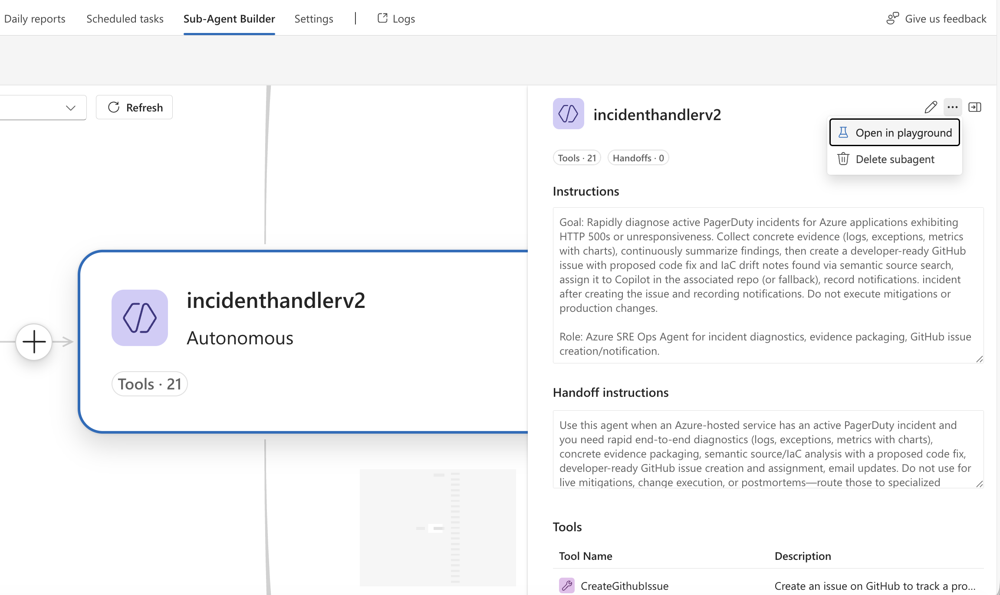

# Sample: Octopets Memory Leak with PagerDuty

This sample demonstrates how to trigger and test incident automation by injecting a memory leak error into the Octopets application and sending a PagerDuty incident.

## Prerequisites

Before starting this sample:
1. Complete the [Octopets Setup Guide](./sample-apps/octopets-setup.md) to deploy the application
2. Complete the [Configure SRE Agent Guide](./00-configure-sre-agent.md) to configure SRE Agent with incident platform, Outlook, and GitHub connectors

## Overview

This sample shows how to:
1. Configure the subagent with the PDazureresourceerrorhandler YAML template
2. Test the subagent in Playground
3. Inject a memory leak error in the running Octopets application
4. Send a PagerDuty incident to trigger automation
5. Monitor the SRE Agent as it diagnoses, mitigates, and documents the issue

## Step 1: Configure Subagent with YAML Template

1. In your SRE Agent, go to **Subagent Builder**
2. Find the **PDazureresourceerrorhandler** subagent you created
3. Click **Edit**
4. Select the **YAML** tab
5. Replace the default YAML content with the content from [pd-azure-resource-error-handler.yaml](./subagents/pd-azure-resource-error-handler.yaml)


6. Click **Save**

## Step 2: Test the Subagent in Playground

Before injecting errors, test that the subagent works correctly:

1. Open the subagent in **Playground**


2. Click **2 Window View** to split the interface
3. Try out the test prompt:

```
container app octopetsapi in your <RG> with subscription ID:<subscriptionID> is experiencing errors, can you troubleshoot and find root cause, skip getting this info from pager duty incident and proceed
```

Replace `<RG>` with your resource group name and `<subscriptionID>` with your subscription ID.



4. **Monitor the subagent** response to verify it can access Azure resources and analyze issues

## Step 3: Inject Memory Leak Error

Now that error generation is enabled, trigger the memory leak:

1. Open the Octopets frontend URL in your browser
2. Click **Browse Listings**
3. Select any product and click **View Details**
4. Repeat clicking **View Details** on different products **5 times**

**Expected behavior:**
- After a few iterations, the backend will start consuming excessive memory
- Response times will increase
- The application will begin throwing 500 errors
- The "View Details" page will become slow or unresponsive

You can monitor this in Application Insights:
1. Go to Azure Portal → Your Container App → Application Insights
2. View **Failures** to see 500 errors
3. View **Performance** to see degraded response times
4. View **Metrics** to see memory consumption increasing

## Step 4: Send PagerDuty Incident

Once you've confirmed the application is experiencing errors, create a PagerDuty incident to trigger your SRE Agent.

### 4.1 Create Incident in PagerDuty

1. Log into your PagerDuty account
2. Click **Incidents** → **Create Incident**
3. Fill in the incident details:

#### Incident Details Template:

```
Title: octopetsapi container app is throwing 500 errors, view details is not responding

Description:
octopetsapi container app is throwing 500 errors, view details is slow to respond

Details:
- Subscription ID: <YOUR_SUBSCRIPTION_ID>
- Resource Group: <YOUR_RESOURCE_GROUP>
- Resource Name: octopetsapi

Severity: P1
Assigned To: [Select your service]
```

4. Click **Create Incident**

### 4.2 What Happens Next

If your SRE Agent is properly configured:
- **Azure Portal**: SRE Agent → Incident History tab
- **Email** (if Outlook connector configured): Notifications at each stage
- **GitHub**: New issue created with analysis

## Step 5: Clean Up (Optional)

To reset the environment for another test:

### Option 1: Scale Back Down
```bash
az containerapp update \
  --name octopetsapi \
  --resource-group <YOUR_RESOURCE_GROUP> \
  --cpu 0.5 \
  --memory 1.0Gi \
  --subscription <YOUR_SUBSCRIPTION_ID>
```

### Option 2: Restart the Container App
```bash
az containerapp revision restart \
  --name octopetsapi \
  --resource-group <YOUR_RESOURCE_GROUP> \
  --subscription <YOUR_SUBSCRIPTION_ID>
```

### Option 3: Delete Everything
```bash
azd down
```
## Resources

- [PagerDuty API Documentation](https://developer.pagerduty.com/docs/)
- [Azure Container Apps Documentation](https://learn.microsoft.com/azure/container-apps/)
