# Fix it before they feel it - higher reliability with proactive mitigation

## 📺 Watch the Demo

This demo was presented at **.NET Day 2025**:

[](https://www.youtube.com/watch?v=Kx_6SB-mhgg)

🎬 **[Fix it before they feel it - .NET Day 2025](https://www.youtube.com/watch?v=Kx_6SB-mhgg)**

---

What if your infrastructure could detect performance issues and fix them automatically—before your users even notice? This demo brings that vision to life using **Azure SRE Agent**, an AI-powered autonomous agent that monitors, detects, and remediates production issues in real-time.

## 🎯 What You'll See

Watch as we intentionally deploy "bad" code to production and observe how the SRE Agent:

1. **Detects the degradation** — Compares live response times against learned baselines
2. **Takes autonomous action** — Executes a slot swap to roll back to healthy code
3. **Communicates the incident** — Posts to Teams and creates a GitHub issue
4. **Generates reports** — Summarizes MTTD/MTTR metrics for stakeholders

> 💡 **The magic**: Zero human intervention required. The agent handles detection, diagnosis, remediation, and reporting—all autonomously.

## 🚀 Demo Highlights

| Capability | What It Shows |
|------------|---------------|
| **Proactive Baseline Learning** | Agent learns normal response times and stores them in a knowledge base |
| **Real-time Anomaly Detection** | Instant comparison of current vs. baseline metrics |
| **Autonomous Remediation** | Agent executes Azure CLI commands to swap slots without human approval |
| **Cross-platform Communication** | Automatic Teams posts and GitHub issue creation |
| **Incident Reporting** | End-of-day email summaries with deployment health metrics |

## Architecture

```mermaid
graph LR
    %% ===== APPLICATION ARCHITECTURE (Left) =====
    subgraph AppArch["🖥️ Application Architecture"]
        APP["📦 .NET App<br/>App Service"]
        INSIGHTS["📊 App Insights"]
        ALERTS["🔔 Monitor Alerts"]
        APP --> INSIGHTS
        INSIGHTS --> ALERTS
    end

    %% ===== AZURE SRE AGENT (Center) =====
    subgraph SREAgent["🤖 Azure SRE Agent"]
        subgraph Triggers["🎯 Triggers & Tasks"]
            INCIDENT["⚡ Incident<br/>Trigger"]
            SCHED_BASELINE["📈 Baseline Task<br/>every 15m"]
            SCHED_REPORTER["📋 Reporter Task<br/>every 24h"]
        end

        RUNTIME["🧠 SRE Agent<br/>Runtime"]

        subgraph SubAgents["Sub-Agents"]
            HEALTH["✅ Health Check"]
            BASELINE["📈 Baseline"]
            REPORTER["📋 Reporter"]
        end

        KNOWLEDGE["💾 Knowledge Store"]

        %% Internal agent flows
        INCIDENT --> RUNTIME
        SCHED_BASELINE --> RUNTIME
        SCHED_REPORTER --> RUNTIME
        RUNTIME --> HEALTH
        RUNTIME --> BASELINE
        RUNTIME --> REPORTER
        BASELINE -->|"store"| KNOWLEDGE
        HEALTH -->|"read"| KNOWLEDGE
    end

    %% ===== HEALTH CHECK ACTIONS (Right) =====
    subgraph HealthActions["✅ Health Check Actions"]
        GITHUB["🐙 Create GitHub Issue"]
        GHSEARCH["🔍 GitHub Semantic Search"]
        COPILOT["🤖 Assign to Copilot"]
        TEAMS_POST["💬 Post to Teams"]
    end

    %% ===== REPORTER ACTIONS (Right) =====
    subgraph ReporterActions["📋 Reporter Actions"]
        TEAMS_READ["💬 Read Teams"]
        OUTLOOK["📧 Send Email"]
    end

    %% ===== CROSS-BOUNDARY FLOWS =====
    ALERTS -->|"deployment<br/>alert"| INCIDENT
    HEALTH -->|"query"| INSIGHTS
    HEALTH -->|"swap"| APP
    BASELINE -->|"query"| INSIGHTS
    
    HEALTH --> GITHUB
    HEALTH --> GHSEARCH
    HEALTH --> TEAMS_POST
    GITHUB --> COPILOT
    
    REPORTER --> TEAMS_READ
    REPORTER --> OUTLOOK

    %% ===== STYLING - Brand Colors =====
    %% Runtime
    style RUNTIME fill:#1e293b,color:#fff,stroke:#3b82f6,stroke-width:3px
    
    %% Triggers
    style INCIDENT fill:#ef4444,color:#fff
    style SCHED_BASELINE fill:#3b82f6,color:#fff
    style SCHED_REPORTER fill:#a855f7,color:#fff
    
    %% Sub-Agents
    style HEALTH fill:#22c55e,color:#fff
    style BASELINE fill:#3b82f6,color:#fff
    style REPORTER fill:#a855f7,color:#fff
    
    %% Knowledge Store
    style KNOWLEDGE fill:#6366f1,color:#fff
    
    %% GitHub - Black
    style GITHUB fill:#24292e,color:#fff
    style GHSEARCH fill:#24292e,color:#fff
    style COPILOT fill:#24292e,color:#fff
    
    %% Teams - Purple
    style TEAMS_POST fill:#5059c9,color:#fff
    style TEAMS_READ fill:#5059c9,color:#fff
    
    %% Outlook - Blue
    style OUTLOOK fill:#0078d4,color:#fff
    
    %% Azure - Blue
    style APP fill:#0078d4,color:#fff
    style INSIGHTS fill:#68217a,color:#fff
    style ALERTS fill:#d13438,color:#fff
```



## Prerequisites

- Azure subscription with Contributor access
- Azure CLI installed and logged in (`az login`)
- .NET 9.0 SDK
- PowerShell 7.0+

## Demo Flow

```mermaid
graph LR
    subgraph Step1["Step 1: Setup"]
        S1["🏗️ Deploy Infrastructure<br/>+ Applications"]
    end
    
    subgraph Step2["Step 2: Configure"]
        S2["🤖 Create Sub-Agents,<br/>Triggers & Schedules"]
    end
    
    subgraph Step3["Step 3: Run Demo"]
        S3["🚀 Swap bad code,<br/>watch agent remediate"]
    end
    
    S1 --> S2 --> S3
```



---

## Step 1: Setup Demo Environment

```powershell
cd scripts
.\1-setup-demo.ps1 -ResourceGroupName "sre-demo-rg" -AppServiceName "sre-demo-app-12345"
```

This script will:
1. Prompt for Azure subscription selection
2. Deploy Azure infrastructure (App Service, App Insights, Alerts)
3. Build and deploy **healthy** code to production
4. Build and deploy **problematic** code to staging

---

## Step 2: Configure Azure SRE Agent

After the infrastructure is deployed, configure the SRE Agent before running the demo.

### 2.1 Deploy SRE Agent

1. Navigate to [Azure SRE Agents Portal](https://sre.azure.com)
2. Create a new agent deployment
3. Configure:
   - **Resource Group**: Use the same RG created by `1-setup-demo.ps1` (e.g., `sre-demo-rg`)
   - **Mode**: **Privileged** (required for slot swap operations)
4. Deploy the agent

### 2.2 Create Sub-Agents

Navigate to the **Subagent builder** tab and click **Create** to create each of the following:

| Sub-Agent | Type | Tools | Purpose |
|-----------|------|-------|---------|
| **AvgResponseTime** | Autonomous | QueryAppInsightsByAppId, UploadKnowledgeDocument | Captures baseline response time metrics |
| **DeploymentHealthCheck** | Autonomous | SearchMemory, QueryAppInsightsByAppId, PostTeamsMessage, CreateGithubIssue, QuerySourceBySemanticSearch, FindConnectedGitHubRepo, GetAzCliHelp, RunAzCliReadCommands, RunAzCliWriteCommands | Detects degradation and executes remediation |
| **DeploymentReporter** | Autonomous | GetTeamsMessages, SendOutlookEmail | Generates deployment summary reports |

#### Creating AvgResponseTime Sub-Agent + BaselineTask Trigger


**Steps:**
1. Go to the **Subagent builder** tab
2. Click **Create** → **Subagent**
3. Configure:
   - **Name**: `AvgResponseTime`
   - **Type**: Autonomous
   - **Instructions**: Query App Insights for average response time, store baseline in knowledge store
   - **Handoff**: "Use this to calculate the AvgResponseTime"
4. Select tools: `QueryAppInsightsByAppId`, `UploadKnowledgeDocument`
5. Click **Create subagent**
6. Click **Create** → **Scheduled trigger** to create **BaselineTask**
7. Configure schedule: Daily at desired time
8. Connect to `AvgResponseTime` subagent

#### Creating DeploymentHealthCheck Sub-Agent + Swap Alert Trigger


**Steps:**
1. Click **Create** → **Subagent**
2. Configure:
   - **Name**: `DeploymentHealthCheck`
   - **Type**: Autonomous
   - **Instructions**: Compare response times to baseline, auto-swap if >20% slower, create GitHub issues, post to Teams
   - **Handoff**: "Deployment health check to see if response times are larger than expected"
3. Select 9 tools from various categories (Knowledge Base, App Insights, Communication, DevOps, Azure CLI)
4. Click **Create subagent**
5. Click **Create** → **Incident trigger** to create **Swap Alert**
6. Configure:
   - **Severity**: All severity
   - **Title contains**: `slot swap`
   - **Agent Autonomy**: Autonomous
7. Connect to `DeploymentHealthCheck` subagent

#### Creating DeploymentReporter Sub-Agent + ReporterTask Trigger


**Steps:**
1. Click **Create** → **Subagent**
2. Configure:
   - **Name**: `DeploymentReporter`
   - **Type**: Autonomous
   - **Instructions**: Look at Teams posts, build deployment summary email
   - **Handoff**: "Run this agent to create a deployment summary email"
3. Select tools: `GetTeamsMessages`, `SendOutlookEmail`
4. Click **Create subagent**
5. Click **Create** → **Scheduled trigger** to create **ReporterTask**
6. Configure schedule: Daily at desired time
7. Connect to `DeploymentReporter` subagent

### Final Configuration Overview


After completing all steps, your Subagent builder should show:
- **3 Sub-agents**: AvgResponseTime, DeploymentHealthCheck, DeploymentReporter
- **2 Scheduled triggers**: BaselineTask, ReporterTask
- **1 Incident trigger**: Swap Alert

---

## Step 3: Run the Demo

```powershell
.\2-run-demo.ps1
```

This script will:
1. Show current state (production = fast, staging = slow)
2. Perform slot swap (bad code goes to production)
3. Generate load to create telemetry
4. Wait for SRE Agent to detect and remediate

**Flow when the demo runs:**
```
Slot Swap Occurs (demo script)
       │
       ▼
Activity Log Alert Fires
       │
       ▼
Incident Trigger Activated
       │
       ▼
DeploymentHealthCheck Agent Runs
       │
       ├── Queries current response time from App Insights
       ├── Retrieves baseline from knowledge store
       ├── Compares (if >20% degradation)
       │   └── Executes: az webapp deployment slot swap
       ├── Creates GitHub issue (if degraded)
       └── Posts to Teams channel
```

---

## Project Structure

```
dotnetday/
├── DotnetDay.sln              # Solution file
├── README.md                  # This file
├── .gitignore                 # Git ignore rules
│
├── infrastructure/
│   └── main.bicep             # Azure infrastructure as code
│
├── scripts/
│   ├── 1-setup-demo.ps1       # One-time setup script
│   └── 2-run-demo.ps1         # Live demo script
│
├── SubAgents/
│   ├── AvgResponseBaseline.yaml      # Baseline capture agent
│   ├── DeploymentHealthCheck.yaml    # Health check & remediation agent
│   └── DeploymentReporter.yaml       # Report generation agent
│
└── SREPerfDemo/               # .NET Web API application
    ├── Controllers/
    │   ├── ProductsController.cs     # Main API (fast/slow toggle)
    │   └── ...
    ├── Program.cs
    └── ...
```

## How the Demo Works

### The Performance Toggle

The app has a compile-time toggle in `ProductsController.cs`:

```csharp
private const bool EnableSlowEndpoints = false;  // false = fast, true = slow
```

The setup script creates two versions:
- **Production**: `EnableSlowEndpoints = false` → ~50ms responses
- **Staging**: `EnableSlowEndpoints = true` → ~1500ms responses (artificial delay)

### Demo Timeline

| Time | Event |
|------|-------|
| 0:00 | Run `2-run-demo.ps1` |
| 0:30 | Swap staging → production (bad code deployed) |
| 1:00 | Production now slow (~1500ms) |
| 1:30 | Load generation begins |
| 2:00 | App Insights ingests telemetry |
| ~5:00 | Slot Swap Alert fires |
| ~5:01 | SRE Agent triggered via incident trigger |
| ~5:02 | DeploymentHealthCheck queries metrics |
| ~5:03 | Agent compares to baseline, detects 20%+ degradation |
| ~5:04 | Agent executes slot swap (rollback) |
| ~5:30 | Production restored to healthy state |
| ~6:00 | Agent posts to Teams, creates GitHub issue |

---

## API Endpoints

### Health Check
```
GET /health
```
Returns health status with performance metrics.

### Products API (Performance Toggle)
```
GET /api/products           # List products
GET /api/products/{id}      # Get single product
GET /api/products/search    # Search products
```

When `EnableSlowEndpoints = true`, these endpoints add artificial delay.

---

## Cleanup

Delete all Azure resources:

```powershell
az group delete --name sre-demo-rg --yes --no-wait
```

---

## Troubleshooting

### Alerts Not Firing
- Ensure load generation ran for at least 5 minutes
- Check that the Activity Log Alert is enabled
- Verify the Action Group is properly configured

### SRE Agent Not Triggering
- Verify the incident trigger is connected to the correct alert
- Check agent is deployed in **privileged** mode
- Ensure agent has access to the resource group

### Slot Swap Fails
- Verify agent has Contributor role on the App Service
- Check that both slots exist and are running

---

## Technology Stack

- **Framework**: ASP.NET Core 9.0
- **Infrastructure**: Azure Bicep
- **Monitoring**: Application Insights + Log Analytics
- **Automation**: Azure SRE Agent
- **Scripts**: PowerShell 7.0+
