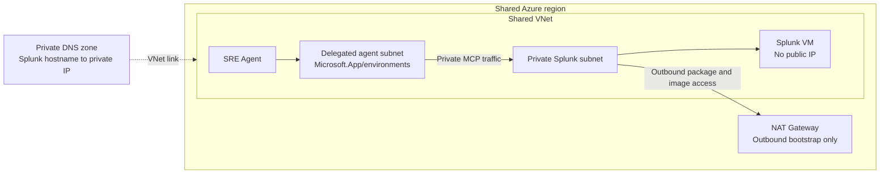

# Private same-region Splunk MCP lab

This example deploys a private Splunk Enterprise MCP endpoint in the **same Azure region and VNet** as the delegated subnet used by an existing Azure SRE Agent.

Use this example when the SRE Agent region can also host the private Splunk workload. Use [`../private-splunk-mcp-cross-region`](../private-splunk-mcp-cross-region/) when Splunk must remain in another Azure region.

## Architecture



The SRE Agent and Splunk use isolated subnets in one VNet, so no VNet peering is required.

## What this example deploys

| Resource | Purpose |
|---|---|
| Shared regional VNet | Contains both isolated subnets |
| Delegated `/27` agent subnet | Same-region attachment for an existing SRE Agent |
| Private `/24` Splunk subnet | Hosts the private Splunk VM |
| `Microsoft.App/environments` delegation | Allows SRE Agent VNet integration |
| NSG | Allows only the agent subnet to reach the test and MCP ports |
| NAT Gateway and public IP | Outbound-only bootstrap access; no inbound public endpoint |
| Private DNS zone and VNet link | Resolves `splunk-mcp.lab.internal` inside the VNet |
| Ubuntu VM | Docker host for a standalone, nonproduction Splunk Enterprise lab |

The templates do **not** deploy an SRE Agent, contain a Splunk password or MCP token, redistribute the Splunk MCP package, or create the connector automatically.

## Important boundaries

- This is a lab and starting point, not a production Splunk architecture.
- The standalone Splunk container stores data on Docker volumes backed by the VM OS disk.
- Download the official MCP package directly from [Splunkbase app 7931](https://splunkbase.splunk.com/app/7931).
- Review and accept the [Splunk General Terms](https://www.splunk.com/en_us/legal/splunk-general-terms.html).
- Production should use HTTPS with a certificate trusted by the SRE Agent runtime.
- `--enable-lab-http` disables TLS only on the private Splunk management endpoint and is intended only for an isolated lab.
- The setup scripts use protected Azure VM Run Command parameters and verify the VM-side exit code.

## Prerequisites

- An existing SRE Agent in the target Azure region.
- Contributor or equivalent permissions for the lab resource group.
- Azure CLI and `jq` for Bash, or Azure CLI and PowerShell 7+.
- Terraform 1.5+ for the Terraform path.
- An SSH public key.
- The downloaded MCP Server for Splunk Platform package.
- VM quota and SKU availability in the SRE Agent region.

Check the default VM SKU:

```bash
az vm list-skus --location eastus2 --resource-type virtualMachines --size Standard_D4as_v5 --all --output table
```

## Deploy with Bicep

Copy and edit the parameters:

```bash
cp bicep/main.parameters.json.example bicep/main.parameters.json
```

Set:

- `namePrefix` to a unique lowercase prefix.
- `location` to the existing SRE Agent region.
- `adminSshPublicKey` to your public key.
- Nonoverlapping CIDRs if the defaults conflict with existing networks.

Bash:

```bash
./scripts/deploy.sh bicep --resource-group rg-private-splunk-same-region --parameters bicep/main.parameters.json
```

PowerShell:

```powershell
./scripts/Deploy.ps1 -Backend Bicep -ResourceGroup rg-private-splunk-same-region -ParametersFile ./bicep/main.parameters.json
```

## Deploy with Terraform

Copy and edit the variables:

```bash
cp terraform/terraform.tfvars.example terraform/terraform.tfvars
```

Bash:

```bash
./scripts/deploy.sh terraform --tfvars terraform/terraform.tfvars
```

PowerShell:

```powershell
./scripts/Deploy.ps1 -Backend Terraform -TfVarsFile ./terraform/terraform.tfvars
```

## Attach the existing SRE Agent

Use the Bicep `agentSubnetId` or Terraform `agent_subnet_id` output.

Bash:

```bash
./scripts/patch-agent.sh --subscription "<subscription-id>" --resource-group "<agent-resource-group>" --agent-name "<agent-name>" --subnet-id "<agent-subnet-resource-id>"
```

PowerShell:

```powershell
./scripts/Patch-Agent.ps1 -SubscriptionId "<subscription-id>" -ResourceGroup "<agent-resource-group>" -AgentName "<agent-name>" -SubnetId "<agent-subnet-resource-id>"
```

The patch script confirms that the agent and VNet are in the same region, selects `AzureVNet` egress, enables private DNS resolution, and disables remote HTTP MCP access through the SRE Agent infrastructure network. It refuses to silently move an agent already attached to another subnet.

## Install Splunk and the MCP app

Bash with trusted HTTPS:

```bash
./scripts/configure-splunk.sh --resource-group rg-private-splunk-same-region --vm-name sre-splunk-vm --package ~/splunk-mcp-server.tgz
```

PowerShell:

```powershell
./scripts/Configure-Splunk.ps1 -ResourceGroup rg-private-splunk-same-region -VmName sre-splunk-vm -PackagePath ./splunk-mcp-server.tgz
```

For the isolated lab-only HTTP workaround:

```bash
./scripts/configure-splunk.sh --resource-group rg-private-splunk-same-region --vm-name sre-splunk-vm --package ~/splunk-mcp-server.tgz --enable-lab-http
```

```powershell
./scripts/Configure-Splunk.ps1 -ResourceGroup rg-private-splunk-same-region -VmName sre-splunk-vm -PackagePath ./splunk-mcp-server.tgz -EnableLabHttp
```

## Validate private routing

From the SRE Agent inspect terminal:

```bash
getent hosts splunk-mcp.lab.internal
```

Expected: the configured private VM address, such as `10.100.1.4`.

If you installed a certificate trusted by the SRE Agent runtime, validate the default HTTPS mode:

```bash
curl -v --connect-timeout 15 https://splunk-mcp.lab.internal:8089/services/mcp
```

Expected: HTTP `405 Method Not Allowed`. MCP uses authenticated JSON-RPC `POST`; the `GET` response proves private DNS and TCP reachability.

Splunk's default self-signed certificate is not trusted by the SRE Agent connector. If you explicitly configured the isolated lab with `--enable-lab-http`, use:

```bash
curl -v --connect-timeout 15 http://splunk-mcp.lab.internal:8089/services/mcp
```

## Mint an encrypted MCP token

With a trusted HTTPS certificate:

Bash:

```bash
./scripts/mint-mcp-token.sh --resource-group rg-private-splunk-same-region --vm-name sre-splunk-vm --scheme https --days 7
```

PowerShell:

```powershell
./scripts/Mint-McpToken.ps1 -ResourceGroup rg-private-splunk-same-region -VmName sre-splunk-vm -Scheme https -Days 7
```

For the explicit `--enable-lab-http` mode, replace `https` with `http`. Store the displayed token in an approved secret store.

## Configure and test the connector

In the SRE Agent portal:

1. Open **Build + setup > Connectors**.
2. Add the **Splunk** partner MCP connector.
3. Set the endpoint to `https://splunk-mcp.lab.internal:8089/services/mcp` after installing a trusted certificate, or `http://...` only for the explicit isolated-lab HTTP mode.
4. Paste the encrypted token.
5. Select the required read-only tools.
6. Save and wait for **Connected**.

Ask the agent:

```text
Use only the private Splunk connector. Call splunk_get_info and report the version, health, and server identifier. Then call splunk_get_indexes and list the first five indexes.
```

Success requires:

- The connector reports **Connected**.
- MCP tools are discovered.
- Both tool calls complete.
- Splunk access logs show `python-httpx` requests from the delegated agent subnet.

## Cleanup

Before deleting infrastructure, disconnect the SRE Agent from the lab subnet or move it to its intended network.

Bicep:

```bash
az group delete --name rg-private-splunk-same-region --yes
```

Terraform:

```bash
terraform -chdir=terraform destroy -var-file=terraform.tfvars
```

## References

- [Azure SRE Agent network integration](https://learn.microsoft.com/azure/sre-agent/network-integration)
- [Azure SRE Agent MCP connectors](https://learn.microsoft.com/azure/sre-agent/mcp-connectors)
- [MCP Server for Splunk Platform](https://splunkbase.splunk.com/app/7931)
- [Azure NAT Gateway](https://learn.microsoft.com/azure/nat-gateway/nat-overview)
