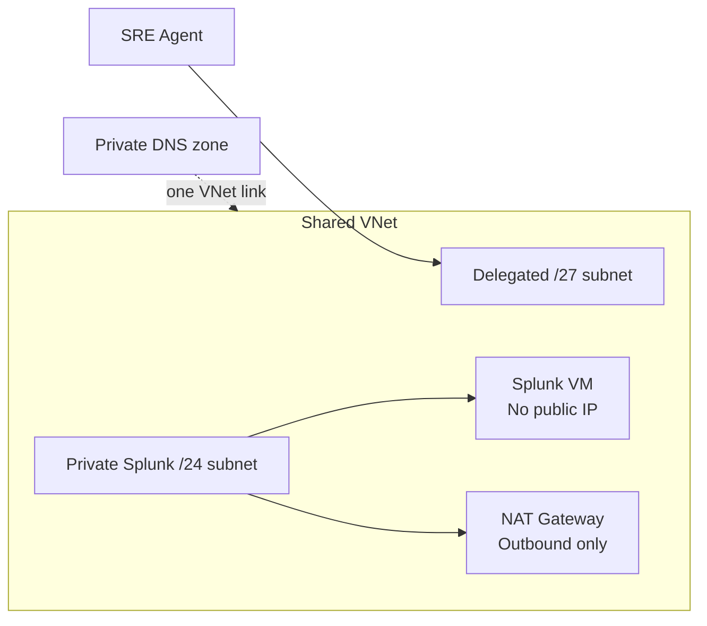
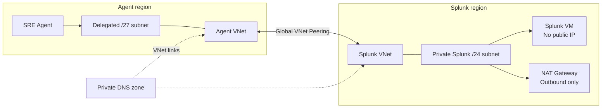

# Private Splunk MCP lab

This example deploys a private Splunk Enterprise MCP endpoint for an existing Azure SRE Agent. Select one topology with the `topology` input:

- `same-region`: one VNet containing separate delegated agent and Splunk subnets.
- `cross-region`: separate VNets in different Azure regions with bidirectional Global VNet Peering.

Both modes keep the VM private, use NAT only for outbound bootstrap, restrict inbound traffic to the delegated agent subnet, and resolve the MCP hostname through private DNS.

## Architecture

### Same region



### Cross region



## Deploy

Copy exactly one complete sample and replace its SSH key placeholder:

```bash
cp bicep/same-region.parameters.json.example bicep/main.parameters.json
./scripts/deploy.sh bicep --resource-group rg-private-splunk-lab --parameters bicep/main.parameters.json
```

```bash
cp terraform/cross-region.tfvars.example terraform/terraform.tfvars
./scripts/deploy.sh terraform --tfvars terraform/terraform.tfvars
```

PowerShell equivalents use `Deploy.ps1 -Backend Bicep -ResourceGroup ... -ParametersFile ...` or `-Backend Terraform -TfVarsFile ...`.

The wrappers validate topology, region relationships, CIDR sizes and containment, subnet/VNet overlap, usable private IP, and SSH key shape before creating a resource group. Direct Bicep deployments enforce the same invariants with `@allowed` and assertions; Terraform enforces them with variable validation and resource preconditions.

Stable outputs in either mode include the agent subnet, both VNet IDs, Splunk VM ID/name/private IP/hostname, and endpoint candidates. In same-region mode both VNet outputs contain the shared VNet ID.

## Protect and patch agent state

Before live validation, capture only the writable agent fields:

```bash
./scripts/capture-agent-state.sh --subscription "<id>" --resource-group "<agent-rg>" --agent-name "<agent>" --output agent-state.json
./scripts/patch-agent.sh --subscription "<id>" --resource-group "<agent-rg>" --agent-name "<agent>" --subnet-id "<new-subnet-id>" --allow-subnet-reassignment
```

Use `--allow-subnet-reassignment` (or PowerShell `-AllowSubnetReassignment`) only after capture when moving from a different subnet. The patch preserves nested VNet and sandbox configuration while enabling Azure VNet egress, private DNS, and disabling infrastructure-network HTTP MCP bypass.

Before destroying a test subnet, delete the uniquely named test connector, restore the original fields, and verify them:

```bash
./scripts/restore-agent-state.sh --subscription "<id>" --resource-group "<agent-rg>" --agent-name "<agent>" --state-file agent-state.json
```

PowerShell equivalents are `Capture-AgentState.ps1` and `Restore-AgentState.ps1`. Restore performs an ARM PATCH from a body file, GETs the agent, and compares the two writable fields. Never edit or replace existing connectors during validation; create and delete a unique connector per matrix entry.

## Configure Splunk

Use `configure-splunk.sh`/`Configure-Splunk.ps1` with the downloaded Splunk MCP package. The scripts use protected Run Command parameters, base64 transport for punctuation-heavy values, no storage data-plane role assignment, and delete the temporary storage account. `--enable-lab-http`/`-EnableLabHttp` is for isolated testing only.

Mint a short-lived encrypted connector token with `mint-mcp-token.sh`/`Mint-McpToken.ps1`. The scripts scrub Run Command output and delete the command resource even after failures. Store the displayed token only in an approved secret store.

## Terraform state migration

Migration from `private-splunk-mcp-same-region` or `private-splunk-mcp-cross-region` state is intentionally unsupported because root resource addresses moved into modules. Back up the old state, use the old repository version and old folder to destroy the deployment, verify cleanup, then deploy from this shared folder. Do not point existing state at this root.

See [TESTING.md](TESTING.md) for the four-path validation matrix, detailed safety sequence, and cleanup commands.
